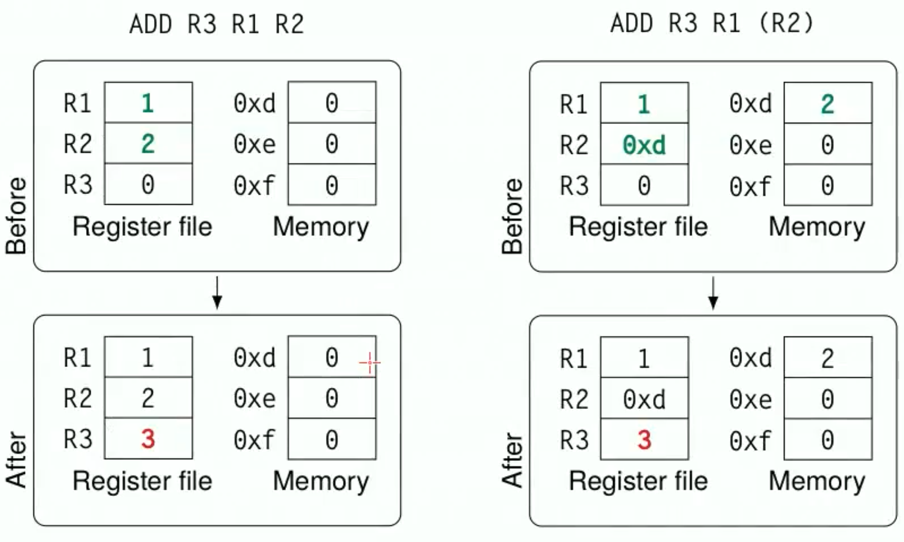
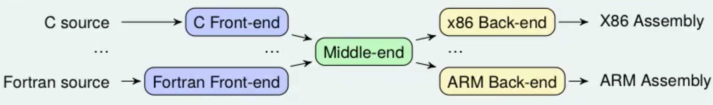

sudo apt update && sudo apt install –y build-essential flex bison


{width=50%}

## This lab explained to a child

> Humans can tolerate ambiguity, computers and compilers no. 

And this is what actually happen in reality and in our exercises. If a grammar which is not LR is parsed by a LR tool  this two things can happen in practice: 

- reduce reduce conflicts: basically the compiler gets confused because it sees two possible ways to group things together
- shift reduce conflicts: the compiler this time gets confused because it doesn't know if it should take the next block and build with it right away, or if it should wait and try to group it with another block later. The typical example of this is the "dangling else problem" (it's an ambuiguity problem). 

Exists also LL, which is another way to parse the input. LL parsers use a top-down parsing approach and have the property of not allowing left-recursion in their grammar. Left-recursion would cause the parser to enter into an infinite loop, as it would continually expand the same non-terminal symbol without making progress.
LL parsers are also less expressive than LR parsers.


There are several variants of LR parsers, one of them are **LALR** parsers.
LR (and LALR) parsers can be generated by a parser generator from a formal grammar defining the syntax of the language to be parsed. This is what Bison (GNU Parser Generator) does: it's not a parser but a parser generator. Bison uses the LALR(1) parsing algorithm, LALR(1) stands for "Look-Ahead LR(1)" which is an efficient bottom-up parsing algorithm.
LALR(1) builds a parse tree for a given input string by starting at the leaves and working its way up to the root. It's an efficient algorithm for parsing context-free grammars.
LALR(1) languages are strictly less expressive than general context-free languages, but are more efficient to parse.


## Flex 


It's implemented as non-deterministic finite state automaton. 


- definitions: where you can declare useful REs
- rules: most important part where you bind RE combinations to actions 
- user code: C code

Each part is separated by ```%%```  


Longest matching rule 
The flex scanner in case of more than one match (with more one rules) the longer match will always win: if a longer regular expression match an expression and then others regular expression match subsets of the expression, the longer rule willl have precedence. 

the first rule 


Flex breaks up the input into individual tokens that are then passed to the parser (in our case we use Bison) for further processing.


Flex -> we do lexical analysis: from words to tokens 
In particular Flex generates a scanner (which recognizes tokens in the stream of characters and maybe decorate them in order to provide additional info). 


A flex file is structured in this way (three sections separated by \%\%). 

```` C
Definitions 
//declare useful REs
%% 
Rules
//bind RE combinations to actions
%%
User code
//C code (generally helper functions)

````

Each rule basically corresponds to a token to be recognized: in particular it links a token with an action to perform when the token is matched. 


Syntac and Semantic Analysis


3 levels 

Lexical Analysis 

Syntactic analysis 

Semantic analysis 
 


This is our workflow: 


The `yylex` function used by the parser will be provided by Flex.
The parser provides a `yyparse` function that returns 0 when the parsing is successful.


# Bison

It reads a specification of a grammar for a particular programming language or input format, and generates a parser which can recognize and parse input written in that language or format. 

- prologue: useful place where to put header file inclusions and variable declarations
- definitions
- rules 
- user code 


Bison file structure is similar to Acse. 


````C
%{
//prologue and headers 
}%
// definitions
%%
//rules like a context-free grammar 
not_terminal : terminal1 
				   | terminal2 TOKEN_A  
				   | terminal3 { /* C code */ }
%%
//user code
````


Very similar to grammar ... uppercase tokens are non terminals and lowercase tokens are terminals symbols. 

You can add semantic actions for each grammar rule. 

Byson uses bottom-up parsing: it always gives precedence to the inner-most rule. 


In acse the assembly code is generated while the parser (generated by Bison) is parsing (using the Bison semantic rules).


````C
%union{ //in the %union I list the possible semantic data types  
	float f_value;
	struct Expr expr;
}

//Here I specify the type which the tokens can assume: 

%token <f_value> FLOAT //%token are terminals  
%type <expr> expr //%type are non terminals 
````


## ACSE


The parser generated by Bison would be responsible for recognizing and parsing the ACSE code while the lexical analyzer (generated by Flex) would be responsible for breaking the code up into individual tokens.


Acse is a LANCE ( a simplified version of C) compiler which emits RISC-like assembly code and is built on Flex and Bison. 


> Mindset: in this kind of exercises we are not actually doing assignments, we are just writing the instructions that will produce the assignment when the program will be executed. We are translating the program, not executing. Compilation is a form of planning. No space for its value is reserved in the memory of the compiler, however, the compiler knows in which register or memory location the variable will be at runtime. 

 
ACSE is a simplified compiler in order to reduce the effort to understand how compilers work. ACSE accepts a C-like source language called LANCE:   
• very small subset of C99   
• standard set of arithmetic/logic/comparison operators   
• reduced set of control flow statements (while, do-whi le, if)   
• only one scalar type (int)   
• only one aggregate type (array of ints)   
- only two I/O operations:   
	- `read(var)` stores into var an integer read from standard   
	- `write(var)` writes var to standard output writing


LANCE produces a RISC-like assembly language: 

|Type  | Operands  | | 
|:--:|:---:|:--:|
| Ternary  | 1 destination and 2 source registers   | ADD R3 R1 R2  |
| Binary   | 1 destination and 1 source register, and 1 immediate operand  | ADD R3 R1 #4| 
| Unary   |1 destination and 1 address operand (label) |  LOAD R1 L0   |
| Jump   |1 address operand   |BEQ LO|

Jump instructions:
- BT: unconditional branch
- BEQ: branch if last result was zero 
- BNE: branch if last result was not zero

Using `( )` to point to the memory address. 



Special registers:

- `R0` zero, always contains 0  
- status word `PSW` , mainly exploited by conditional jumps
	- N, negative
	- Z, zero
	- V, overflow
	- C, carry
	

ACSE works using **mace** which is a simulator of the fictional MACE process. 

Compiler translates a program written in a language and it's organized as a pipeline: 

- front-end: source language into intermediate forms
- middle-end: where transformations and optimizations are applied (for example vectorization)
- back-end


- Front-end: the source code is tokenized by a flex-generated scanner, while the stream of tokens is parsed by a bison-generated parser. At the end, the code is translated to a temporary intermediate o a representation by the semantic actions in the parser.
- No middle-end since no optimizations are made
- Back-end: we use the MACE processor 


A real-world example of a compiler is LLVM.   



The theory part of the course mainly focused on the frontend: 


ACSE has: 

- reduced set of control flow statements (while, do-while, if)
- only one scalar type (int)
- only one aggregate type (arrayofuints)
- no functions
- limited I/O (just `read(var)` and `write(var)`)

Why this language? This is an ¨academical" language and its focus to education. So there is basically nothing so that they can ask stuff to be implemented during the exam. 

The parser (Bison) modifies the intermediate languages made of variable and instructions list. Then backend process it. 

Precedence and associativity of expressions are handled by Bison. 

Constant folding: optimization to "merge" constants at compile time.  
To do this we use a structure which memorize the "value" and the type "IMMEDIATE|REGISTER". If at compile time there is a sum of two immediate, they will merged inside a single immediate.

To do this, you will use: 

````C
handle_bin_numeric_op()  //Arithmetic and logical operations   
handle_binary_comparison()   // Comparisons
````

at the exam the grammar part is the most easy part. The difficult part is the semantic action. 

Tip: It's always useful to "de-sugar" a construct you are implementing to clear up any doubt you might have about its implementation

for syntax sugar -> any for can be replaced with while 


If in Bison part we use " $2" we refer to the second token

Semantic actions are independent blocks or scopes and variables declared in a semantic action are local to that action!
Our exam consists in: 

- add tokens modifying Flex (lexical)
- add grammar rules to recognize new constructs using Bison (syntactic)
- write semantic actions to generate code for new constructs 

In particular: 


1) add the "keyword" to the Flex token declaration:
	- `"keyword" { return KEYWORD_TOKEN }`
2) then in Bison ( `Acse.y`) we place the token definition: 
	- `%TOKEN KEYWORD_TOKEN` 
3) Then you have to define the syntactic rules or modifications to existing one. 
4) Define the semantic actions needed to implement the required functionality, always in `Acse.y`. General stuff in the exam could be:
	- generate a custom structure to manage results
	- use some of the 3 possible techniques to manage nesting expressions and the "stack". 
	- modify existing code


approach: 
 
1) read the text 
2) rewrite the text using a snippet of pseudo code 
3) add the tokens needed in the `Acse.lex`  
4) add the tokens in `Acse.y` with `%token` ? Is it a statement or an expression? 
5) add the "rule like a context-free grammar" in the `Acse.y` and so the **semantic action** 
6) for the semantic action we probably need to define a struct in the `acse_struct.h` associated with what we are adding
7) any new struct declared as to be added as an item in the `%union{  <here> } ` ] ?? 
8) add the struct declared to the new token  ] ?? 


in flex: 

````
[0-9]+        { yylval.value = atoi(yytext);
                return NUMBER; }
````
In bison definitions: 
````
%token <value> NUMBER
````
and then always in bison: 
````
NUMBER
  {
    $$ = $1;
  }
````


resources: 

- `Acse.lex` : flex source (scanner)
- `Acse.y`: Bison syntax grammar of LANCE in `Acse.y` . The semantic actions are responsible for the actual translation from LANCE to assembly
- `codegen`: instruction generation functions: `aze_gencode.h` where there are all the helper functions to generate assembly. 


## ACSE Cheatsheet 

#### Working with Nonterminals


in order to assign a value to a variable, we have to know where the variable is located (i.e. in which register) the function `get_symbol_location` is used in order to retrieve the register location assigned to a given identifier. A symbol table keeps track of the location of every declared variable and `get_symbol_location` perform a query on the symbol table in order to discover the correct location of the variable with `$1` as identifier get the location of the symbol with the given ID. `location = get_symbol_location(program, $1, 0);`


#### Working with registers

Check if a nonterminal (usually exp) is an immediate or a register: `if (${num}.expression_type == IMMEDIATE){...}else{...}`

- in a statement it makes no sense to use \$\$ because I don´t have to pass any value to the caller
- \$\$ cannot be assigned in a midrule action
- always free `$NUM` the identifiers at the end
-   Creating a new register: `int reg = getNewRegister(program);`
-   Initializing a global register: `int glob_reg;` before the "semantic records" section in Acse.y, then initialize it with `glob_reg = getNewRegister(program);` before using it
-   Creating a register and assigning an immediate value: `int reg = gen_load_immediate(program, {val});`
-   Copying the value of a register type nonterminal into another already initialized register: `gen_add_instruction(program, dest_reg, REG_0, ${num}.value, CG_DIRECT_ALL);`
-   Copying the value of an immediate type nonterminal into another already initialized register: `gen_move_immediate(program, dest_reg, ${num}.value);`
-   Returning the register of an identifier nonterminal: `int reg = get_symbol_location(program, ${num}, 0);`. Remember to free the identifier with  at the end of code. The returned value is not the value contained in the register but the number of the register we need to use in the instructions! 
-   Checking if the content of a register is 0 (useful for loop counters as it can be followed by a conditional jump): `gen_andb_instruction(program, reg, reg, reg, CG_DIRECT_ALL);`
-   Adding another register value into a register: `gen_add_instruction(program, dest_reg, dest_reg, source_reg, CG_DIRECT_ALL);`
-   Adding an immediate value into a register: `gen_addi_instruction(program, dest_reg, dest_reg, {num});`

t_axe_expression handle_bin_numeric_op(program, t_axe_expression exp1,
t_axe_expression exp2, int binop);
binop = ADD, ANDB, ANDL, ORB, ORL, EORB, EORL, SUB, MUL, SHL, SHR, DIV


#### Working with variables 

````C
typedef struct t_axe_variable  {
	int type;   
	int isArray;   
	int arraySize;   
	int init_val;   
	char *ID;   
	t axe label *label ID;   
} t_axe_variable;
````

````C
t_axe_variable *v_dst = getVariable(program,$1)
t_axe_variable *v_src1 = getVariable(program,$3)
t_axe_variable *v_src2 = getVariable(program,$5)
````

We can use `getVariable(program,char * id)`;

````C

// to convert immediate exp into register 
// after this piece of code you can handle expression not caring if it is immediate or register

int reg;
if($3.expression_type == IMMEDIATE){
	reg = gen_load_immediate (program, norm_exp.value); 
} else {
	reg = norm_exp.value;
}
````

#### Working with immediates

To "create a new register": int getNewRegister(program); . Solitamente non si usa perchè sostituita dalle 2
sottostanti
```C
void gen_move_immediate(program, int dest, int imm); //does ADDI
int r_i = gen_load_immediate(program,0); //restituisce ID del registro
```

````C
t_axe_expression handle_bin_numeric_op(program, t_axe_expression exp1,
t_axe_expression exp2, int binop);
````

binop = `ADD, ANDB, ANDL, ORB, ORL, EORB, EORL, SUB, MUL, SHL, SHR, DIV 

#### Working with arrays

````C
t_axe_variable *d_array = getVariable(program, $1);
t_axe_variable *s1_array = getVariable(program, $3);
t_axe_variable *s2_array = getVariable(program, $5);

// $NUM needs to be freed at the end of code

if(!d_array->isArray || !s1_array->isArray || !s2_array->isArray)yyerror("problem");
````
---
- Saving an array element into a new register 
````C
// in case of register index 
int r_i = gen_load_immediate(program,2);
//r_i can be modified here
int reg = loadArrayElement(program, $NUM, create_expression(r_i, REGISTER));
````
- alternative in case of immediate index (in this case accessing element 2):
````C
int reg = loadArrayElement(program, $NUM, create_expression(2, IMMEDIATE));
````
---
- Storing an array element into an identifier nonterminal of an array: 
````C
void storeArrayElement(program, $NUM, 
					   t_axe_expression index,
					   t_axe_expression data);
````
- Saving a nonterminal array (represented by identifier) into a variable: `t_axe_variable *array = getVariable(program, ${num});` `S{num}` **needs to be freed at the end of code**.
- Declaring a normal array initialized with zeros: `int *array = calloc(sizeof(int), {num for size});` needs to be freed at the end of code. This can be used as a normal C array with normal C array operations.
- remember to free `free($NUM);` . 

#### Working with jumps and labels

- Declaring label: `t_axe_label *label = newLabel(program)`
- Fixing label position of an already declared label in the code: `assignLabel(program, {labelname})`
--- 
- Declaring label and fixing its position in the same point (use only for backwards jumps):
`t_axe_label *label = assignNewLabel(program, {labelname})`
--- 
- Unconditional jump to label: `gen_bt_instruction(program, {labelname}, 0)`
--- 
- Jump if `r_index` is greater than array length: 
````C
gen_sub_instruction(program,getNewRegister(program),r_array->isArray,r_index)
gen_ble_instruction(program, l_exit , 0);
````
--- 
Alternative method for jumps using `handle_binary_comparison`:
````C
handle_binary_comparison(program,
	create_expression(r_j, REGISTER),
	create_expression(v_src1->arraySize,IMMEDIATE),
	_LT_); 
````
This function generates instructions that perform a comparison between two values. It takes as input two expressions and a binary comparison identifier.
Valid values for the condition are: 

- `_EQ_` 
- `_NOTEQ`  
- `_LT_`
- `_GT_` 
- `_LTEQ_`
- `_GTEQ_`  

Assigning label as global variable to a token: in the token declaration `%token <label> {tokenname}` then, to initialize it in the code of the rule `${num corresponding to the token} = newLabel(program)` and to place it `assignLabel(program, ${num corresponding to the token})

````C
int reg_i = gen_load_immediate(program, 0); //i=0

t_axe_label *exit_lbl = newLabel(program) ; //declare end of the loop
t_axe_label *loop_lbl = assignNewLabel(program) ; //declare start of the loop

//LOOP CONDITION
handle _binary_comparison(program, 
						  create_expression(reg_i, REGISTER),
						  create_expression(s1_array->arraySize, IMMEDIATE), 
						  _LT_); // i < size
gen_beq_instruction(program, exit_lbl, 0); // in case we skip to the end of the loop

// **************
// LOOP BODY
// **********

gen_addi_instruction(program, reg_i, reg_i, 1); // i++ 
gen_bt_instruction(program, loop_lbl, 0); //branch back  

assignLabel(program, exit_lbl); //here is the label to exit the loop
````

#### Sharing variables

We have 3 ways to share variables between semantic actions, basically equivalent:

1) global variable: super easy to apply but it doesn't work if the statement is nestable.
2) Re-purpose a symbol's semantic value as a variable: one of the token is used to store the value, generally use this at the exam. Sometimes the variable is a new struct which we make.
3) Stack method: most complicated one and sometimes overkill.

##### Struct in (2)

To implement the 2nd option it is usually needed to declare a new structure
How to declare a new structure:
1. add it to the axe_struct.h file
2. define a type with that struct in the %union
3. actually use the type fot the token that we want (so now the token has a semantic value)

- Add a new type to give global properties to a token
- In the token section: `%token <{struct of token name}> {token name}`
- Add to the `%union` struct: `t_{struct of token name} {struct of token name}`
- In the axe_struct.h file: `typedef struct t_{struct of token name}{...variable declarations...} t_{struct of token name}`
- Access variables in the rule code: `$<num corresponding to token>.{variable name}`
- Evaluate exp nonterminal: `t_axe_expression unl_cond = handle_binary_comparison(program, $11, create_expression(0, IMMEDIATE), _NOTEQ_);`
- Check if the condition is true: `if(unl_cond.expression_type == IMMEDIATE){...} else{...}`


##### List, Stack method

2nd option is the best but not possible to do in this case to make it in nestable situation where it's necessary to use "a stack method". 
In particularly we have to use a linked list:

At the beginning we had a new type: 
`%type <list> exp_list `

list is a pointer to the type t_list which can be found in %union

This is the first time 

`addElement(NULL, (void*) data, int pos);`

First time of the allocated list, adding the token `$1` in this case:

````C
t_axe_expression *our_exp = malloc(sizeof(t_axe_expression));
*our_exp = $1; 
$$ = addElement(NULL, (void*)our_exp, -1);
````

Then each time I'm adding stuff on the list(stack): 
````C
t_axe_expression *our_exp = malloc(sizeof(t_axe_expression));
*our_exp = $3;
$$ = addLast($1, (void *)our_exp);
````

Then we can access the t_list declaring it in the other rule 

````C
// in this case the list is in the $6
t_list *cur_list_elem = $6 //current first element of the list

````

Then we can use the current list_elem_exp in any operation, for example: 
When you have a tlist, you have to unroll it at compile time. 


````C

for(int i=0, i<array->arraySize;i++){

	if(cur_list_elem ==NULL) yerror("expression list too short"); 

	//loading the t_axe_expression 
	t_axe_expression *cur_list_elem_exp =
		(t_axe_expression *) LDATA(cur_list_elem);
		
	mul = handle_bin_numeric_op(program,
								*cur_list_elem_exp,
							   create_expression(r_val,REGISTER), //an generic expression
							   MUL);

	free(cur_list_elem_exp) 
	cur_list_elem = LNEXT(cur_list_elem)	
}

if(cur_list_elem !=NULL) yerror("expression list too long"); 

````

where 

````C
/* get the next list item. NULL if item is the last item in the list. */
#define LNEXT(item) ((item)->next)

/* get the previous list item. NULL if item is the first item in the list. */
#define LPREV(item) ((item)->prev)

/* get the data associated to this list item. */
#define LDATA(item) ((item)->data)
````


In particularly the t_list struct is defined in collections.h as: 

````C
typedef struct t_list
{
	void *data;
	struct t_list *next;
	struct t_list *prev;
}t_list;
````

And we have mainly this methods: 
````C
/*add an element `data' to the list `list' at position `pos'. If pos is
 *negative, or is larger than the number of elements in the list, the new
 *element is added on to the end of the list. Function `addElement' returns a
 *pointer to the new head of the list */
extern t_list* addElement(t_list *list, void *data, int pos);

/*add an element to the end of the list */
extern t_list* addLast(t_list *list, void *data);

/*add an element at the beginning of the list */
extern t_list* addFirst(t_list *list, void *data);

/*remove an element at the beginning of the list */
extern t_list* removeFirst(t_list *list);

/*remove all the elements of a list */
extern void freeList(t_list *list);

/*get the last element of the list. Returns NULL if the list is empty
 *or list is a NULL pointer */
extern t_list* getLastElement(t_list *list);
````


