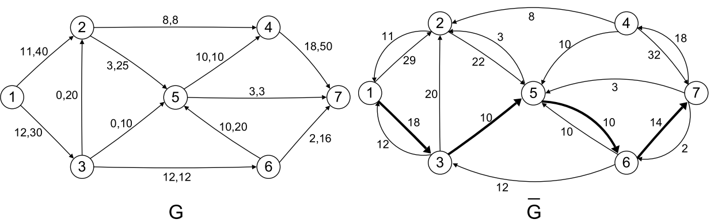
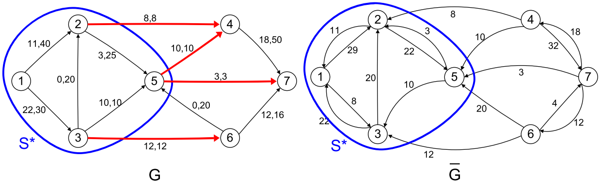

[Alberi e grafi](../../../BSc(italian)/Algoritmi%20e%20Principi%20dell'Informatica/src/12.Alberi%20e%20grafi.md) 

Before diving into linear programming problems, we first examine problems that can be represented by a **graph**. Graph optimization algorithms can be applied to solve problems such as minimum cost spanning tree, shortest path, and flow problems. 
Some random recalls related to graphs: 

- Path: A sequence of consecutive arcs.
- Elementary path: A path with no repeated nodes. 
- Cycle: A closed path, same start and end node. 
- Elementary cycle: A cycle with no repeated nodes. 
- Hamiltonian cycle/Eulerian tour: A cycle that visits all nodes. 


## Minimum Cost Spanning Tree 

Spanning trees have a lot of applications: 

- network design 
- IP network protocols 
- compact memory storage (DNA) 

A complete graph with $n$ nodes ($n \ge 1$) has $n^{n-2}$ spanning trees.

An edge is cost decreasing if is not in the tree and if is add to it, it will decrease the cost to reach a node. 

A tree T is of minimum total cost iff no cost-decresing edge exists. <- so this is a way to check if the spanning tree is the optimal one. 


### Prim's algorithm 

Prim's algorithm builds a spanning tree iteratively:

 - Start from any node
 - Add to the current partial tree an edge of **minimum cost** at each step
 - Continue until all nodes are included in the spanning tree
 - The resulting spanning tree will be optimal.

Things to know:

- Worst case is $O(nm)$ where $m$ is the total number of edges. 
- Other implementations of the algorithm with proper data structures give us complexity of $O(n^2)$ or $O(m \log n)$ where the graph is sparse. 
- Prim's algorithm is **exact**: it provides an optimal solution for every instance of the problem. 
- Prim's algorithm is a **greedy** algorithm: greedy algorithm constructs a feasible solution iteratively by making at each step a 'local optimal' choice, without reconsidering previous choices. 

### `Kruskal` 

Kruskal's algorithm first sort all the edges:

- The edges are ordered by increasing cost. 
- Then iteratively:
	- The cheapest edge still available is selected at each step only if it does not create a cycle with the previously selected edges. To check for a cycle, we see if the starting or ending node is already in the forest. 
- The algorithm stops when $n-1$ edges are selected.


Things to know:

 TODO 


A good way to implement Kruskal algorithm is to use [disjoint sets](../../Advanced%20Algorithms%20and%20Parallel%20Programming/src/05.Randomized%20data%20structures.md##Disjoint%20sets) data structure to identify the connected components of the sub-graph. A vector is used and an index $v_i$ is kept for each of the node so that $v_i=i$, $i=1, \ldots, n$. Later during the algorithm, when two nodes are connected in the vector will be assigned $v_j=v_i$ . In this way is possible to keep track of the connected components. The algorithm each iteration, before adding a new node to the spanning tree, checks if $v_i \neq v_j$. If $v_i \neq v_j$ then an edge $e=\{i, j\}$ can be added to $G^{\prime}$ as it does not create a cycle, and the indices are updated. If $v_i=v_j$, edge $e$ is skipped to avoid creating a cycle since the nodes are already in the spanning tree.


## Shortest Path 


### Dijkstra 

Mainly used for navigation problems. 

Optimal path with Dijkstra in graphs with non-negative arc costs.
A little note: remember that for each node you store the cost of the optimal path and the predecessor of that node in the optimal path.
Remember that the 'labels' of distance are permanent and you need 2 'sets' of nodes to indicate the nodes already discovered or the nodes that will be discovered: the prof called them 'with permanent labels' and 'non permament labels'.

The complexity depends a lot on implementation, but the upper bounds is surely $O(nm)$ where $m$ is the number of edges. It's shown that is $O(n^2)$ . 

We also saw the proof that Dijkstra algorithm always 'choose' the best optimal path. Remember that an edge with negative cost is sufficient to invalidate the algorithm.

### Floyd Marshall algorithm

1. 2 matrices, a predecessors one and a distance one 
2. Triangular check for all the neighbors, at each iteration
3. at the end combining the matrixes we have the shortest path tree


If the graph contains a circuit of negative cost the shortest past problem may not well-defined.
The Floyd / Marshall operation is based on iteratively applying the 'triangular operation' : for each pair of nodes it tries to find another path using less cost .

in particular, the path [2,1,3] is found, replacing the path [2,3] which has fewer edges but is longer (in terms of weight). 

The distance matrix at each iteration of k, with the updated distances in **bold**, will be.

$$d_{iu} + d_{uj} \le d_{ij}$$

It should compute the shortest path from all nodes to all nodes and also find if there is a negative cycle. (it stops if it finds a negative cycle).

To use the algorithm you use a matrix. If on the diagonal there is a negative cost you will immediately stop. 


### Dynamic programming for Shortest Path

[Dynamic programming](../../Advanced%20Algorithms%20and%20Parallel%20Programming/src/06.Dynamic%20programming.md) 

Dynamic programming is both a mathematical optimization method and a compute:   
programming method. The method was developed by Richard Bellman in the 1950s   
In both contexts it refers to simplifying a complicated problem by breaking it down   
into simpler sub-problems in a recursive manner. While some decision problems   
cannot be taken apart this way, decisions that span several points in tirne do often   
break apart recursively.   
In terms of mathematical optimization, dynamic programming usually refers to   
simplifying a decision by breaking it down into a sequence of decision steps over time.

DA CORREGGERE
````Python 
const fib = (n, memo = {}) => {
	if (n in memo) return memo[n]   
	if (n <= 2) return 1

#memoization

	memo[n] = fib(n - 1, memo) + fib(n -2, memo);   
	return memo[n];   
}
````


A DAG can be always ordered topologically.  
At each step we delete the node (or one of the nodes if there are more than one node) that has not any edge arriving in it. 


If it's DAG, it's guaranteed to find always at least one node that hasn't any edge arriving in it. So if it's DAG there is always a topological order. 

The shortest path of a DAG? Dynamic programming algorithm.

The dynamic programming is very efficient and it's used every time the solution of the main problem is the sum of the same problem of smaller subsets of the main problem: the best path from 1 to x is the shortest path form 1 to x-1 node that depends on the shortest path form x-2 etc. etc. 

While in a generic graph any node can be the predecessor of any other node. In a DAG, after topologically ordered, the only possible predecessors of a node t have necessary an index smaller that t. 
The constraint of this algorithm so it's to not have any cycle. 

The dynamic programming algorithm for finding shortest/longest paths in DAGs is optimal and exact. 

Any optimal solution is composed by optimal subsolutions. 
Each best path can be divided into two smaller paths: 

- the optimal path from $1$ to $i$  (optimal subsolution)
- the cost between $i$ and $j$ 

Proposed in 1953 by Richard Bellman (1920-1984).
General technique in which an optimal solution, composed of a sequence of elementary decisions, is determined by solving a set of recursive equations.
DP is applicable to any "sequential decision problem" for which the optimality property is satisfied.

Wide range of applications: 

- optimal control (rocket launch)
- equipment maintenance and replacement
- selection of inspection points along a production line

## Project planning

### Gantt Chart 


### Critical path method (CPM)

Overall minimum duration of more activities and the slack (the maximum time the activity can be delayed) of each activity. 

## Flow of a graph

Problems involving the distribution of a given "product" (e.g., water, gas, data, ... ) from a set of "sources" to a set of "users" so as to optimize a given objective function (e.g., amount of product, total cost, ... ). 

### Flow balanced constraint

The flow balance constraints at each intermediate node amount entering is equal to the amount exiting (except obv the source and the destination). 

There is a dual relationship between the minimum capacity problem and maximum flow problem. 

We define: 

- a cut is a collection of arcs 
- the capacity of a cut is the sum of the capacity of each arc (don't look the direction of them)
- the vaIue of the feasible flow through the cut is the sum of the flow of each arc in the cut (look the direction of each flow, consider it negative if it is 'opposite' to the direction of the flow). 

### Duality of 

The property $\varphi(S) \leq k(S)$ for any feasible flow $x$ and for any cut $\delta(S)$ separating $s$ from $t$, expresses a weak duality relationship between the two problems:

- Primal problem: determine a feasible flow of maximum value from $s$ to $t$ .
- Dual problem: determine a cut separating $s$ from $t$ of minimum capacity.

### Ford algorithm 

The **Ford–Fulkerson method** or **Ford–Fulkerson algorithm** (**FFA**) is a greedy and exact algorithm that computes the maximum flow. 
First we have to define: 

- An augmenting if:
	- exists a forward arc along the path where the flow is less than the maximum capacity. This means we can pump more flow through. 
	- exists a **backward** arc along the path where the flow is greater than zero. 
- The residual network of a graph is the graph constructed by associating all the possible flow variations of empty edges and not saturated edges. 

Since a network is at maximum flow iff there is no augmenting path in the residual network, the algorithm is based on continuing find an augmenting path at each iteration, until we stop. 


#### Ford algorithm in detail

0) Build the **residual network** $\bar{G}$ removing all arcs that are not fully saturated. Keep the same nodes and also add the backward arcs on arc that are not empty. 
1) Repeat until no more trivial augmenting path can be found:
	1) Choose an augmenting path in $\bar{G}$ from source to target. 
	2) Send a value that is equal to the minimum capacity along the path just considered. 
	3) Rebuild the residual graph.
2) Halt when no path from node source to node destination in $\bar{G}$. 
3) The set $S^*$ of all the nodes that can be reached from the source induces the **cut** $\delta\left(S^*\right)$ of **minimum total capacity**. 

#### Extra

Some "particular" cases are when in order to maximize the flow to reach an arc decreased the amount of product flowing through it, for example here in $(5,6)$ :



By sending $\delta=10$ additional units along the augmenting path $\langle(1,3),(3,5),(5,6),(6,7)\rangle$ we obtain:



##### Capacity on nodes

Capacities on nodes can be reduced to those on arcs. Node $i$ with capacity $c_i$ can be replaced with two auxiliary nodes. These nodes are connected by an arc with capacity $c_i$, and all entering arcs go to the left node and all exiting arcs leave from the right node.


