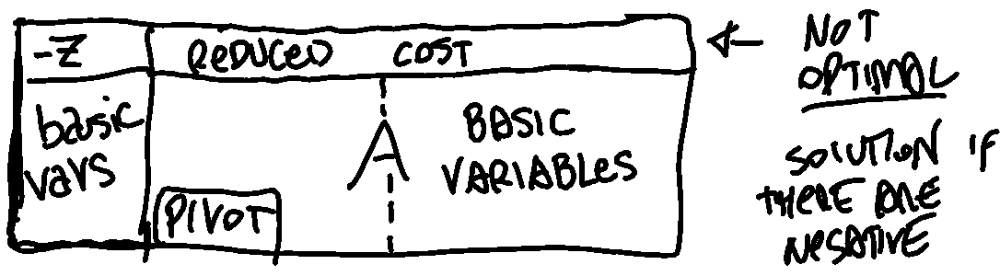

# Geometry of Linear Programming Problem 

-   Each inequality defines an affine half-space in the variable space. An affine half-space is a region in the space defined by an hyperplane which divides the space into two regions, one on each side of the hyperplane. 
    
-  The feasible region X of any LP (linear program) is a polyhedron P (intersection of a finite number of half-spaces). A polyhedron is a geometric object with flat faces, straight edges, and vertices (corners). In the context of an LP, the polyhedron represents the set of all points in the variable space that satisfy the constraints of the problem.
    
-   The polyhedron P is always convex (P is convex if for any two points in the set, the line segment connecting the two points is entirely contained in P). 
    
-  A convex combination of two points is a point that can be represented as a weighted average of the two points. 
- A vertex is one of the "corners" of the polyhedron and that cannot be expressed as a convex combination of other distinct points in the set.

-   A non-empty polyhedron P in standard form or canonical form has a finite number of vertices. Standard form refers to a specific way of writing the constraints of an LP, while canonical form refers to a specific way of writing the objective function of an LP. In both cases, the polyhedron will have a finite number of vertices because it is a bounded set. DA STUDIARE MEGLIO DIFFERENZA STANDARD E CANONICAL FORM

Understanding the geometric and algebraic aspects of linear programming (LP), and familiarity with an LP algorithm

feasible region 

vertices 

moving along each vertex 

canonical form and standard form 

transformations using slack variables

matrix notation and algebra stuff 

### Foundamental theorem of LP 

The fundamental theorem of linear programming states that any optimal solution to an LP can be found at one of the vertices (or corners) of the polyhedron P of feasible solutions. This means that to solve an LP, it is sufficient to consider only the vertices of the polyhedron, rather than all the points in the polyhedron.
However, the geometrical definition of a vertex (a point that cannot be expressed as a convex combination of other points) is not very useful for solving LPs algorithmically. Instead, we need an algebraic characterization of a vertex, which is a way to describe a vertex using algebraic equations or inequalities. This allows us to identify the vertices of the polyhedron and evaluate the objective function at each vertex to find the optimal solution.

The facets of a polyhedron are its bounding surfaces, or faces. In two dimensions, the facets are simply the edges of the polyhedron. In higher dimensions, the facets are higher-dimensional surfaces.

In the context of an LP, the facets of the polyhedron of feasible solutions are obtained by setting one of the variables to 0. This means that we consider a constraint of the form x_i = 0, where x_i is one of the variables in the problem. This constraint defines a hyperplane in the variable space that intersects the polyhedron along a facet.

On the other hand, the vertices of the polyhedron are obtained by setting n-m variables to 0, where n is the number of variables in the problem and m is the number of constraints. This means that we consider a set of constraints of the form x_i = 0 for a subset of the variables. The intersection of the hyperplanes defined by these constraints defines a vertex of the polyhedron.

In general, the vertices of the polyhedron represent the "corners" of the feasible region, while the facets represent the bounding surfaces. By considering the vertices and facets of the polyhedron, we can fully describe the feasible region and find the optimal solution to the LP.

 
In a convex polyhedron, any point in the polyhedron can be expressed as a convex combination of the vertices of the polyhedron.

a feasible growing direction is a direction in which we can move from the current point without violating any of the constraints of the problem. In other words, it is a direction in which we can "grow" the objective function without leaving the feasible region.

The concept of a feasible growing direction is related to the concept of a gradient in optimization. The gradient of a function is a vector that points in the direction of the steepest ascent at a given point. In other words, it is a direction in which the function will increase the most if we move a small distance in that direction.

The simplex algorithm involves moving from one vertex (a point in the feasible region) to another in order to improve the solution. The direction in which the solution moves is called the feasible growing direction.

The concept of pivoting is closely related to the feasible growing direction. Pivoting refers to the process of selecting a pivot element (usually a variable or a constraint) and using it to improve the solution. The pivot element is chosen in such a way that it causes the feasible growing direction to change, leading to an improved solution.

In summary, the feasible growing direction is the direction in which the solution moves in the tableau method, and pivoting is the process of selecting a pivot element to change the feasible growing direction and improve the solution. These concepts are closely related and are essential for understanding and applying the simplex algorithm in linear programming.

# Simplex Algorithm 

List of basic solutions and at each iteration, we move from a basic feasible solution to a neighbour basic feasible solution. 

We know that a basic feasible solution is an optimal one looking if all reduced costs have positive coefficients. 
The simplex method with Bland's rule terminates after $\leq\left(\begin{array}{c} n \\ m \end{array}\right)$ iterations where $n$ is the number of decision variables and $m$ is the number of constraints. <- CORREGGERE IL NOME M E N 

### Tableu method with Bland's Rule

 

1) considering the canonical form, build the corresponding Tableu:
$$\{\begin{array}{c}
z=c^T x \\
A x=b
\end{array}\right.$$ $$\begin{array}{|l|ll|}
\hline 0 & & c^{\prime} (x_1 & \cdots & x_n) & \\
\hline b & & A & \\
\hline
\end{array}$$
	note that the first column contains the right hand side of the objective function and the right side vector.
2) while the coefficients are negative you continue to perform the pivoting operation switching the basic variables in the first column with non basic variables:
	1) the pivoting operation consist in selecting a **non negative** $a_{ij}$ from $A$ in the Tableu corresponding to the left most negative coefficient (column $j$) of the objective function (first line) and with the minimum ratio $\frac{a_{0j}}{a_{ij}}$ . 
	2) divide the whole row $i$ of the pivot by $a_{ij}$  
	3) subtract the others row (even the obj function) by the values of the row $i$ of the pivot $a_{ij}$  multiple by a value $k$  
	4) the value $k$ differs for each row and it's choose to make all the coefficients in the pivot column $j$ equal to zero. $$\begin{aligned}
&\begin{array}{|llll|l|}
\hline 1 & 1 & 1 & 0 & 6 \\
2 & 1 & 0 & 1 & 8 \\
\hline
\end{array}\\
&\text{after pivoting on } a_{10} : 
\\ &\begin{array}{|cccc|c|}
\hline 0 & 1 / 2 & 1 & -1 / 2 & 2 \\
1 & 1 / 2 & 0 & 1 / 2 & 4 \\
\hline
\end{array}
\end{aligned}$$
	5) during each pivoting you always have a feasible solution but with the difference that you have turned a negative coefficient in the reduced cost into a $0$ . 

## 2 Phase Method

After turning the LP problem in standard form, if a feasible basic solution is not evident, we apply the two-phase simplex method. 
The goal of the first phase is to find an initial basic feasible solution of the original LP problem if it exists.

1) We introduce an artificial variable $y_i$ for each equality constraint.
2) We express the basic variables with the nonbasic ones, changing non basic variables.
3) We pivot using the Tableau method as always (with Bland’s rule) and we continue to iterate until the reduced costs for the nonbasic variables are all nonnegative. 

At this point phase 1 stops, proving that the feasible region of the original problem is nonempty, and yielding an initial basic feasible solution with the basic variable. 

4) We re-change the objective function, replacing all the variables to have the non-basic variable explicit and we remove from the tableau the columns of the auxiliary variables. 

--- 

Understanding LP duality and the complementary slackness optimality conditions 

## Dual Problem 

$$\begin{array}{|c|c|}
\hline \text { MIN problem } & \text { MAX problem } \\
\hline \text { variables } & \text { constraints } \\
\hline \text { constraints } & \text { variables } \\
\hline \text { cost vector } & \text { right hand side (b) } \\
\hline \text { right hand side (b) } & \text { cost vector } \\
\hline \text{CONSTRAINTS }A_i x \ge b & y_i \ge 0 \\
\hline \text{CONSTRAINTS }A_i x \le b & y_i \le 0 \\
\hline  x_i \ge 0 & \text{CONSTRAINT }yA^{i} \le c_i \\
\hline  x_i \le 0 & \text{CONSTRAINT }yA^{i} \ge c_i \\
\hline  x/y \text { unrestricted} & \text{CONSTRAINT }A_i (y/x) = c_i \\
\hline
\end{array}$$

complementary slackness conditions

$$y_1(a^{T}_i x - b_i)=0$$

## Sensitivity analysis in LP 

- Variation of the objective function coefficients: how much stable the solution is and how much is sensible to small variations on the objective function coefficients?  
- Variations of the right-hand side terms 

Changing the parameters influences: 

- the position of the constraint changing the right-side of a constraint
- direction of the objective function change the parameters

Understanding the economic interpretation of the dual of some LP problems

