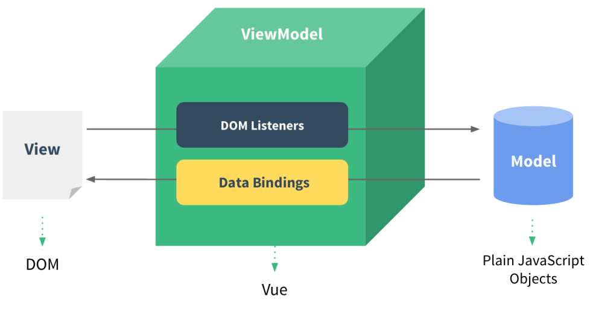
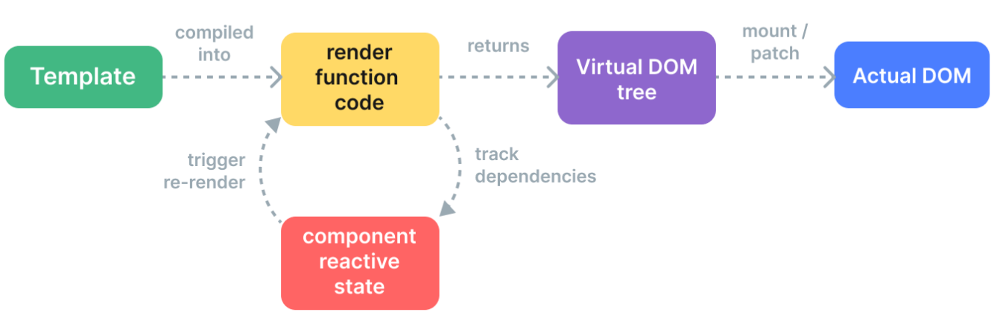
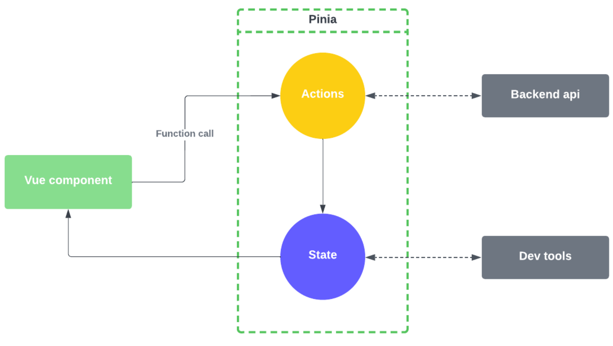

# Vue.js

Vue.js is a JavaScript framework for creating interactive and reactive web frontends. It simplifies the process of rendering data to the DOM using a straightforward template syntax.
Some features: 

- **Declarative Rendering**: Vue extends HTML to describe output based on JS state using templates.
- **Reactivity**: Vue tracks state changes and updates the DOM efficiently.
- Based on **MVVM** pattern. While the controller is the entry point to the application in MVC, in MVVM the view is the entry point. MVVC code is event-driven in MVVM.
{width=50%}
- Vue.js has a **virtual DOM** which solves bottleneck issue with searching and updating the "traditional" DOM in web apps. Virtual because Vue rapresents the DOM with JavaScript objects. This allows for programmatically creating, inspecting, and composing structures and leaves the direct DOM manipulation to the renderer.
{width=50%}
- It can be used in a **widget approach** mode where Vue can control parts or entire HTML pages but also as a **Single page application (SPA)** where Vue controls the entire frontend (the server sends one file with all Vue code, and Vue takes over the UI). 

## Import vue 

To import Vue functionalities, you can simply import its scripts into a basic HTML file. This is an easy solution for prototyping and learning purposes.

````javascript
<script type="importmap">
  {
    "imports": {
      "vue": "https://unpkg.com/vue@3/dist/vue.esm-browser.js"
    }
  }
</script>
````


## Installing vue 


To create a new project from scratch, launch the following command
`npm create vue@3`

```javascript
import { createApp } from 'vue'
const app = createApp({
  /* root component options */
})
app.mount('#app')
```


## Text interpolation 

The most basic form of data binding is text interpolation using the "Mustache" syntax (double curly braces):

```
<span>Message: {{ msg }}</span>
```

You can specify arbitrary data inside Javascript and then you can to refer the data inside html code . The data will fetch the value stored inside Javascript. If the data changes the view automatically displays the new value.

## Attribute interpolation

You can dinamically change some value  coming from the backend, like for example an image.

## Directives

VueJS has built-in directives such as `v-if`, `v-else`, `v-show`, `v-on`, `v-bind`, and `v-model`, which are used to reactively apply side effects to the DOM when the value of its expression changes.
They are very useful for many purposes, for example through the `v-if`, `v-else-if` and `v-else` directives, it's possible to render a block based on the condition in the directive’s expression (conditional rendering) directly inside the html page.

Using `v-for` directive 
## Event Listener

To listen to DOM events and perform certain actions upon triggering, we can use the `v-on` directive, which can be shortened to `@`. For instance, we can use `v-on:click` or `@click` to trigger an action when a click event occurs.

## Computed vs Method properties

For any complex logic that includes reactive data, it is better to use a computed property or a method. Methods and computed properties achieve the same result, but computed properties are cached based on their reactive dependencies: it only re-evaluates when some of its reactive dependencies have changed.
This means that multiple access to a computed property with no changed reactive dependencies, will immediately return the previously computed result without having to run the getter function again. 

## Watch property 

A reactive behaviour can also be obtained by using watch properties. These are used when we need to perform “side effects” in reaction to state changes.

## Vue component 

Vue components are reusable instances that can be easily called by writing the name assigned to them. 

Components are elements that can be used in different places and pages inside the project. To manage the increasing size of JS code while defining new components, we can split components **over multiple files**. This makes it easier to locate things and manage the code.


## Props and Emit ?? 

Communication between a component and its parent is achieved via two tools: 

• `props`, which involves passing data to the component. 
• `emit`, which calls an event to trigger a function in the parent component.


## Pinia 

Pinia is a state management pattern + library for Vue to handle a centralized store for all the components in an application. It models a global entity managing a global state.

{width=50%}


## Single Page Application (SPA)

SPA (Single-page application): 

- A web app that loads only one web document and updates its content via JavaScript APIs
- Saves time and bandwidth as only necessary content is loaded 

Vue Router: 

- Official router for VueJS to build SPAs 
- Utilizes Vue components to update content on activation of a new route 
- Routes are URLs that indicate the requested page and its parameters

