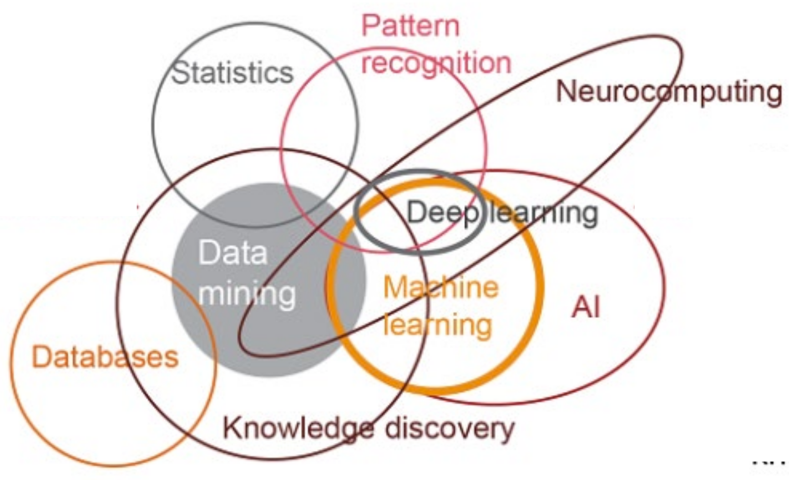
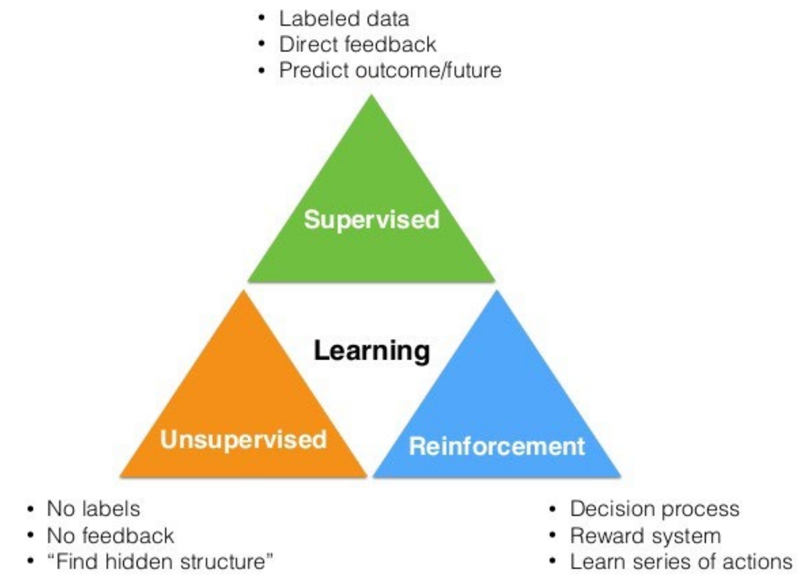

# Machine Learning first lesson 

 

Goals

- Learn to correctly model machine learning problems
- Learn the principles and the main techniques of ML
- Learn how to assess the performances of ML models
- Learn limitations of ML techniques and how to choose the most appropriate one for your problem
- Provide the basic background to understand latest developments in this field

We need computers to make informed decisions on new, unseen data

Machine learning allows to automatically extract relevant information from previous data and exploit it on new one

Getting computers to program themselves (automating automation) writing software is the bottleneck let the data do the work instead

[Supervised](00.Supervised.md)

[Unsupervised](projects/polimi-notes/MSc(english)%20(WIP)/Machine%20Learning%20(WIP)/src/Unsupervised.md)

[Reinforcement](projects/polimi-notes/MSc(english)%20(WIP)/Machine%20Learning%20(WIP)/src/Reinforcement.md) 
