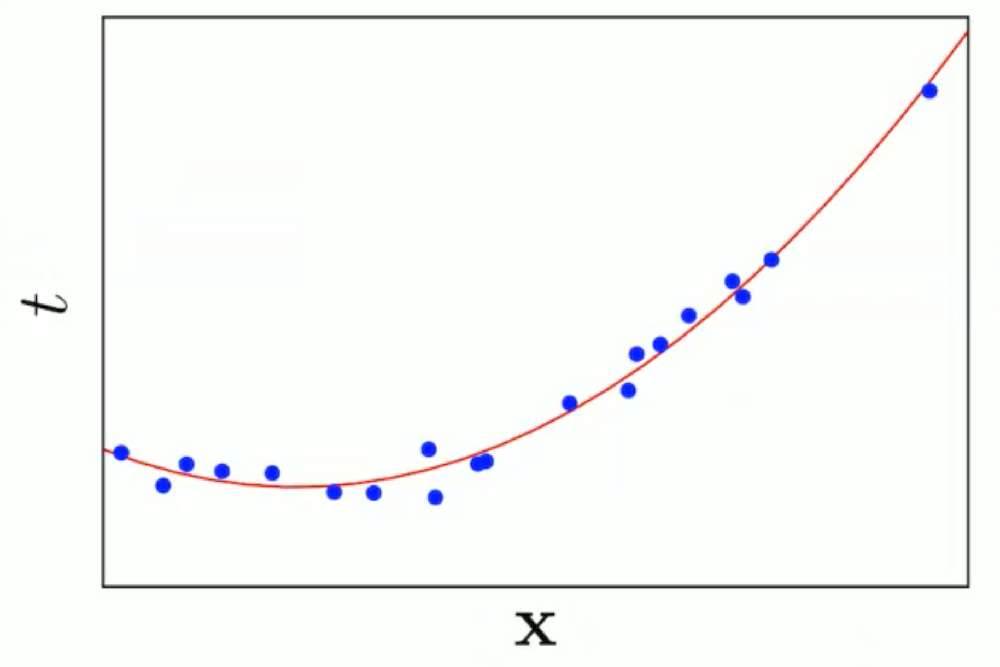
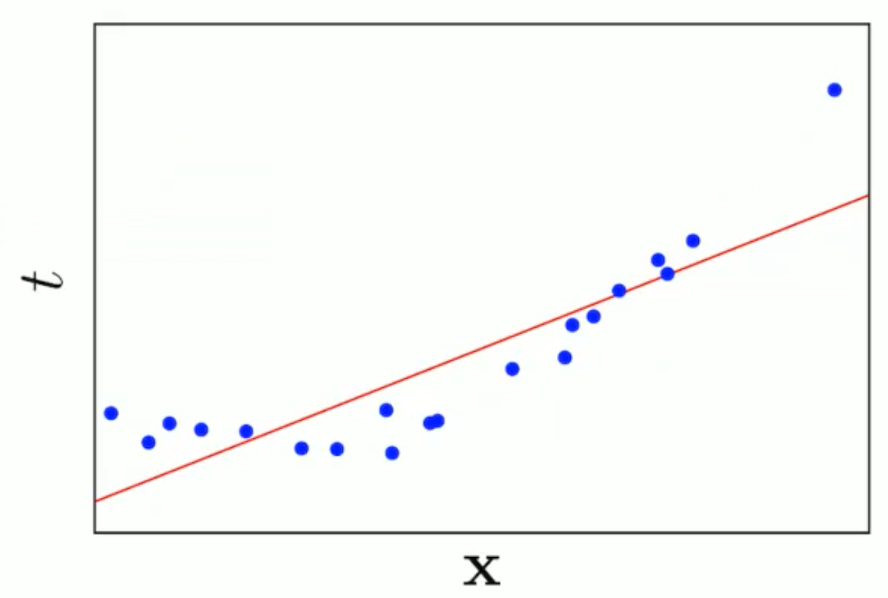
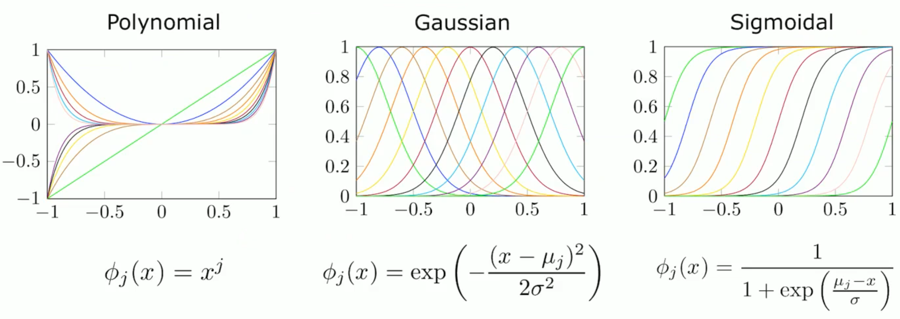
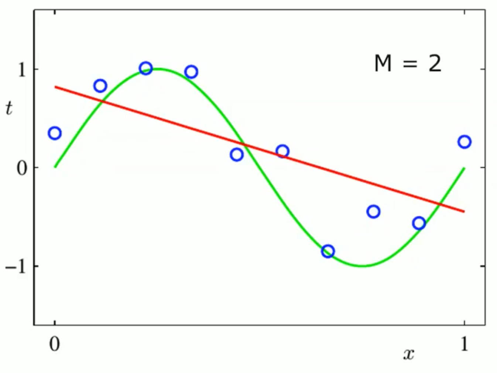
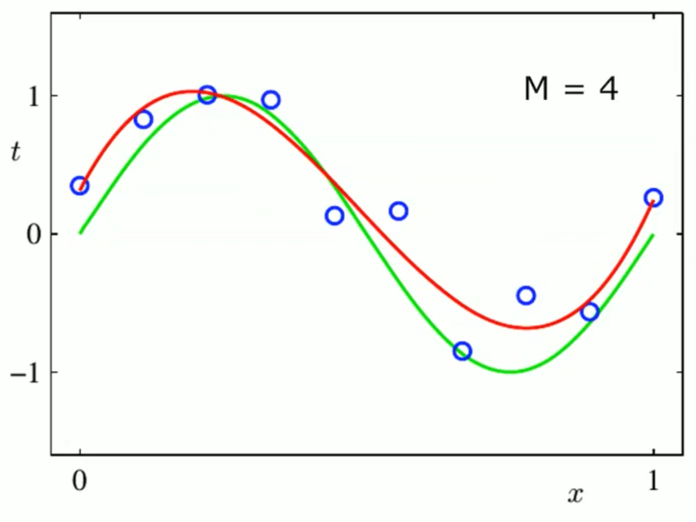
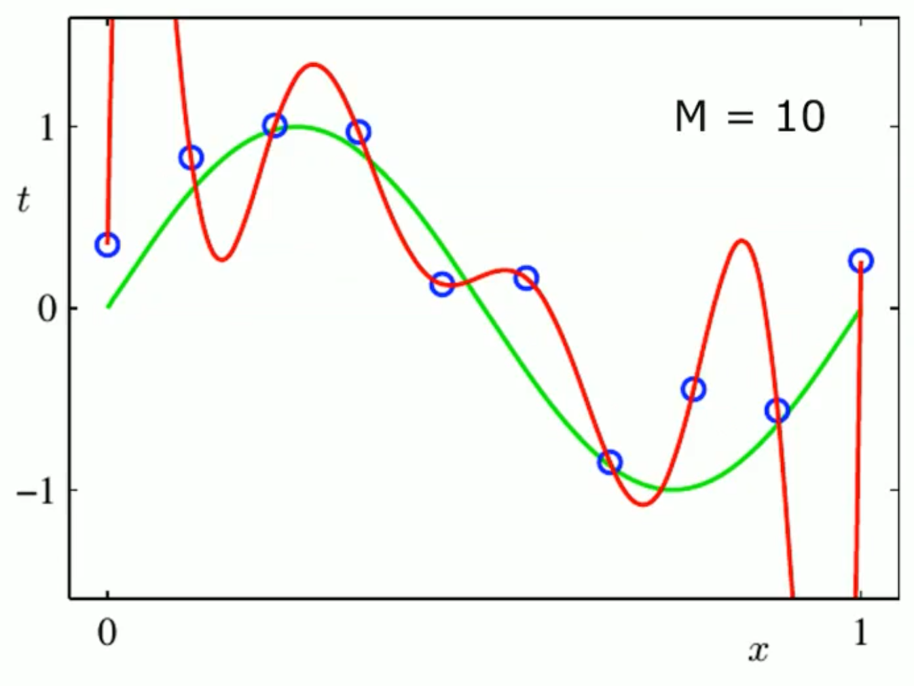

# Linear Regression

Regression: learning an approximation of function $f(x)$ that maps input $x$ and a **continuous** output $t$ . 

$$
\mathcal{D}=\{\langle x, t\rangle\} \Rightarrow t=f(x)
$$

In linear regression, $f(x)$ is modeled with linear functions which are easier and can be solved analytically.

Linear models are actually the foundations on linear models ... so don't worry if atm our approximation is at the moment a shit since we are 

$$
y={y}(\mathbf{x}, \mathbf{w})=w_0+\sum_{j=1}^{D-1} w_j x_j=\mathbf{w}^T \mathbf{x}
$$

where $w_0$ is called "bias parameter" . 

and a good loss function is: 

$$L(\mathbf{w})=\frac{1}{2} \sum_{n=1}^N\left(y\left(x_n, \mathbf{w}\right)-t_n\right)^2$$
(Sum of squared error)

Actually we need a model that is linear in the parameters!!

We can define a model using non-linear basis functions 

Same formula but applied on a basis function: 

$$y={y}(\mathbf{x}, \mathbf{w})=w_0+\sum_{j=1}^{D-1} w_j \phi_j(x)=\mathbf{w}^T \mathbf{\phi_j(x)}$$

In order to make my linear model work I don't need that that the linear model is linear with the input. 

A linear model is linear not on the input variable but linear on the parameter vector. 

I want to model  a regression model that is able to predict  a target variable given an input. 

A basis function is any function applied to the input vector. 

We have introduced a new feature. 

We are now in a "feature space". 

a basis function is a mathematical function that is used to transform the original input data into a new space of features. The new space of features is often higher-dimensional than the original space of features, and it is designed to capture more complex relationships between the input data and the output variable.

This is known as the "kernel trick", which is a common technique used in machine learning to transform the input data into a new space of features.

Some "general" , "common"  basis functions : 

Often, if you have a basis function that makes sense and is derived after consideration on the nature of the problem, then it is likely to be effective.

How to solve the optimization problem?? 

Compact way: 

$$
L(\mathbf{w})=\frac{1}{2} R S S(\mathbf{w})=\frac{1}{2}(\mathbf{t}-\mathbf{\Phi} \mathbf{w})^T(\mathbf{t}-\mathbf{\Phi} \mathbf{w})
$$

The target is always a scalar value!! 

How can I optimize this? Deriving. 

Just compute the first derivate and put it equal to zero like always. 

## Geometric interpretation of OLS 

$$y=w^t \phi (x)$$

but we can make a matrix $\Phi$ which represents all the features of the points. Where each row represent a sample and each column represent  all the values of the single feature computed over the dataset. So each column can be seen as $\phi _1$ . 

We have a target for each point of the dataset, and we can see the approximation as the attempt to predict $\hat t$  which is computed as $w^T \Phi$ . 

$$
\hat{\mathbf{t}}=\boldsymbol{\Phi} \hat{\mathbf{w}}=\boldsymbol{\Phi}\left(\boldsymbol{\Phi}^T \boldsymbol{\Phi}\right)^{-1} \boldsymbol{\Phi}^T \mathbf{t}
$$

We can see the linear combination of  each column $\phi _i$ as a subspace (in this case (with 2 vectors) is a plane). We are trying to minimize the squared error, which means we are trying to find the projection of the original target $t$ in the subspace. 

So the prediction $\hat t$ with OLS is just the projection on the subspace of the variable target $t$ . 

What happens if our regression problem has multiple outputs, i.e., t is not scalar. It is possible to solve independently a regression problem for each problem

from this: 

https://kwichmann.github.io/ml_sandbox/linear_regression_diagnostics/

Ordinary Least Squares (OLS) is based on the idea of minimizing the sum of squared residuals. Residuals are the differences between the actual and predicted values of the output variable. The **square** is just used to avoid discrimination between positive and negative "residuals".

But in practice we will use Least Mean Square LMS (sequential learning approach). This because the OLS is not feasible with large dataset. The LMS is a stochastic algorithm. 

Instead of trying to solve the equation to have the first derivative equal to zero with the "entire summatory" . I just try to focus on each data point. And I try to compute the gradient on just a single datapoint or a batch (subset) of datapoints. 

$$\begin{aligned} & L(\mathbf{x})=\sum_n L\left(x_n\right) \\ & \Rightarrow \mathbf{w}^{(n+1)}=\mathbf{w}^{(n)}-\alpha^{(n)} \nabla L\left(x_n\right) \\ & \Rightarrow \mathbf{w}^{(n+1)}=\mathbf{w}^{(n)}-\alpha^{(n)}\left(\mathbf{w}^{(n)^T} \boldsymbol{\phi}\left(\mathbf{x}_n\right)-t_n\right) \boldsymbol{\phi}\left(\mathbf{x}_n\right)\end{aligned}$$

 {width=50%}

{width=50%}

{width=50%}

Increasing the order of the polynomial model we are reducing the "smoothness" of the approximation. 

The size of the weights are indeed increasing with the incresing of the order of the polynomial model. 

To "fix" this we can use a "regulization" coefficient. That can be designed in different ways. 

- ridge regression: like a penalty term 
- lasso 

ridge:

$$
L(\mathbf{w})=L_D(\mathbf{w})+\lambda L_W(\mathbf{w})
$$
$$
\begin{gathered}
L_W(\mathbf{w})=\frac{1}{2} \mathbf{w}^T \mathbf{w}=\frac{1}{2}\|\mathbf{w}\|_2^2 \\
L(\mathbf{w})=\frac{1}{2} \sum_{i=1}^N\left(t_i-\mathbf{w}^T \phi\left(\mathbf{x}_i\right)\right)^2+\frac{\lambda}{2}\|\mathbf{w}\|_2^2
\end{gathered}
$$

The first loss function is used to measure and minimize the error on the data (RSS). The second loss function is not related to the data, but is related to the model complexity, that we want to minimize.

Lasso on the left, ridge on the right: 

--- Third lesson 

Same problem but from a different POV

Instead of looking the problem as an approximation with OLS. 

Maximum Likelihood ML is instead a probabilistic way

We define a probabilistic model that maps inputs ($x$) to outputs ($t$). 

Such probabilistic model, $y(x, w)$, will include some unknown parameters

The idea is to observe some points from the dataset and trying to create a model. 
Then, we model the likelihood, i.e., the probability that observed data D is
generated by a given set of parameters ($w$):

$$
p(\mathcal{D} \mid \mathbf{w})
$$

$$
\mathbf{w}_{M L}=\underset{\mathbf{w}}{\arg \max } p(\mathcal{D} \mid \mathbf{w})
$$

We will see our probabilistic model as: 

Given a dataset $\mathcal{D}$ of $N$ samples with inputs $X=\{\mathbf{x}_1, \ldots, \mathbf{x}_N\}$ and outputs $\mathbf{t}=\{\mathrm{t}_1, \ldots, \mathrm{t}_{\mathrm{N}}\}^{\top}$ :

$$
t_i=y(\mathbf{x_i}, \mathbf{w})+\epsilon=\mathbf{w}^T \boldsymbol{\phi}(\mathbf{x})+\epsilon
$$

Since the distributions are independent of each other, we can maximize them individually (rather than as a joint probability):

$$
p(\mathcal{D} \mid \mathbf{w})=p\left(\mathbf{t} \mid \mathbf{X}, \mathbf{w}, \sigma^2\right)=\prod_{n=1}^N \mathcal{N}\left(t_n \mid \mathbf{w}^T \boldsymbol{\phi}\left(\mathbf{x}_n\right), \sigma^2\right)
$$

It's easier analytically to maximize the log-likelihood:

$$
\ell(\mathbf{w})=\ln p\left(\mathbf{t} \mid \mathbf{X}, \mathbf{w}, \sigma^2\right)=\sum_{n=1}^N \ln p\left(t_n \mid \mathbf{x}_n, \mathbf{w}, \sigma^2\right)=-\frac{N}{2} \ln \left(2 \pi \sigma^2\right)-\frac{1}{2 \sigma^2} R S S(\mathbf{w})
$$

And if we try to optimize it: 

$$
\begin{aligned}
\nabla \ell(\mathbf{w})= & \sum_{n=1}^N t_n \phi\left(\mathbf{x}_n\right)^T-\mathbf{w}^T\left(\sum_{n=1}^N \boldsymbol{\phi}\left(\mathbf{x}_n\right) \phi\left(\mathbf{x}_n\right)^T\right)=0 \\
\end{aligned}
$$
We will obtain the same result of OLS: 

$$\begin{aligned}\mathbf{w}_{M L}=\left(\boldsymbol{\Phi}^T \boldsymbol{\Phi}\right)^{-1} \boldsymbol{\Phi}^T \mathbf{t}
\end{aligned}
$$

The obtained outcome is equivalent. So we can say that the assumptions made in the probabilistic model are also implicitly assumed when applying OLS regression. Specifically, in order to apply OLS, it is assumed that the data is generated by a linear function and that the residuals follow a normal distribution, which is the second assumption of Maximum Likelihood estimation. Consequently, it's not reasonable to assume that the residuals are not normally distributed, as this may lead to biased or unreliable results.

--- 

Bayesian Linear Regression

Bayesian statistics allows us to formulate our understanding of the world in a probabilistic way. We define a model with unknown parameters and specify a prior distribution to account for our uncertainty about them.

$$
p(\text { parameters} \mid \text {data })=\frac{p(\text { data } \mid \text { parameters }) p(\text { parameters })}{p(\text { data })}
$$

The posterior distribution for the model parameters can be found by combining the
prior with the likelihood for the parameters given data.

$$
p(\mathbf{w} \mid \mathcal{D})=\frac{p(\mathcal{D} \mid \mathbf{w}) p(\mathbf{w})}{p(\mathcal{D})}
$$

- $p(\mathcal{D} \mid \mathbf{w})$  is the likelihood: the probability of observing the data $D$ given some value of the parameters ($w$). 

- $p(\mathbf{w} | D)$ is the posterior probability of parameters $w$ given training data. 

- $p(D)$ is the marginal likelihood and acts as normalizing constant

In the general setting is difficult analytically to use this method. 
We can model the prior $p(w)$  as a Gaussian likelihood: 
$$
p(\mathbf{w})=\mathcal{N}\left(\mathbf{w} \mid \mathbf{w}_0, \mathbf{S}_0\right)
$$
And doing this also the posterior probability $p(\mathbf{w} | D)$  will be a Normal. 
$$
p\left(\mathbf{w} \mid \mathbf{t}, \mathbf{\Phi}, \sigma^2\right) \propto \mathcal{N}\left(\mathbf{w} \mid \mathbf{w}_0, \mathbf{S}_0\right) \mathcal{N}\left(\mathbf{t} \mid \mathbf{\Phi} \mathbf{w}, \sigma^2 \mathbf{I}\right)
$$

... CONTINUA  .. 

$w^*$ with ML is the same as the model with Bayesian Linear Regression.  
$$P(w \mid D) = N(w_N, S_N)$$
and we now that $\text{ argmax } N(w_N, s_N) = w^*$ which is the same as ML but it gives the information about the corresponding covariance matrix $S_N$ , so we know the complete distribution and we can make a confidence interval on the estimation. 

What about regularization? 

--- 

Iteratevely : 

How to exploit the Bayesian approach for sequential learning?
We compute posterior with initial data
When additional data is available, the posterior becomes the prior

Additional benefit of Bayesian Regression over Maximum Likehood. 

---

First practice lesson

Linear model, where $w$ are the parameters: 

$$
\hat{t}=y(\mathbf{x}, \mathbf{w})=w_0+\sum_{j=1}^{M-1} w_j x_j=\mathbf{w}^{\top} \mathbf{x}$$

Residual sum of squares (loss function, a way to evaluate the "quality" of my model): 

$$\qquad \operatorname{RSS}(\mathbf{w})=\sum_{n=1}^N\left(y\left(\mathbf{x}_n, \mathbf{w}\right)-t_n\right)^2
$$

Just a way to "see" the difference between my predicted target with the actual target.

outlier is a data which is completely different from any other data. It is removed. 

Data normalization 

z-score 

$\frac{s- \bar s }{S}$ for each data where $\bar s = \frac{\sum _i ^n s_i}{n}$  and $S^2 = \frac {\sum _i ^n (s_i - \bar s)^2}{n-1}$  . After this transformation the data will have mean = 0 and standard deviation equals  1.

Second approach is called min-max feature scaling is to have all the data between 0 and 1 without any specific distribution:

$$
\frac{s-s_{\min }}{s_{\max }-s_{\min }}
$$

Indices to evaluate the model : 

RSS (residual sum of squares). 

$$
\begin{aligned}
& \operatorname{RSS}(\mathbf{w})=\sum_{n=1}^N\left(\hat{t}_n-t_n\right)^2 \quad \text { where } \quad \hat{t}_n=y\left(\mathbf{x}_n, \mathbf{w}\right) \\
& \text { or: } \operatorname{MSE}=\frac{\operatorname{RSS}(\mathbf{w})}{N} \\
& \text { re Error: } \mathrm{RMSE}=\sqrt{\frac{\operatorname{RSS}(\mathbf{w})}{N}}
\end{aligned}
$$

Another important to evaluate the linear model is R-squared: 
(the coefficient of determination)
$$
R^2=1-\frac{\operatorname{RSS}(\mathbf{w})}{\mathrm{TSS}}
$$
where $\mathrm{TSS}=\sum_{n=1}^N\left(\bar{t}-t_n\right)^2$ is the Total Sum of Squares and $\bar{t}=\frac{1}{N} \sum_{n=1}^N t_n$

You happy when $R^2$ is close to $1$ . 

$dfe= N - M$ degree of freedom is the difference between the number of samples and number of parameters. 

--- 

Statistical Test on coefficients to evaluate the model. 

$t_n=\mathbf{w}^T \mathbf{x}_n+\epsilon_n$, 

$$
\frac{\hat{w}_j-w_j}{\hat{\sigma} \sqrt{v_j}} \sim t_{N-M},
$$
T-student distribution with dfe=N-M degrees of freedom. 

$$
\hat{\sigma}^2=\frac{\operatorname{RSS}(\hat{\mathbf{w}})}{N-M} .
$$

Then another test on the overall significance of the model 

"Machine Learning (ML) is used when you encounter a problem that requires learning from data and where you cannot directly compute the result using a precise algorithm. ML is particularly useful when the solution depends on individual users, requires prediction, or involves complex models that cannot be computed exactly."

When to use the methods? 

small number of parameters -> OLS since it's easy to compute.  

When performing Ridge regression you are performing a regularization with a specific $\lambda$ . So the eigenvalues for the modified matrix  $\phi ^T \phi + \lambda I$ will be not negative and will be greater of the regularization coefficients. 

--- 

07/03

SUM UP OF LINEAR REGRESSION with predective distribution

From the modeling pov:

- Model should fit all likely functions
- Prior should avoid small probabilities and spreading out probability

From a computational pov:

- Analytical integration only possible with conjugate priors for simple models
- Approximated approaches used for more general cases:
    - Gaussian (Laplace) approximation
    - Monte Carlo integration
    - Variational approximation

To move at the start of this chapter: 

Fixed -> features function decided at the start and "fixed", never change during the "training"/computation. 

Linear Models with Fixed Basis Functions:

Advantages:

-   Allow closed-form solutions
-   Tractable Bayesian treatment
-   Can model non-linear relationships with proper basis functions

Limitations:

-   Basis functions are not adaptive to the training data
-   These models suffer from the curse of dimensionality, meaning they can struggle with high-dimensional datasets.

# Exercitation 01 

**Linear regression** is a technique used to model the relationships between observed variables. The idea behind simple linear regression is to "fit" the observations of two variables into a linear relationship between them.

**feature vectors** are used to represent numeric or symbolic characteristics, called **features**, of an object in a mathematical, easily analyzable way.

feature vectors are the tools used between gathering data, and making sense of the data

The least square estimate of $w$ has the smallest variance among all linear unbiased estimates. But note there are maybe other biased solutions with smalle MSE (Mean Square Error, [ Inferenza parametrica](06.%20Inferenza%20parametrica.md)). 

A computer program is said to learn from experience with respect to some class
of tasks and performance measure, improves with experience;

this is one of the most formal definition for ML, provided by Mitchell, high-
lighting the central role of experience to solve a problem;

Machine Learning is the sub-field of Artificial Intelligence where the knowledge
comes from the use of experience to perform induction;

here we underline that the experience is able to generate some models which
are used to perform induction and use the learned models to generalize;

Machine Learning is the field of study that gives computers the ability to learn without being explicitly programmed 
this is one of the more informal definition for ML, provided by Samuel, high- lighting that with ML we are able to make inference from data without an explicit implementation of the procedure.

EXAMPLE

The loss function is a measure of how well a machine learning model fits the training data. In this case, the loss function is defined as $L(w|x_n,t_n) = |y(x_n,w) - t_n|$, where w is the model's parameters, xn is the input data, tn is the target output, and $y(xn,w)$ is the model's predicted output.

The Laplace Loss function is a type of loss function that is used to measure the errors between the predicted output and the actual output. Unlike the squared loss, which is differentiable everywhere, the Laplace Loss function is not differentiable at the origin. This means that there is no unique definition of its derivative at that point.

Furthermore, there is no closed form solution for the Laplace Loss function. A closed-form solution is a solution that can be expressed in terms of standard mathematical functions and operations. Because there is no closed-form solution, numerical methods such as gradient descent are often used to optimize the parameters of the model.

In summary, the Laplace Loss function is a non-differentiable loss function that does not have a closed-form solution. This means that numerical methods must be used to optimize the model's parameters.

A closed-form solution refers to a mathematical solution that can be expressed using a finite number of mathematical operations, such as algebraic equations, integrals, and derivatives.

No closed-form solution means -> it doesn't allow for the use of analytical methods to find the optimal parameters.

