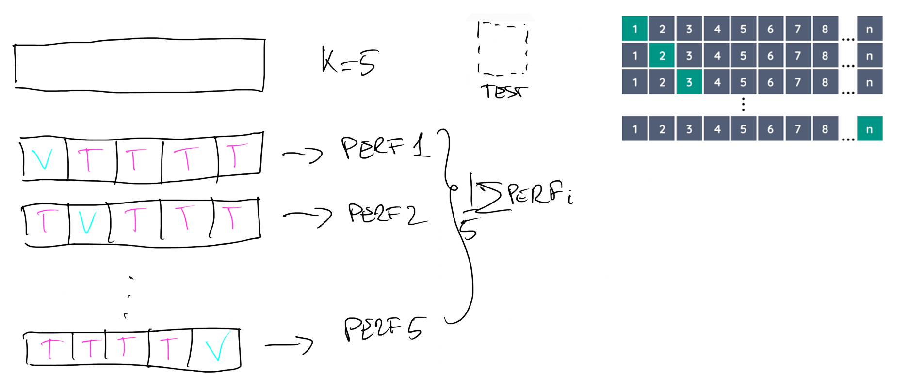

# Model Selection

# Training Error

Given a data set D with N samples, we can split it in a training set and a test set. To calculate the training error we have to choose a loss function(e.g. RSS). 

We can distinguish between

- Regression: $L_{\text {train }}=\frac{1}{N} \sum_{n=1}^N\left(t_n-y\left(x_n\right)\right)^2$
- Classification: $L_t \operatorname{rain}=\frac{1}{N} \sum_{n=1}^N\left(I\left(t_n \neq y\left(x_n\right)\right)\right)$

The training error measures how close our model is to training data. As we can imagine, increasing model complexity decreases the training error. But we also know that passed a certain complexity the generalization capability of our model will be decrease. So training error is not a good estimator of our model performance because is monotonically decreasing with model complexity, so it is an optimistically biased estimate of prediction error. Our objective is to estimate the true prediction error

- Regression: $L_{\text {true }}=\int(f(x)-y(x))^2 p(x) d x$
- Classification: $L_{\text {true }}=\int I(f(x) \neq y(x)) p(x) d x$

 
- Data is split randomly into a training set and test set. 
- The model parameters are optimized using the training set.
- The prediction error is estimated using the test set.
- Calculated with test set
- Important to not mix training and test set
- Estimation of prediction error

- Identifies possible problems:
    - High Bias
        - Training and test errors high and close
    - High Variance
        - Training error smaller and slowly approaches test error

{width=50%}

Only if test set is never used for training and model selection, it can provide an unbiased estimate of prediction error

### Data scarsity is a problem 

We split data in three parts: 

- Training Data: the sample of data used to fit the model
- Validation Data: the sample of data used to provide an unbiased evaluation of a model fit on the training dataset, while tuning model hyperparameters
- Test Data: the samples of data used to provide an unbiased evaluation of the final model fit

We use training data to learn model parameters and for each model learned (i.e., different features and hyperparameters) we use validation data to compute the validation error.  
We then select the model with the lowest validation error and finally use test data to estimate prediction error. 

In practice, the training set is used to learn the parameters, the validation set to tune the hyperparameter and the test set to evaluate the performance of our fit. Note that validation set can’t be use directly to estimate the error, because is used indirectly in the training phase.

The solution is to use cross validation. In practice we want to train the model on training set and evaluate it on the validation set. The novelty in the cross validation approach is that training and validation set are not fixed

7Every sample is used as training data and validation data in different phases of the learning process

## LOO (Leave One Out)

provides an almost unbiased estimate of prediction error (slighlty pessimistic) 

Unfortunately, LOO is extremely expensive to compute

Leave One Out is used when dataset is small and the models are simples (the computational complexity doesn't explode). 

## K-fold cross validation

We randomly split the training data 𝒟𝒟 into 𝑘𝑘 folds: 𝒟𝒟1, … , 𝒟𝒟𝑘𝑘  For each fold 𝒟𝒟𝑖𝑖 We train the model on 𝒟𝒟 − {𝐷𝐷𝑖𝑖} We compute the error on 𝐷𝐷𝑖𝑖

Finally, we estimate the prediction error as the average error computed:

$$
L_{k-fold}=\frac{1}{k} \sum_{i=1}^k L_{\mathcal{D}_i}
$$

provides a slightly biased estimate of prediction error (pessimistic) but it is much cheaper to compute

Usually we have $k  \sim 10$ .

If you want to evaluate the performances of a set of different models in case of large dataset this technique is preferable than LOO. 

## How to choose the right model complexity? 

Actually is not possible to choose the right model complexity is not formally possible. 

Complexity is related to the size of the problem space. 

The main challenges are:

- Computational cost 
- Amount of data
- large model variance (overfitting)

In ML we have "curse of dimensionality". It is related to the exponential increase in volume associated with adding extra dimensions to the input space. Working with high dimensional data is difficult because the variance of the model becomes larger -> So more computational cost. 

### Reducing the variance 

These three approaches are not necessarily mutually exclusive and they can be used toghether

- Feature Selection: we should design the feature space by selecting the most effective subset of all the possible features
- Dimensionality Reduction: the input space can be mapped to a lowerdimensional space
- Regularization: the values of the parameters are shrunked toward zero

feature selection in Machine Learning, where the goal is to select the most relevant features affecting the outcome of a model, and focusing on three methods: Filter, Embedded, and Wrapper. 

- Filter involves ranking features based on evaluation metrics and selecting the top k, but may miss interdependent features. 
- Embedded method selects features specific to the learning approach (lasso, decision trees etc)
- Wrapper uses a search algorithm to evaluate features by training models and assessing their performance. Greedy algorithms are generally used in Wrapper.

# PCA 

Improving the trade off between bias and variance:

- Bagging: reduce variance without increasing bias
- Boosting: reduce bias without increasing variance

# Bagging 

- Reduces variance
- Not good for stable learners
- Can be applied with noisy data
- Usually helps but the difference might be small
- Parallel by design

Bagging stands for Bootstrap Aggregation:

- Generate $N$ datasets applying random sampling with replacement

We do so by averaging multiple models together. 

In order to be able to apply this method we need to find a way to generate multiple models from one dataset. To do so we use bootstrap. This statistical technique consists in generating samples of size B (called bootstrap samples) from an initial dataset of size N by randomly drawing with replacement B observations.

In practice we want to average multiple overfitting model. From what we have studied before, an overfitting model has low bias and high variance. By combining different model we reduce the variance maintaining the low bias. In practice bagging almost always helps.

# Boosting 

- Reduces bias (generally without overfitting)
- Works with stable learnes
- Might have problem with noisy data
- Not always helps but it can makes the difference
- Serial by design

If learning algorithm is stable, changing input slightly won't put effect on the hypothesis. In unstable, it would. 

Sequentially means that we train a model based on the prediction of the previous. The steps to perform boosting are the following,

- Give an equal weight to all training samples 
- Train a weak model on the training set 
- Compute the error of the model on the training set 
- For each training samples increase its weight if the model predicted wrong that sample. Doing so we obtain a new training set. 
- Iterate the training on the new training set, error computation and samples re-weighting until we are satisfied by the result

The final prediction is the weighted prediction of every weak learner. In practice we are combining a set of sequential underfitting model. Doing so, we have low variance and the bias is improved by combining the weak learner to form a strong learner. On average, boosting helps more than bagging, but it is also more common for boosting to hurt performance

| Similarities | Differences |
| :---: | :---: |
| Both are ensemble methods to get "N" learners from "1" learner | but, while they are built  independently for Bagging, Boosting  tries to add new models that do well  where previous models fail.  |
| Both generate several training data sets  by random sampling | but only Boosting determines  weights for the data to tip the scales  in favor of the most difficult cases.  |
| Both make the final decision by  averaging the "N" learners (or taking the  majority of them) | but it is an equally weighted  average for Bagging and a weighted  average for Boosting, more weight to  those with better performance on  training data.  |
| Both are good at reducing variance and  provide higher stability | but only Boosting tries to reduce  bias. On the other hand, Bagging  may solve the over-fitting problem,  while Boosting can increase it.  |

a hypothesis space is the set of all possible models that can be learned by an algorithm. It represents the range of functions or mappings that the algorithm can choose from to make predictions based on input data.

For example, let's say we want to build a model that predicts whether a given email is spam or not. We could use a simple linear classifier as our hypothesis space, where each email is represented as a vector of features (e.g., number of exclamation marks, presence of certain keywords) and assigned a weight for each feature. The output would be either "spam" or "not spam" depending on whether the weighted sum exceeds some threshold.

Alternatively, we could use more complex models such as decision trees or neural networks with multiple layers and non-linear activation functions. These models have larger hypothesis spaces and are capable of capturing more intricate relationships between features in the data.
