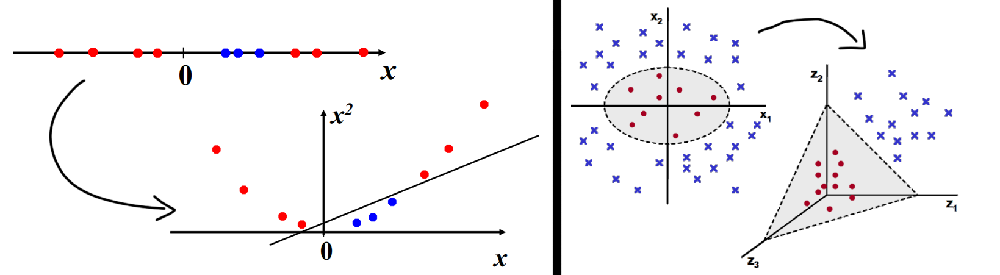
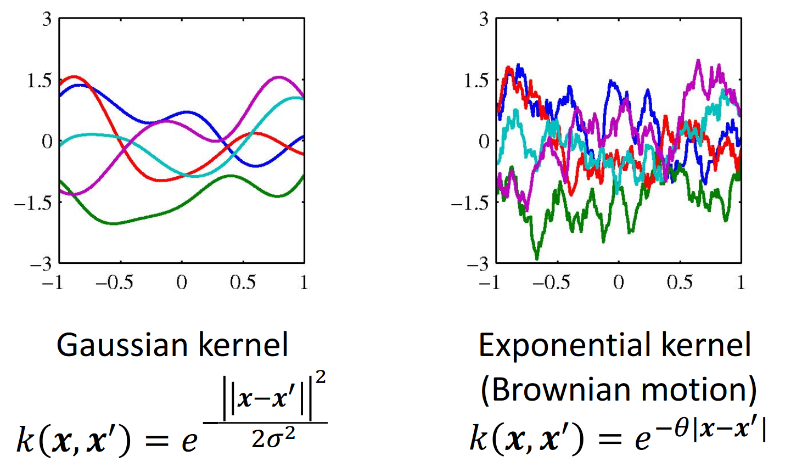
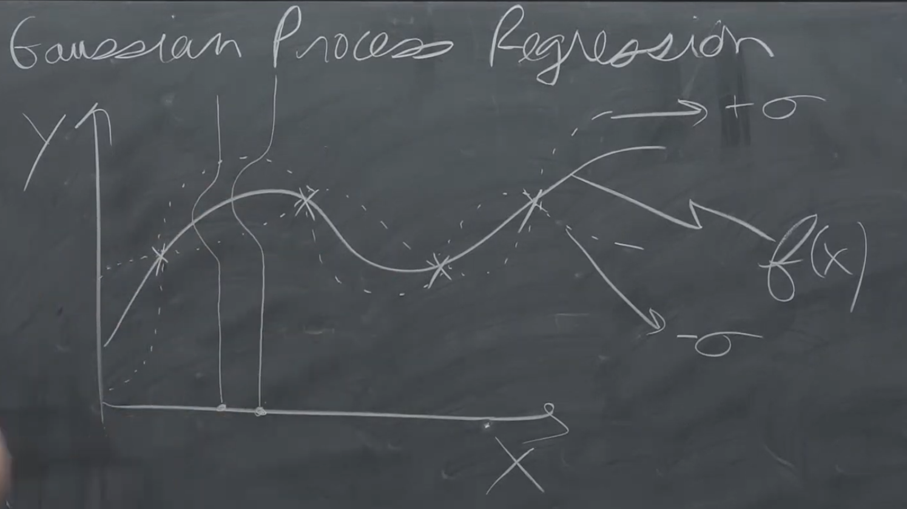

# Kernel Methods

Kernel methods are a family of **non-parametric** techniques.

With parametric method a certain hypothesis in the hypothesis space is defined by the combination of values of the learnable parameters. For example, linear regression is a parametric method, where each hypothesis is defined by the value of the parameters associated with each feature plus the constant term.

With non-parametric methods we have no explicit parameters. In parametric methods the training set is used in the training phase to learn the parameters. Then for the prediction phase the training set is not used because all the relevant information are encoded in the learned model.

Sometimes linear separators cannot be found in the input space in machine learning.
A solution is to map the input space to a feature space that allows a linear separator to be found. This can be done by adding features. 

But computing the feature mapping for a large number of input variables is computationally infeasible. This is where kernel methods come in, as they don't require explicit computation of the feature mapping. Although they are expensive, they are still computationally feasible.

The kernel function is defined as the scalar product between the feature vectors. 
This is useful since often it's possible to compute the Kernel functions without actually computing the feature vectors. 

$$k(x,x')=\phi (x)^T \phi (x')$$

Math trick 

It is possible to rework the representation of linear models to replace all the terms that involve 𝜙𝜙 x with other terms that involve only 𝑘𝑘 x,⋅

In other words, the output of linear model can be computed only on the basis of the similarities between data samples (computed with the kernel function)

Many linear models for regression and classification can be reformulated in terms of dual representation, in which the kernel function arises naturally. We want this in order to be able to apply the kernel trick. In practice we want to describe our model not using feature but with a kernel. For every linear model exist a dual representation involving kernels. Let’s take as an example ridge regression.

f the data is not linearly separable in the original, or input, space then we apply transformations to the data, which map the data from the original space into a higher dimensional feature space. The goal is that after the transformation to the higher dimensional space, the classes are now linearly separable _in this higher dimensional feature space_.

Kernel trick 

In real applications, there might be many features in the data and applying transformations that involve many polynomial combinations of these features will lead to extremely high and impractical computational costs.

The “trick” is that kernel methods represent the data only through a set of pairwise similarity comparisons between the original data observations **x** (with the original coordinates in the lower dimensional space), instead of explicitly applying the transformations _ϕ_(**x**) and representing the data by these transformed coordinates in the higher dimensional feature space.

Remember, our data is only linearly separable as the vectors _ϕ_(**x**) in the higher dimensional space, and we are finding the optimal separating hyperplane in this higher dimensional space _without having to calculate or in reality even know anything about ϕ(x)._

Dual representation Is computationally convenient when  is very large or even infinite

We can represent features expansion that include billions of elements with very simple kernel which need few operation to be computed. In this way we have constructed a memory based method which doesn’t use both features and weights, but it exploit the training data only to predict new samples.

Computationally speaking is very very conveniant. 

**Gaussian Kernel**

How to compute valid kernels 

g

### Exe notes 

video: 

With Gaussian Processes we model uncertainty with a Gaussian distribution. 

{width=50%}

The Gaussian process framework applies this approach to obtain a distribution over functions at every input point, which can be used to make predictions and quantify the uncertainty in those predictions.

What to do in the case the model you are considering is not performing well even by tuning properly the parameters (cross-validation)?
We have two opposite options:

- simplify the model
- increase its complexity
In the second hypothesis, one might see the problem in a more complex space:

- use handcrafted features
- look at the problem in the kernel space

Theorem Mercer’s theorem tells us that any continuous, symmetric, positive semi-definite kernel function $k(x, x_0)$ can be expressed as a dot product in a high-dimensional space. Since demonstrating the positive semi-finite function can be challenging ... we can make new kernels using the simpler and well-known kernels as **building blocks**. 
Given valid kernels $k_1\left(\mathbf{x}, \mathbf{x}^{\prime}\right)$ and $k_2\left(\mathbf{x}, \mathbf{x}^{\prime}\right)$ the following new kernels will be valid:

1) $k\left(\mathbf{x}, \mathbf{x}^{\prime}\right)=c k_1\left(\mathbf{x}, \mathbf{x}^{\prime}\right)$
2) $k\left(\mathbf{x}, \mathbf{x}^{\prime}\right)=f(\mathbf{x}) k_1\left(\mathbf{x}, \mathbf{x}^{\prime}\right) f\left(\mathbf{x}^{\prime}\right)$ where $f(\cdot)$ is any function
3) $k\left(\mathbf{x}, \mathbf{x}^{\prime}\right)=q\left(k_1\left(\mathbf{x}, \mathbf{x}^{\prime}\right)\right)$, where $q(\cdot)$ is a polynomial with non-negative coefficients
4) $k\left(\mathbf{x}, \mathbf{x}^{\prime}\right)=\exp \left(k_1\left(\mathbf{x}, \mathbf{x}^{\prime}\right)\right)$
3) $k\left(\mathbf{x}, \mathbf{x}^{\prime}\right)=k_1\left(\mathbf{x}, \mathbf{x}^{\prime}\right)+k_2\left(\mathbf{x}, \mathbf{x}^{\prime}\right)$
6) $k\left(\mathbf{x}, \mathbf{x}^{\prime}\right)=k_1\left(\mathbf{x}, \mathbf{x}^{\prime}\right) k_2\left(\mathbf{x}, \mathbf{x}^{\prime}\right)$
7) $k\left(\mathbf{x}, \mathbf{x}^{\prime}\right)=k_3\left(\phi(\mathbf{x}), \phi\left(\mathbf{x}^{\prime}\right)\right), \quad$ where $\phi(\mathbf{x})$ is a function from $\mathbf{x}$ to $\mathbb{R}^M$
8) $k\left(\mathbf{x}, \mathbf{x}^{\prime}\right)=\mathbf{x}^T A \mathbf{x}^{\prime}, \quad$ where $A$ is a symmetric positive semidefinite matrix
9) $k\left(\mathbf{x}, \mathbf{x}^{\prime}\right)=k_a\left(\mathbf{x}_a, \mathbf{x}_a^{\prime}\right)+k_b\left(\mathbf{x}_b, \mathbf{x}_b^{\prime}\right), \quad$ where $x_a$ and $x_b$ are variables with $\mathbf{x}=\left(x_a, x_b\right)$
10) $k\left(\mathbf{x}, \mathbf{x}^{\prime}\right)=k_a\left(\mathbf{x}_a, \mathbf{x}_a^{\prime}\right) k_b\left(\mathbf{x}_b, \mathbf{x}_b^{\prime}\right)$

Gaussian Process (GP) are kernel methods that can be applied to solve regression problems. 

$$\mathbf{C}_{N+1}=\left(\begin{array}{cc}
\mathbf{C}_N & \mathbf{k} \\
\mathbf{k}^{\top} & c
\end{array}\right)$$
The Gram matrix is a matrix built on the kernel of each pair of samples of the database, aka each scalar product between all the samples in the dataset, aka a matrix of similarites of pairs of samples. 
$$K=\left[\begin{array}{lll}
k\left(\mathbf{x}_1, \mathbf{x}_1\right) & \ldots & k\left(\mathbf{x}_1, \mathbf{x}_N\right) \\
\vdots & \ddots & \vdots \\
k\left(\mathbf{x}_N, \mathbf{x}_1\right) & \ldots & k\left(\mathbf{x}_N, \mathbf{x}_N\right)
\end{array}\right]$$

Note that is symmetric, since one of the properties ...

$$\mathbf{k}=\left(K\left(\mathbf{x}_1, \mathbf{x}_{N+1}\right), \ldots, K\left(\mathbf{x}_N, \mathbf{x}_{N+1}\right)\right)^{\top} \quad c=K\left(\mathbf{x}_{N+1}, \mathbf{x}_{N+1}\right)+\sigma^2$$

The magic to compute the mean of any new target and the covariance: 

- $m\left(\mathbf{x}_{N+1}\right)=\mathbf{k}^{\top} C_N^{-1} \mathbf{t}$
- $\sigma^2\left(\mathbf{x}_{N+1}\right)=c-\mathbf{k}^{\top} C_N^{-1} \mathbf{k}$

Where $k$ is the kernel between the new target and all the training data points (so a vector .. we have to keep in memory all the kernels ..), multiply it for the Gram matrix and for the original target. 

In a linear regression model even if we use the probabilistic view of the linear regression, we will have an average prediction and also some standard deviation around them which is exactly the same for each one of the points in our input space. In Gaussian processes the overall variance changes in every point. We have different confidence in different points in our input space, which is something we couldn’t do with a linear model.

Yes, that means function. This captured intuition that I want some function that are, in some sense, smooth. So functions such that, if I am evaluating this function, Y in similar points, XI&XJ, if xi is similar to XJ, then I want that the covariance between these two values is high. Is high, which sense, in the sense Of the kernels. Rernember, kernels are evaluating the similarity between two points.

Uh gum metrics, the structure in mediator. the gamma matrc is telling me that there will be a correlation between my dat a correlation whose amount is related to the values of the kernels. so the more my points are similar, the larger the kernel will be, because kernel is modern similarity, valid kernel is modest and therefore i am modeling the fact that there will be correlation in my data. my data must be similar. my y of x