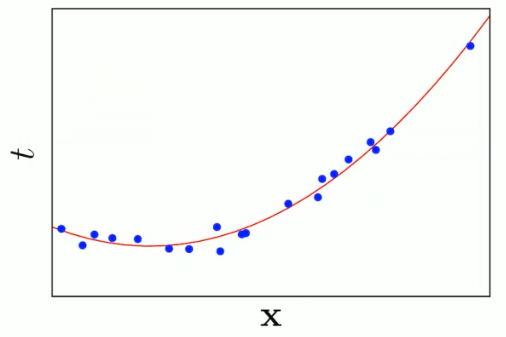
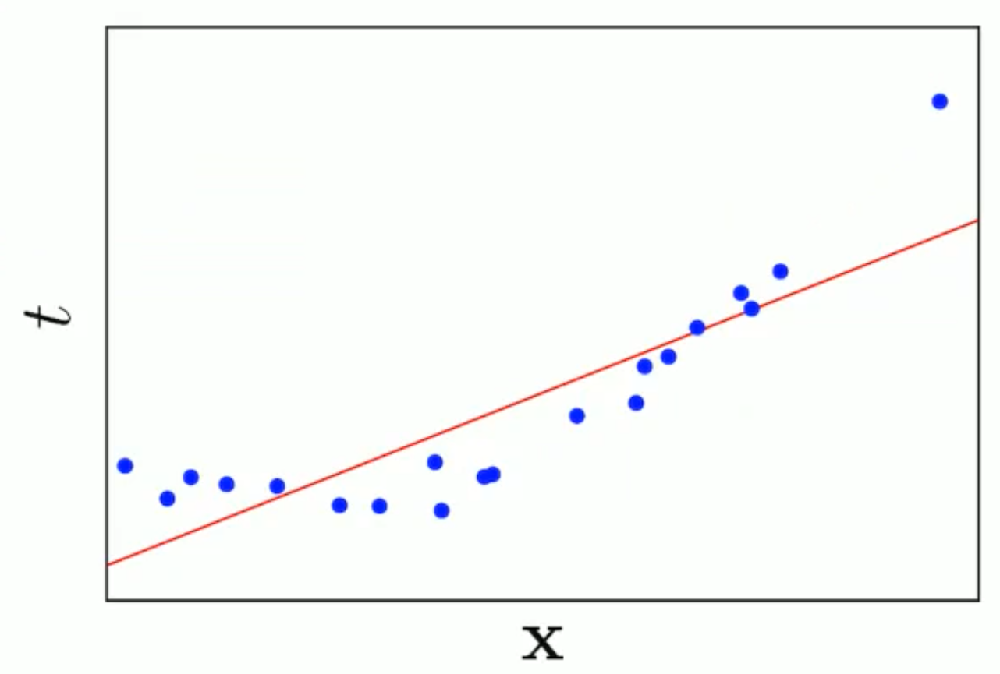
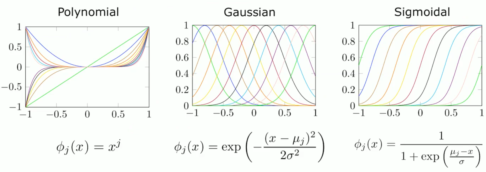

# Linear Regression

Regression: learning an approximation of function $f(x)$ that maps input $x$ and a **continuous** output $t$ . 

$$
\mathcal{D}=\{\langle x, t\rangle\} \Rightarrow t=f(x)
$$

In linear regression, $f(x)$ is modeled with linear functions which are easier and can be solved analytically.

Linear models are actually the foundations on linear models ... so don't worry if atm our approximation is at the moment a shit since we are 

$$
y={y}(\mathbf{x}, \mathbf{w})=w_0+\sum_{j=1}^{D-1} w_j x_j=\mathbf{w}^T \mathbf{x}
$$

where $w_0$ is called "bias parameter" . 

and a good loss function is: 

$$
L(\mathbf{w})=\frac{1}{2} \sum_{n=1}^N\left(y\left(x_n, \mathbf{w}\right)-t_n\right)^2
$$
(Sum of squared error)

Actually we need a model that is linear in the parameters!!

We can define a model using non-linear basis functions 

Same formula but applied on a basis function: 

$$
y={y}(\mathbf{x}, \mathbf{w})=w_0+\sum_{j=1}^{D-1} w_j \phi_j(x)=\mathbf{w}^T \mathbf{\phi_j(x)}
$$

In order to make my linear model work I don't need that that the linear model is linear with the input. 

A linear model is linear not on the input variable but linear on the parameter vector. 

I want to model  a regression model that is able to predict  a target variable given an input. 

A basis function is any function applied to the input vector. 

We have introduced a new feature. 

We are now in a "feature space". 

a basis function is a mathematical function that is used to transform the original input data into a new space of features. The new space of features is often higher-dimensional than the original space of features, and it is designed to capture more complex relationships between the input data and the output variable.

This is known as the "kernel trick", which is a common technique used in machine learning to transform the input data into a new space of features.

Some "general" , "common"  basis functions : 

Often, if you have a basis function that makes sense and is derived after consideration on the nature of the problem, then it is likely to be effective.

How to solve the optimization problem?? 

Compact way: 

$$
L(\mathbf{w})=\frac{1}{2} R S S(\mathbf{w})=\frac{1}{2}(\mathbf{t}-\mathbf{\Phi} \mathbf{w})^T(\mathbf{t}-\mathbf{\Phi} \mathbf{w})
$$

The target is always a scalar value!! 

How can I optimize this? Deriving. 

Just compute the first derivate and put it equal to zero like always. 

But in practice we will use Least Mean Square LMS (sequential learning approach). This because the OLS is not feasible with large dataset. The LMS is a stochastic algorithm. 

Instead of trying to solve the equation to have the first derivative equal to zero with the "entire summatory" . I just try to focus on each data point. And I try to compute the gradient on just a single datapoint or a batch (subset) of datapoints. 

$\begin{aligned} & L(\mathbf{x})=\sum_n L\left(x_n\right) \\ & \Rightarrow \mathbf{w}^{(n+1)}=\mathbf{w}^{(n)}-\alpha^{(n)} \nabla L\left(x_n\right) \\ & \Rightarrow \mathbf{w}^{(n+1)}=\mathbf{w}^{(n)}-\alpha^{(n)}\left(\mathbf{w}^{(n)^T} \boldsymbol{\phi}\left(\mathbf{x}_n\right)-t_n\right) \boldsymbol{\phi}\left(\mathbf{x}_n\right)\end{aligned}$

Geometric interpretation of OLS ??

 {width=50%}

{width=50%}

{width=50%}

Increasing the order of the polynomial model we are reducing the "smoothness" of the approximation. 

The size of the weights are indeed increasing with the incresing of the order of the polynomial model. 

To "fix" this we can use a "regulization" coefficient. That can be designed in different ways. 

- ridge regression: like a penalty term 
- lasso 

Lasso on the left, ridge on the right: 

