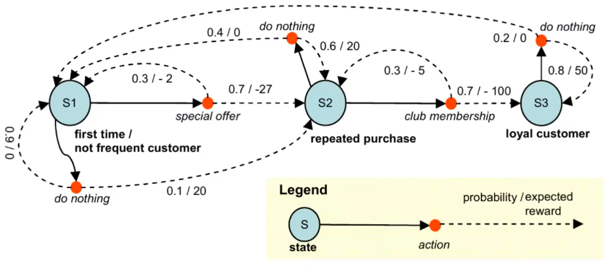

# Markov Decision Processes

Reinforcement Learning is a generalization of Machine Learning framework we seen so far which deals with a **sequential decision-making process**. ML problems like classification and regression lack of the **sequentiality** nature. In RL, each decision influences future decisions. The aim is to model process dynamics and choose from different actions in each situation.
Two different problems:

- **Prediction**: given a specific behaviour (policy) in each situation, estimate the expected long-term **reward** starting from a specific state.
- **Control**: learn the optimal behaviour to follow in order to maximize the expected long-term **reward** provided by the underlying process.

Markov Decision Process models states with possible actions, each with a probable reward.

First, we model the MDP as a tuple of six elements $\mathcal{M}:=(\mathcal{S}, \mathcal{A}, P, R, \mu, \gamma)$:

- **States**: $S$
- **Actions**: $A$ note that not all actions are possible in all the states
- **Transition model**: $P: S \times A \rightarrow \Delta(S)$ tells how the environment evolves after each action.  It's possible to rapresent it with a matrix. 
- **Reward function**: $R: S \times A \rightarrow \mathbb{R}$
- **Initial distribution** $\mu \in \Delta(S)$, we need $\operatorname{dim}(\mu)=|S|$ numbers to store it
- **Discount factor**: $\gamma \in(0,1]$

The agent's behavior is modeled by means of a policy $\pi: S \rightarrow \Delta(A)$. 
The policy can be both deterministic or probabilistic. 
Other interesting tools are: 

- $P^\pi\left(s^{\prime} \mid s\right)=\sum_{a \in \mathcal{A}} \pi(a \mid s) P\left(s^{\prime} \mid s, a\right)$ is the probability to reach state $s'$ given we are in state $s$ , so it's a function which maps state. 
- $R^\pi(s)=\sum_{a \in \mathcal{A}} \pi(a \mid s) R(s, a)$ expected reward you will ever get from state $s$ . Formula based on the expected value of the reward function. 

The **Bellman** expectation equation: 

$$\begin{aligned}
V^\pi(s)=\mathbb{E}^\pi\left[\sum_{t=0}^{+\infty} \gamma^t R\left(s_t, a_t\right) \mid s_0=s\right] & =\sum_{a \in \mathcal{A}} \pi(a \mid s)\left[R(s, a)+\gamma \sum_{s^{\prime} \in \mathcal{S}} P\left(s^{\prime} \mid s, a\right) V^\pi\left(s^{\prime}\right)\right] \\
& =R^\pi(s)+\gamma \sum_{s^{\prime} \in \mathcal{S}} P^\pi\left(s^{\prime} \mid s\right) V^\pi\left(s^{\prime}\right)
\end{aligned}$$

The value function is a mathematical tool which is used to encode the notion of performance in RL. The expected value of the sum over an infinite horizon of the reward function. Discount factor $\gamma$ regulates the weight given to future rewards. 

We can invert the matrix (computationally costly) and say: 

$$V^\pi=\left(I-\gamma P^\pi\right)^{-1} R^\pi$$

or we can simply approximate the $V^{\pi}$ in an **iterative** and **recursive** way: 

$$V^\pi=R^\pi+\gamma P^\pi V^\pi$$

