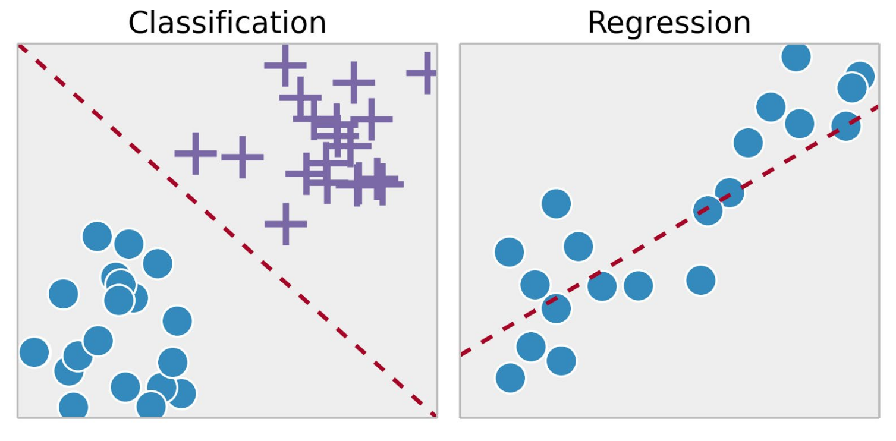

## Supervised 

It is the most popular and well established learning paradigm

The goal is to learn a good approximation of an unknown function that maps an input x to an output

This function can be seen as a mapping. Possible types of mapping: 

- [Linear Regression](Linear%20Regression.md) 
- [Linear Classification](Linear%20Classification.md) 
- Probability estimation

Supervised learning can be used every time we can't clearly explain which is this function. Why shouldn't we know what this function looks like? 

- human cannot perform the task (DNA analysis)
- human cannot explain a clear algorithm (medical image analysis)
- the task continues to change over time (stocks price prediction)
- the task is user-specific (recommender system)

We want to approximate a function $f$ : 

- Loss function: a function which says "how much is good the approximation (called $h$) of $f$?"
- Hypothesis space: you restrain yourself to a subset of the set of all possible function $f$ 

The problem is to design correctly a loss function. 

Elements of Supervised Learning Algorithms
Representation
Evaluation
Optimization
