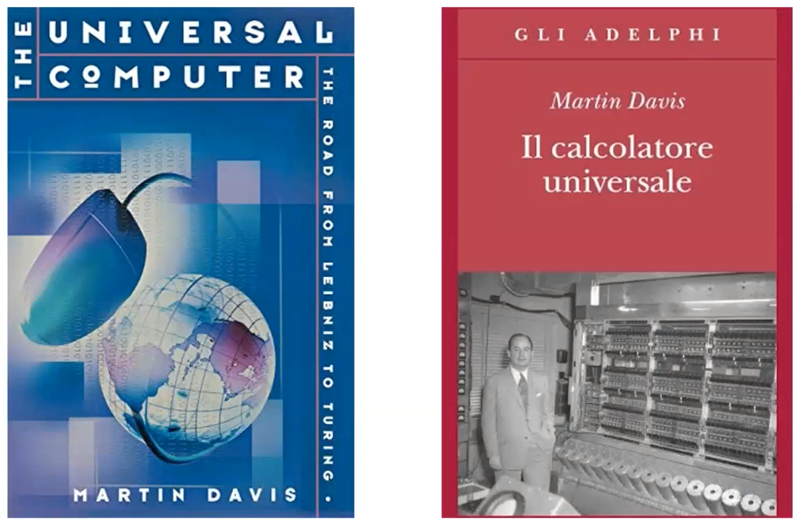
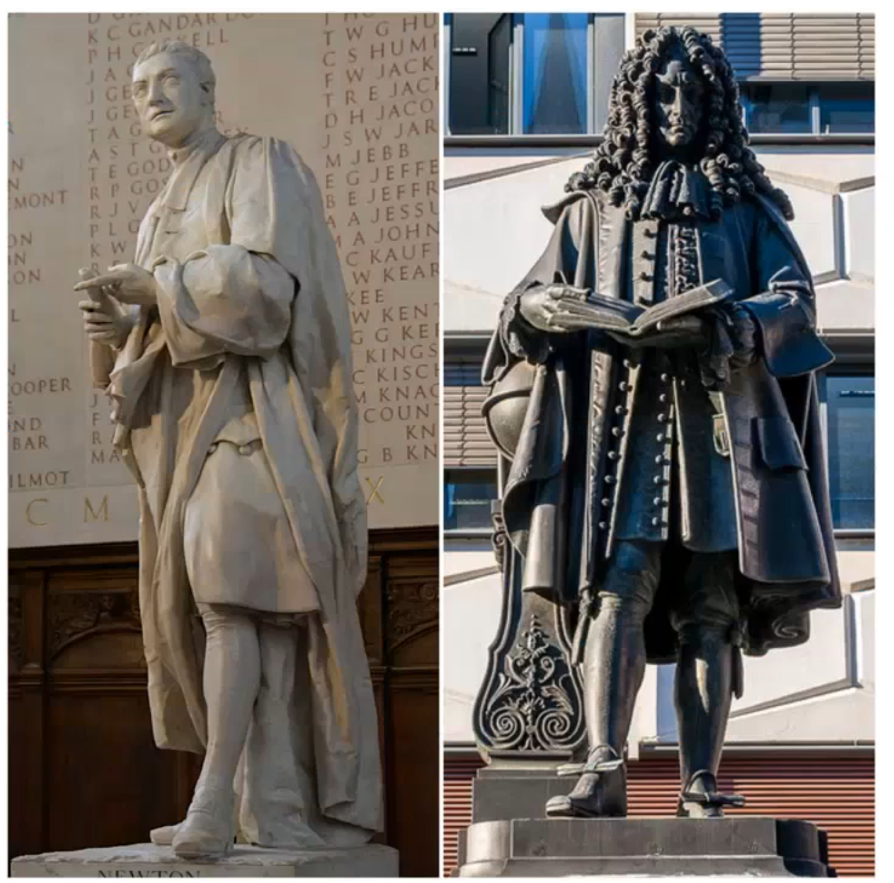
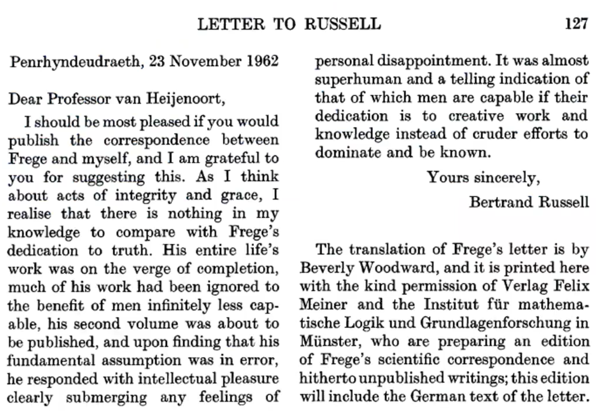
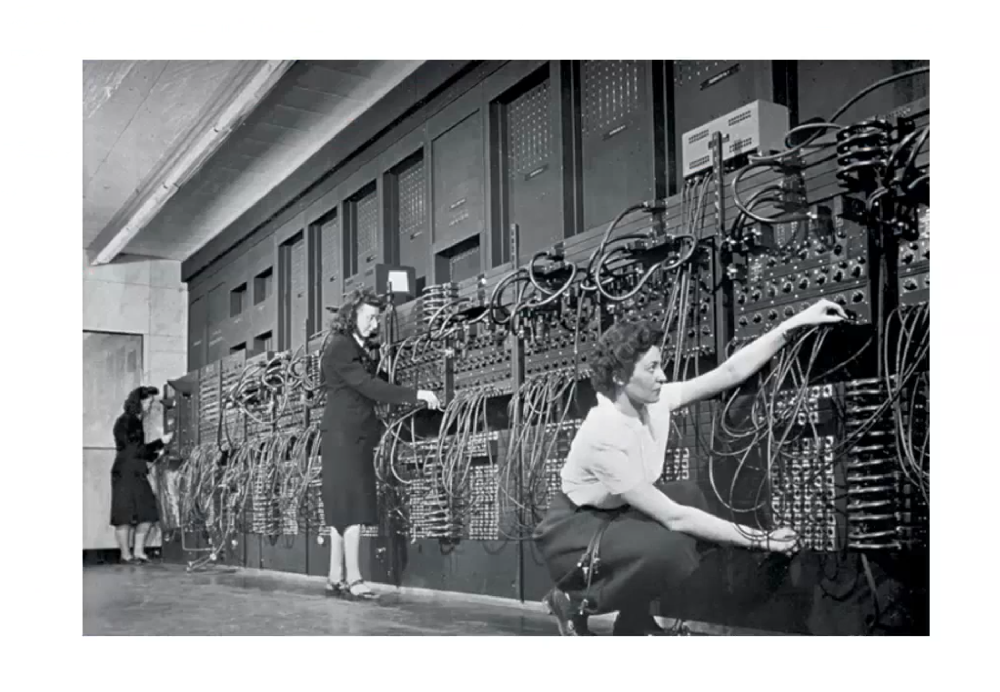

I want to focus on some kind of historical background but as I'm not a historian of science and technology I will give you a kind of philosophical overview of this history.

The history of computing has its roots in various fields such as philosophy, mathematics, and logic. While some approaches focus on the mathematical aspect of computing, others emphasize the engineering aspect. One example of an often-overlooked aspect of computing history is the attempt to find a way to represent reasoning. This is significant because reasoning has long been regarded as a distinctive human characteristic. Raymond Roule, a philosopher from Spain, created a primitive method of knowledge representation known as Ars Magna, which aimed to produce new knowledge using symbols and numbers. The machine was not just a way of representing information but a tool for generating new knowledge. Roule called it "a technique to find new truth," or nars imbeniendi veritade. Although it is uncertain whether the machine was ever built or how it was used in practice, this primitive knowledge representation system laid the groundwork for the development of computing and the idea of representing and reasoning on knowledge.

## Pascal 

I'm mentioning a mathematician, a philosopher living more or less the same period and also in the same country, so in the same cultural context.

But here I will mention Pascal for the invention of the **first mechanical calculator**.

it's important to understand that this mechanical calculator at least at the beginning was not invented for practical reasons.

This is a key point.

Why it's a key point? Because here the mechanical calculator was just invented as a kind of game and indeed it was used as a kind of way of like making some kind of fun during parties or kind of recreational contexts.

Why? Because here the point was not to prove that you can just delegate some calculations to machines or the idea was not to have something to have humans in doing that but it was like a more conceptual attitude with respect to this idea and the conceptual attitude was let's see whether something that so far was considered purely human in this essence like to make calculations as a purely human activities let's see whether this can be delegated to a machine or not.

So I hope you can see that now today we are exactly doing the same in a context in which we live.

And I guess there are many typical examples so I'm not just discussing of tools that can help us in our daily activities and they can support us in decision making or suffering.

I'm seeing like the mechanical calculator exactly now today we can see exactly ChatGpt in the sense of having some kind of fun.

Of course then there are also many worries about the consequences of introducing tools like this in everyday activities but also I see like the same line of thought the idea the kind of surprise that we human beings have with respect to the possibility that machines can do something that we did believe that was just only possible for humans.

- In the 17th century it was mechanical very simple mechanical calculator.

- Today it's a very sophisticated kind of artificial intelligence tool that can answer questions, write poems, of course write quite good philosophical essays and stuff like that.

But this is important because this was not a tradition in which people want to solve practical problems.

So it was like sort of prodigy rather than a real instrument.

Like in some way ChatGpt. 

--- 

The paradoxoscope was invented in the 19th century. Prior to that time, those who studied natural philosophy were referred to as "philosophers of nature."

Aphilosopher of nature Thomas Hobbes and again the idea of reasoning.

He's the idea of reasoning as a way of combining representations.

So this is a game in line with Raymond Lune and that type of tradition.

Of course Hobbes is very well known as a political philosopher rather than a philosopher of nature.

But here for us it's important also to consider him as a person conceptualizing this idea of reasoning as putting together different representations.

--- 

Because we can see that Leibniz has been the first one in the modern history to emphasize that reasoning is a form of calculus okay.

And again this is nothing new of what today is labeled as computationalism.

And we see that computationalism means today that there are many people philosophers scholars computer scientists that think that reasoning and intelligence is a form of computation.

Because Leibniz had a major philosophical project and was the project of mechanizing rationality.

So the original idea was let's find a way to represent knowledge. 

So logic was is of course a good tool and I think you learn also about logic here sometimes and see how logic can be used to represent knowledge.

So why is it a good tool? What is the legal of the tool? It allows a kind of automatic reduction for instance that we can have a rule in some cases that something is possible or impossible under certain circumstances.

Inference 

Exactly so it's a way of preserving the truth of your starting point.

Okay so if your starting points like the premises of formal reasoning are true then in that particular inference that is called **deduction** the conclusion must be true necessary.

So second point why do we use logic and other formal meaning or other formal tools?

Because it's not ambiguous.

what else? 

So we want to have a language that is expressive enough so you can express what is important for you but it's not ambiguous and it's not too complex.

We want to have, produce new knowledge.

Have the guarantee that this new knowledge is true.

Then have a language that is not ambiguous but also it's expressive enough 

His project was mostly conceived as a two-step project.

It was like first step is to find that language able to represent in anonymous videos but express it in a way all human knowledge 

and then to have by means of this representation a way of producing new knowledge that was the calculus of searching out on.

And before I can give you a little bit about the details of this project I have to say that this was a dream and Leibniz was not able to achieve this thing 

Why? Because logic was not formalized enough in the sense that Aristotle and other Greek philosophers after Aristotle invented the idea of logic as connecting and subbing the part of this course okay so it was not formalized okay it was qualitative type of logic

At the meanwhile Leibniz very ambitious project was exactly this this is a very famous quotation: 

you can see first of all the idea of philosophers as calculators so reasoning is not more than a calculus and the idea to just solve all the controversy okay all the controversies not by means of any kind of subjective discussions but by means of calculations why because why is calculations there's no ability there's no subjectivity it's just that numbers can be understood by anybody the same way so that's a way to solve in a definitely way the controversies.

I cannot avoid to see a sort of reflection of personal problems and personal attitudes (problems with Newton controvercy)

Leibniz immediately stopped to the problem of having a good representation of of knowledge.

let's try to investigate 
what is reasoning 
what is human reasoning 
what are the core elements of reasoning 

--- 

Charles Babbage that was a mathematician and an engineer he lived in England in the 19th century 

one of the first ones to move from the idea of a calculator as a prodigy to the calculator as useful tool 

and why because this was a tool to calculate the logarithmic table 

Humans who performed calculations were called computers. In Turing's 1950 paper where he describes the Turing test, when he used the term "computers," he was actually referring to humans, but he wanted to emphasize that he was discussing machines or digital computers. These people made a living by performing calculations professionally. Babbage had the idea that machines could be used to perform these calculations and could avoid the problems caused by human errors, boredom, and fatigue, which occur when a large number of humans are involved in the calculations.

Babbage thought about the analytical machine which remained just a project 

Babbage's um ambitious was uh again an ambitious that was at the time un-unsolvable uh because uh uh this time for financial support 

okay so the analytic machine uh was not uh built um in the mid-ranks um 

Leibniz's dream and the dreams of other can become reality so this is the event of modern logic as formal logic. 

Boole a first step towards algebrization of logic. 

But then Frege (1876) his idea of a format system 

the overall project was to try to find the conceptual foundations of mathematics so this is a key point and please remember this is the key point that also Turing had when he started his career in the 1930s the problem was not a practical one but was a kind of philosophical one because it's not even mathematical one in a sense was how can we say that mathematics is based on secure foundations it's strange because mathematics it's in a sense it's not ambiguous and it adds some properties that uh we discussed but the point was okay what are the core conceptual elements of mathematics okay and 

Frege spent and he in time life in analyzing this problem and again he had a dream and the dream was to try to adapt mathematics logic 

Reduction of mathematics to logic (1893)

Frege spent his life writing his masterpiece 

when he published the book, he received a very nice letter very polite letter and this was a letter of a mathematician a young mathematician british mathematician his name was back in russell -> 

Russell's antinomy 

> " Let's imagine you're in the process of publishing the book of your life. You've spent years of hard work on this book, and you're a well-known figure in your field. One day, you receive a letter from a young person you've never met, who provides feedback that completely destroy your understanding of your work. While most of us might dismiss such feedback but Frege was dedicated to the pursuit of truth, and even when his entire life's work was on the verge of completion, he was willing to accept the possibility that he may have been wrong. "

In fact, when he discovered that his fundamental assumption was in error just as his second volume was about to be published, Frege responded with a level of intellectual honesty that was almost superhuman. He didn't let personal disappointment or feelings of failure overcome him, but rather submerged them with a dedication to knowledge and creative work. 

Frege even added a section to the very end of the book, acknowledging the possibility that his work might be wrong. This was not entirely true, as Frege's work was foundational in the field of mathematics in the early 20th century, and many others were building on his theoretical framework to solve problems of continuity.

----

Hilbert

Basically all mathematicians were working to try to solve this problem and the problem was "okay how is it possible to find concepts that are strong concepts and ideas that are at the roots at the basis of mathematics"

The decision problem so and the problem was to find a general mechanical procedure uh which for any formal extreme system and then formula this mechanical procedure can decide if the formula can be derived from the axioms in the logical calculus

Hilbert was very well recognized very famous he did the list of mathematical problems.

Meanwhile Turing started the study mathematics so he was brilliant and so he wanted to work on one of these problems and this is exactly uh the result of uh this famous paper uh that is basically what we can say today the doctrine thesis okay of of of Turing uh this is a paper published in 1936 on Computable Numbers and basically Turing. 

The Turing machine the model the conceptualization of Turing machine that is described in this paper is a way to provide a formal definition of algebra okay so the Turing machine is the first together with another formal definition the same year you know the same year in 1930s 

Meanwhile Church and Von Neumann provided completely equivalent formalizations. 

The Turing machine is exactly this kind of formalization 

This was first of all a mathematical problem and um the mathematical problem in a sense again started from a sort of philosophical one and it's not by chance that this paper uh that Turing published in 1950 one year before his death was published on a very well-known philosophical journal "Mind".

Turing started with the idea of the uh Turing machine from trying to provide a model of the computers of the human computers so of the people doing calculations and so this model is a model of human making these calculations okay and this is of course quite interesting because Turing emphasizes that the human computer follows the world blindly without using any insight or ingenuity so without using any creativity. without using any kind of subjective and creative thought it just blindly that's the world and the human computers just follows the rule. This is a key point and the key point and we'll see later on in this course whether this kind of model is a model of human beings in general so you can see okay human beings are just computers and everything that we do in the end in the end can be reduced to our computational abilities that sort of computationalism approach I was mentioning or whether this is just a part of human nature like okay we can do calculations we are computers while doing the calculations but we can also can be recognized as something different okay so there's more and we'll see how this can be a good thing to discuss. 

End of the story (semplification) a level. 

So this is the moment in the 1940s in which the two research traditions met this was the engineering tradition you can see that these were like rules okay uh instead of small machines not very powerful but it's also true that this paper we will analyze who left this paper by Turing it's a paper that uh which Turing is very well aware of these machines why because also he played a role and for example he played a role in the design of the computer the Manchester paper that was built in UK okay so he was very well aware of this engineering tradition.

