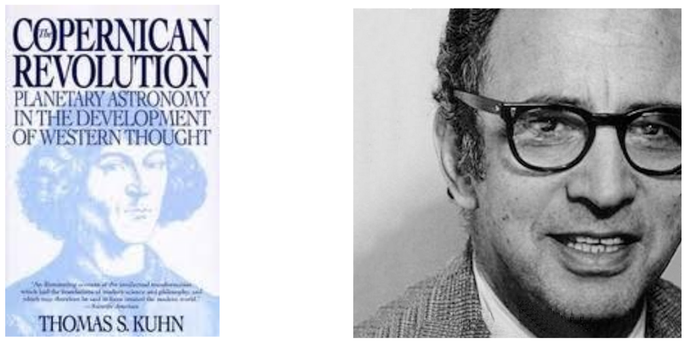

# Philosophical and historical analysis of science, technology, and engineering

So basically what computer science is and we have already discussed many different positions like, is it more science or engineering technology is just a branch of mathematics and software.

But about grey areas (in the past: classification of economics and psychology; in the present: classification of anthropology)

The boundaries of what constitutes an experiment in different fields, such as mathematics and economics, are not well-defined. While mathematics does not make use of experimentation, it is still considered a science because it can provide proof without the need for experimentation. Economics is also considered a science due to its mathematical basis, although the study of human behavior in economics may be less scientific. 

Which kinds of activity count as science?

A scientific theory needs to rely on natural evidence or if it can be based solely on theory? As in the case of Charles Darwin's "Origin of Species," which does not make use of mathematics.

The definition of science and what constitutes an experiment can be a slippery concept, and references a book by Galileo, which is considered a milestone in the scientific revolution despite not containing any mathematical formulas.

How does science work?

- Empiricism: Empiricism as a source of knowledge; Science and empiricism; Limits of empirical tests; Experience over reasoning.
- Mathematics: Empiricism as a source of knowledge; Science and empiricism; Limits of empirical tests; Experience over reasoning.
- Social structure and science: Science's success stems from its unique social structure of elaborate networks of cooperation and trust, a balance of cooperation and competition, and new ways of policing and coordinating groups of people in research.

## Kuhn’s The Copernican Revolution (1957)

{width=50%}

Thomas Kuhn, "The Structure of Scientific Revolution," which discusses the Copernican Revolution and its significance in the history of science. 

Kuhn's book provides a valuable framework for understanding these revolutions and the social, cultural, and political factors that shape scientific knowledge.

Starting from astronomy and ending in physics

In his 1957 book, "The Copernican Revolution: Planetary Astronomy in the Development of Western Thought," Thomas Kuhn explores the impact of the Copernican revolution on the development of Western thought. Kuhn argues that the Copernican revolution, which replaced the Earth-centered Ptolemaic system with the sun-centered Copernican system, was not just a scientific revolution but also a paradigm shift that fundamentally altered the way people viewed the world. He explores how the Copernican revolution challenged the dominant Aristotelian worldview and paved the way for modern science. Kuhn also examines the social and cultural context of the Copernican revolution and how it was received by the scientific community and society at large. The book is considered a landmark in the history and philosophy of science, and Kuhn's concept of scientific paradigms has had a significant influence on subsequent scholarship in the field.

### Ptolemy

Ptolemy later provided a precise and mathematically powerful model of the universe based on Greek philosophy and culture (it was an Aristotelian model) where the most perfect bodies were considered those that did not move, and any movement was seen as imperfect. Greeks believed that uniform circular motion was the closest to perfection, and this belief played a major role in astronomy. They had a model that explained celestial motion as uniformly circular, but this did not explain some planetary movements. 
The Ptolemaic system was based on mathematical precision, it worked very well but it was very complex. 

Copernicus and other astronomers, provided a simpler and more elegant explanation for celestial motion. 
Despite the strong opposition from the Catholic Church and others, the heliocentric theory gradually gained acceptance, and it paved the way for other scientific revolutions that transformed our understanding of the world and the universe. 

The Copernican Revolution marked a paradigm shift in the history of science, leading to a transformation in theory, methods, practices, and instrumentation, and it also had important social implications. 

### Copernicus

The Copernican Revolution challenged the Ptolemaic system. 

In the early modern period, Copernicanism revolutionized our understanding of the universe by presenting the idea that the sun, rather than the Earth, was the center of the solar system. However, it was not only the shift in perspective that made Copernicanism such a significant development, but also the emphasis placed on finding mathematical harmony in the heavens, which was inspired by the philosophical school of Neoplatonism.

Neoplatonism emphasized the idea of simplicity and mathematics as the foundations of the universe. This perspective was rooted in the ancient philosopher Plato's ideas about the existence of abstract mathematical concepts as the ultimate reality, and was revived during the Renaissance as part of a broader fascination with classical thought.

This focus on mathematical harmony led to the discovery of the elliptical orbits of planets and the formulation of the three laws of planetary motion by Johannes Kepler. These laws, which described the mathematical relationships between the movements of planets, allowed for a massive simplification of the understanding of the cosmos, and improved the accuracy of predictions about planetary motion.

The emphasis on simplicity and mathematical harmony in the study of the heavens reflected a broader trend in early modern science towards the use of mathematics as a tool for understanding the natural world. By relying on mathematical principles to describe the physical world, early modern scientists believed they could uncover deeper truths about the universe.

### Kepler's Astronomia Nova (1609)

In conclusion, the combination of Copernicanism with the obsession of finding mathematical harmony in the heavens was a crucial development in the history of science. This approach was rooted in the philosophical ideas of Neoplatonism, which emphasized the importance of simplicity and mathematics in understanding the universe. The discovery of the elliptical orbits and the formulation of Kepler's laws marked a significant shift towards the use of mathematics as a tool for understanding the natural world. The focus on mathematical principles continues to be a central feature of scientific inquiry today.

### Galilei’s Sidereus Nuncius (1609-10)

The use of the telescope to observe the heavens marked a major turning point in the history of science. This breakthrough allowed astronomers to observe a multitude of phenomena that contradicted the Aristotelian view of the world. For instance, according to Aristotle and Ptolemy, celestial bodies were perfect spheres, but observations with the telescope revealed otherwise. The moon, for example, was observed to have holes and craters, indicating that it was not perfect as previously believed.

Another significant observation made with the telescope was the existence of subtle lights on planets like Jupiter, which were previously not visible to the naked eye. This observation challenged the idea that the earth was the center of the universe, as it was previously believed that the earth was the only celestial body with a subtle light - the moon. Furthermore, Galileo's observations of sunsets and sunrises on the moon showed that the same processes and phenomena occurred on the moon as they did on earth. This discovery undermined the Aristotelian view of a clear distinction between supralunar and sublunar regions.

The use of the telescope led to a revolution in astronomy and challenged the traditional ideas of the universe's structure. It prompted the need for a new science that could explain definitively some astronomical problems, such as the motion of planets. The observations made with the telescope marked a shift from relying on theoretical speculation to empirical evidence, which became the hallmark of modern science.

Overall, the use of the telescope to observe the heavens allowed for a deeper understanding of the universe's structure and function, and led to the development of new theories that continue to influence scientific thought to this day. The telescope remains a vital tool in modern astronomy, and its continued use promises to reveal even more about the mysteries of the universe.

Mathematics is a key part of science and one of the three major answers to the question of how science works. The idea is that mathematics provides a precise and logical language that allows scientists to make accurate predictions and test their theories. This approach is often associated with the work of Galileo and Newton, who used mathematical models to explain physical phenomena. However, the book also notes that mathematics alone cannot fully capture the complexity of natural phenomena, and that empirical observation and experimentation are still necessary.

