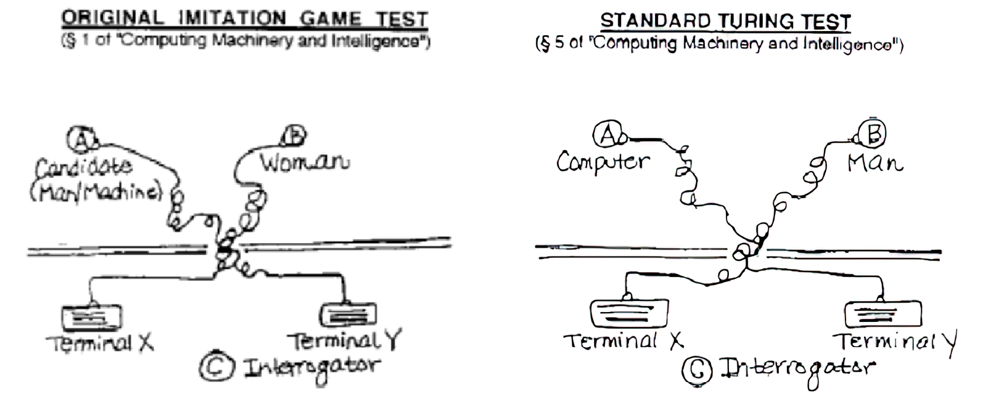

# Machine and Thought: The Turing Test

The article "Computing Machinery and Intelligence" (1950) proposes the concept of the Turing test as a starting point for exploring the relationship between **machine and thought**. 
Turing points out the difficulty of defining intelligence and determining the nature of thinking. This leads to ambiguity and the absence of a definitive answer. 
**Turing suggests a game-like format to clarify and avoid ambiguity in addressing the issue.**

## The imitation game

There are three players: 

- A: a man  
- B: a woman 
- C: an interrogator 

C stays in a separate room and doesn't know A and B's identities. C needs to discern A and B's genders only through questioning. **A**'s goal is to **deceive** C, while **B**'s goal is to **help** the interrogator.
Turing proposes a different approach to solve "Can machines think?" using a game-like format, that allows for more clarity and avoids ambiguity. Turing had an engineering attitude. He justified this shift from a philosophical question to a more quantifiable one, by wanting a question that could be answered with a clear yes or no and a measurable comparison.

> What will happen when a machine takes the part of A in this game? Will the interrogator decide wrongly as often when the game is played like this as he does when the game is played between a man and a woman?

The question is whether a machine can replace a human, specifically in playing a game, and whether its ability is comparable to that of a human.
Digital computers that have a store, executive unit, and control are considered as potential candidates for performing well in such a game. 

> Are there imaginable **digital computers** which would do well in the imitation game? Let us fix our attention on one particular digital computer C. Is it true that by modifying this computer to have an adequate storage, suitably increasing its speed of action, and providing it with an appropriate programme, C can be made to play satisfactorily the part of A in the imitation game, the part of B being taken by a man?

Turing answered:

> I believe that in about fifty years’ time it will be possible to programme computers to make them play the imitation game so well that an average interrogator will not have more that 70 per cent chance of making the right identification after five minutes of questioning”

Turing tries to **criticize his own thesis** (we will have to make this too, in our paper). He addresses various objections: 

- **Arguments from various disabilities**: machines are capable of performing almost every task, except for a few which require human skills and intelligence. Turing holds a skeptical view regarding the ability of machines to perform only routine and mechanical tasks.
- **Lady Lovelace’s objection**: Ada Lovelace argued that machines are incapable of creating anything genuinely new or surprising. In response to this, Turing stated that machines with a deductive process like "All men are mortal; Socrates is a man; Therefore, Socrates is mortal" applied on a complex and large set of premises and axioms can surprise us when inferencing.
- **Mathematical objection**: Godel and Turing, respectively, discussed the limits of state-discrete machines, raising mathematical objections to their capacities. Turing went further to suggest that these limits could also apply to human reasoning.
- *Also others not considered (also theological)* 

## Turing’s two tests for intelligence

In the Turing's paper there are two formulations of the Turing's paper. So Susan Sterrett's paper, published over 20 years ago, provides two interpretations on these two versions: Turing presented them as equivalent, Sterrett claims they are not equivalent. Sterrett's versions: 

- **Original Imitation Game**: The test allows the machine to outperform humans. The game itself does not limit the machine's ability to achieve higher scores. The test prevents the lack of the interrogator's skill from being a factor. The machine's intelligence is measured by comparing its success at tricking the interrogator with a man's. This comparison is not heavily influenced by the interrogator's skill. Both man and machine are required to impersonate. This is critical since the machine’s performance is not directly compared to the man’s, **but their rates** of successfully impersonating against a real woman candidate are compared.
- **Standard Turing Test**: The machine's performance in passing the test is based on the interrogator's skill level. The computer's task is to impersonate a human and its performance is judged based on its similarity to a human's performance.

{width=80%}

Sterrett argues that the **first version** can offer a **more accurate** assessment of the intelligence of a computing system. The test focuses on machine intelligence, not likeness to humans: the aim is to reduce emphasis on training and increase emphasis on thinking, which is necessary to impersonate. 

## Physical symbol system

The concept of the physical symbol system put forth by Newell and Simon in their 1976 paper.

--- 

Contex of the proposal of Physical Symbol System: 

Computer Science as Empirical Inquiry

Starting point: 

> Computer science is an empirical discipline, like astronomy, economics, and geology, and even though some of its unique forms of observation and experience **do not fit** a narrow stereotype of the experimental method, **they are experiments**. Each machine and program is an experiment that poses a question to nature, and its behavior offers clues to an answer. They are not black boxes, and wecan open them up a nd analyze them by all available means.

They basically say that: 

- Computer science is an experimental science that uses new machines and programs as experiments to analyze the relationship between the structure and behavior of these machines and programs.
- It is possible to learn from a single experiment.
- CS is a **basic science** that discovers new phenomena and analyzes known phenomena through **empirical** research.
- The development of the notion of a **symbolic** system is an example of new understanding gained through empirical research.
- In particular they explain **what symbols are**, which is a **scientific proposition** about Nature based on gradual development. Symbols are fundamental to intelligent action because the ability to store and manipulate symbols is a structural requirement for **intelligence**. Simple manipulation of symbols is essential for intelligent action, making it the condition for intelligence

According to the paper: 

- Symbols are expressions or symbol structures, for example:
	- Letters are symbols and words are expressions or symbol structures 
	- Words are symbols and sentences are expressions or symbol structures
- The system consists of symbol structures and processes that create, modify, reproduce, and destroy symbols.
- **Physical symbol system** is a machine producing through time an evolving collection of symbol structures $\leftarrow$ note that this is basically a different way to describe a **Turing Machine**. 

They also provide the definitions of "Designation" and "Interpretation" within the context of the physical symbol system, as well as the use of symbols and symbol structures. It's not necessary to understand what they mean ... rather it's important to focus on the general picture.

### Physical symbol system and computer science

The physical symbol system model is highly similar to general-purpose computers.
Why "physical"? These systems obey to physical laws and can be implemented using engineered components, and the concept of symbols is not exclusive to human symbol systems.

This paper presents a different perspective on intelligence from the one proposed by Turing.

they want to emphasize that

> Any system exhibiting general intelligence will prove upon analysis to be a physical symbol system

This imply that humans are physical symbol system. 

> Any physical symbol system of sufficient size can be organized further to exhibit general intelligence

In 1976, it was acknowledged that computers did not possess general intelligence. However, it was highlighted that physical, simple computer systems could exhibit general intelligence if appropriately organized and made large enough.

> By general intelligent action we wish to indicate the same scope of intelligence as we see in human action

The approach of measuring intelligence is strongly influenced by human intelligence and its generality. This **anthropomorphic** perspective is significant because early AI pioneers, such as Newell and Simon, struggled to develop programs with this level of generality. They faced challenges with generalization in their efforts to advance artificial intelligence.

So the recap is: 

- Symbolic capacity (to store and manipulate symbols) as the basis of intelligent behavior 
- Physical symbol system as an instance of a universal machine (general purpose computers) 
- Intelligent action performed by a system able to execute exclusively algorithmic procedures
- Human beings have the features of physical symbol systems 
- Human intelligent action can be modeled by a system able to manipulate symbols 
- Intelligence and biology: 
	- Our human wetware is not so special 
	- Intelligence can be implemented on other "platforms"

Today there are versions of this position exposed by the authors that is called **strong computationalism**  (a little bit more sophisticated but more or less present the same essence). 

### Strong computalism 

Physical symbol system as the computational model of human cognitive processes

Human cognitive activity can be simulated by a computational process 

Human cognitive activity consists of symbols manipulation

https://en.wikipedia.org/wiki/Metaphysical_solipsism

