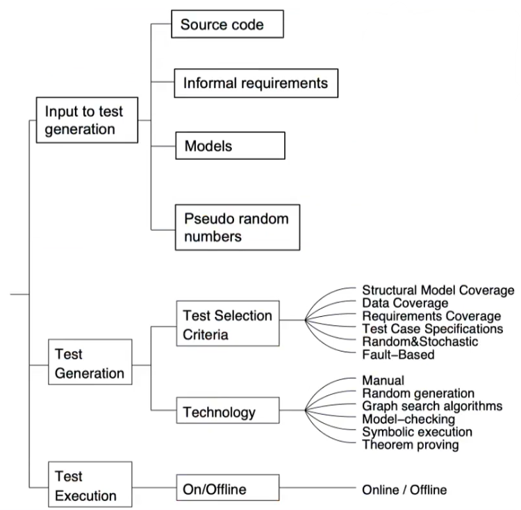
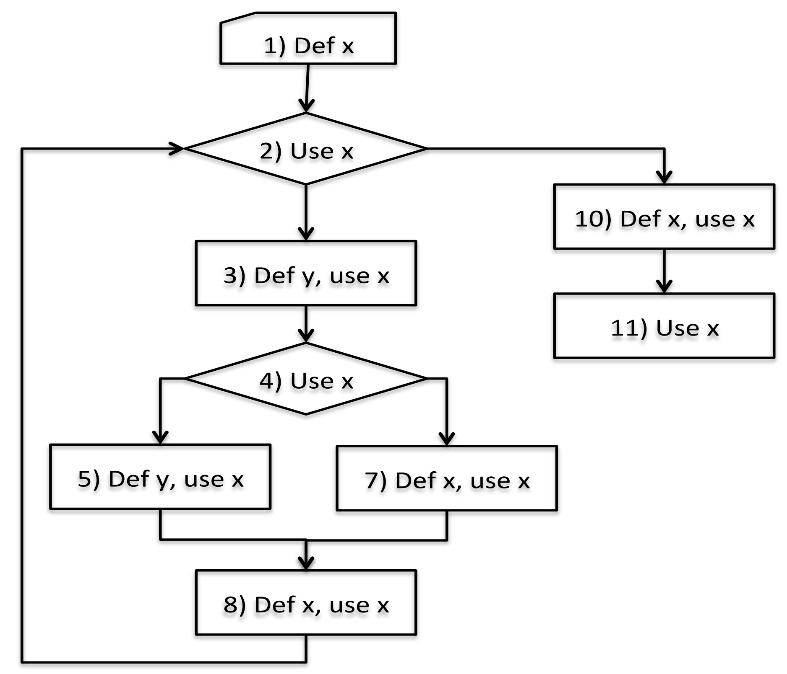

# Verification and Validation 

Two main approaches: 

- ANALYSIS (static) analytic study of properties 
- TESTING (dynamic) experimenting with behavior of the product sampling behaviors and finding counterexamples

## Testing

[10.Testing](../../../BSc([/Ingegneria%20del%20Software/src/10.Testing.md) 

Some def related to testing: 

- Random testing is a testing approach where test cases are generated randomly, without considering the structure or behavior of the software being tested. 
- Systematic testing is an approach that uses characteristics or structure of the software, or information about its behavior, to guide the selection of test cases. 
- Unit testing is a form of testing that is conducted by developers to test individual units of code, and integration testing is a form of testing that focuses on exercising the interactions between different modules or components of a system. 
- System testing is a form of testing that is conducted on the complete system, once it has been integrated, and is designed to identify bottlenecks and other issues. 
- Scaffolding is temporary support structures used to assist in testing
- black box testing is a form of testing that focuses on the external behavior of a system, rather than its internal structure or implementation. When testing a system that acts like a state machine, two common criteria for coverage are state coverage and transition coverage.

## Analysis 

A family of techniques which don't involve the actual execution of software. Two main approaches:

- **Manual inspection**: (informal) Review is an in-depth examination of some work product by one or more reviewers. Product is anything produced for the lifecycle, i.e., requirements, plans, design, code, test cases, documentation, manuals, everything.   
- **Algorithmic static analysis**: a formal evaluation technique (systematic) in which software requirements, design, or code are examined in detail. Two different types: 
	- **\<def-use\>** analysis or **data flow analysis**: focused on usage of variables and possible errors related to them. Typically used by compilers to find symptoms of possible errors: 
		 - a variable is uninitialized when used
		 - a variable assigned and then never used
		 - a variable always get a new value before being used
	- **Symbolic execution**: is a technique which involves representing values in a program as **symbols**, and executing statements to compute new expressions. 

### \<Def-use> analysis

1) Derive the control flow diagram 
2) Identify points where variables are defined and used. 
3) Using basically algorithms that explore the graph and check the variables, analyzing the pairs 

	

### Symbolic Execution 

The symbolic execution can, using mathematical and logical inference on the variables symbolic value, to highlight problems and bugs which are not possible to see using def-use analysis. It is often used in conjunction with def-use analysis to identify potential errors and optimize code. 

