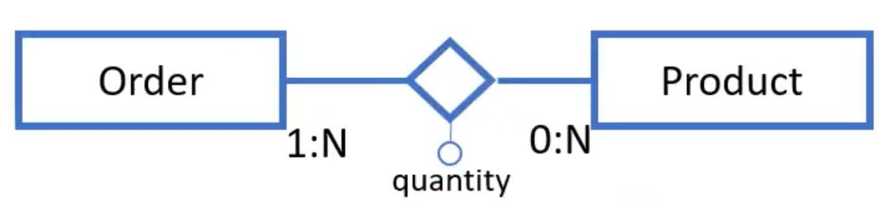

# JPA

ORM stands for Object-Relational Mapping, and it's basically a way to interact with a relational database using an object-oriented programming model. Instead of writing SQL queries to get data from a database, you can just use objects in your code.

One of the most popular ORM frameworks for Java is JPA (Java Persistence API). JPA is basically the standard for ORM in the Java Enterprise Edition (Java EE) platform, and it makes working with a relational database really simple. You can do all the basic stuff like creating, reading, updating, and deleting data without having to write complex SQL queries. Plus, it has some awesome features like caching and lazy loading that can help you make your code run faster.

[JPA Introduction - javatpoint](https://www.javatpoint.com/jpa-introduction)


JPA auto-generates SQL code from Java code, creating correspondence between Java objects and DB tuples. This is called ORM (Object-relational mapping): 

- classes are tables
- objects instances are tables rows (tuples)
- the physical memory address of an objects is the primary key of the tuple 
- references to other objects are the foreign keys 
- methods are triggers 

By default entities are mapped to tables with the same name and their fields to columns with the same names, but you can always change it using some annotations: 

````Java
@Entity @Table(name="SUPERHEROS")
public class Superhero {
@Column(name="REAL_NAME",nullable=false)
private String real_name;
...
}
````

All relationships in JPA are unidirectional, the only way to make bidirectional relationships is using two 'paired' unidirectional mappings. The types of relationships are:

- Many-to-one 
- One-to-many
- One-to-one
- Many-to-many

When the
fetch mode is not specified, by default:
•
A single
valued relationship is fetched eagerly
•
Collection
valued relationships are loaded lazily 


-   Fetch policy
    -   Father to children element collection fetched eagerly to allow the client to recursively navigate the relationship and display the BOM tree
    -   Child to fathers fetched lazily when needed by business components (e.g., to retrieve top products)

So eager -> when there aren't many elements and you can load them runtime when needed. Few data. For small cardinality

So Lazy -> a lot of data. 


First of all you make a class for each entity. 

mapped by specify which foreign key defines this entity. 


There is also cascade type:

- PERSIST
- REFRESH
- REMOVE
- MERGE
- DETACH

### One to many

````Java
@Entity
public class B{
@Id private int id
@OneToMany(mappedBy = "java_var")
private Collection<A> As; 
...
}

//On the other side:

@Entity  //this is the owner of the relationship
public class A{ 
@Id @GeneratedValue(strategy=GenerationType.AUTO)
private int id;

@ManyToOne 
@JoinColumn (name="fk") //the column where there is the foreign key
private B java_var;
...
}
````


### Many to many 

The logical model of a N:M relationships requires a join table (aka bridge table). The N:M relationship with attributes between a parent product and its sub-products is mapped differently in the two directions.

````Java
@Entity
public class B{
@Id private int id
@ManyToMany(mappedBy = "java_list_of_Bs")
private List<A> As; //actually not only lists .. but any kind of collections 
...
}

//On the other side:

@Entity
public class A{
@Id @GeneratedValue(strategy=GenerationType.AUTO)
private int id;

@ManyToMany
@joinTable(
	name="table_name",
	JoinColumns = @JoinColumn(name="this_entity_fk"),
	@InverseJoinColumn = @JoinColumn(name="other_fk"))
private Collection<B> java_list_of_Bs;
...
}
````

Note that the owner in these cases is not relevant.
In a ManyToMany mapping there is no FK column. Such a mapping is implemented by means of a ). The inverse direction (@ManyToMany from child to fathers) is "read-only" and maintained by adding elements to element collection, which is mapped on the same table


## ManyToMany with attributes

- In a "regular" N:M relationship, the access paths are:
    - Fetch all instances of A given B
    - Fetch all instances of B given A
- In N:M with attributes, there are additional access paths:
    - The values of the attributes of the pair <A, B> (equivalently <B,A>)
Every collections implemented as map (not of objects but tuples (e.g., <Product, quantity>)) there are some differences with the "standard" `@ManyToMany` relationship:

- Entities key element collection are specified with the `@ElementCollection` annotation. 
- We use a `@CollectionTable` annotation
- It maps the join from father to child using the `@JoinColumn` to specify the column holding the father id (like in `@ManyToMany` )
- Instead of specifying the `@inverseJoinColumns`, it uses a `@MapKeyJoinColumn` annotation to specify the column holding the PK of the entity used as a map index

### Map Example



We can't have a traditional join table with 2 columns because we have 3 attributes: so we use a map ```Map<Product, Integer>``` . 

````Java
@Entity 
public class Order implements Serializable{
// ...

@ElementCollection(fetch = FetchType.EAGER) 
@CollectionTable(name = "product_order", 
joinColumns = @JoinColumn(name = “orderId")) //orderId is the ID of the owner's entity 
@MapKeyJoinColumn(name = "productId") 
@Column(name = "quantity")
private Map<Product, Integer> products;

//...
}

//ON THE OTHER SIDE: 
												  
@Entity
public class Product implements Serializable {
@Id @GeneratedValue(strategy = GenerationType.AUTO)
private int productId;
private int unitPrice;

@ManyToMany 
@JoinTable (name = "product_order",
	joinColumns = @JoinColumn(name = "productId"),
	inverseJoinColumns =@JoinColumn(name = "orderId"))
private List<Order> orders; // owner of the relation

// ...	getters and setters and stuff
}
```` 

## Check the above code when you do this exercise 

Using this solution you will have (on DB side) a rich table with 3 columns. An alternative solution to this is to make manually a 'bridge entity' . 

You have to use the keyword ```@Embeddable``` (over the class) and a ```@EmbeddedId``` over the primary key of this new bridge entity, which will also contain the ID of the other two entities using ```@MapsId("id1")``` before  ```@JoinColumn(name = "id1")``` and ```@MapsId("id2") ... ``` .  

Composite primary keys

are denoted using the

@EmbeddedId and

@IdClass

annotations

  
  

## One-to-many mapping

  

In the database, relationships are implemented by a foreign

key column that refers to the key of the referenced table

– In JPA, such a column is called join column

 

The annotation @JoinColumn indicates the FK column that implements the relationship in the database; such annotation is normally inserted in the entity owner of the relationship (i.e., the one mapped to the table that actually contains the FK column) – Used to drive the generation of the SQL code to extract the correlated instances 

The mappedBy attribute indicates that “this side” is

the inverse of the relationship, and the owner resides

in the "other" related entity

  

Used to specify bidirectional relationships

  
  
  

In absence of the mappedBy parameter the default JPA mapping (created when the database is generated from the JPA entities) uses a bridge table (as for N:M relationships) • The purpose of the mappedBy parameter is to instruct JPA NOT to create a bridge table as the relationship is already being mapped by a FK in the opposite entity of the relationship

  
## One to One

  
````Java
@OneToOne(mappedBy="B");
private Class A;

// owner side:
@OneToOne(mappedBy="A");
private Class B;
````
  

In the other non-owner entity, the @OneToOne annotations must come with the mappedBy element The presence of mappedBy tells JPA that the foreign key constraint is in the table mapping the OTHER entity
 
## Composite Keys in JPA  

A relation with Composite Key is obtained implementing

a class with @Embeddable

  

basically a class with the keys necessary to map

(the keys that make the composite key )

  

and a constructor which accepts the

  
  

then the class will be merged inside the

  

and then @EmbeddedId over an id var used as composite keys.

  

  

Cell:

  

@EmbeddedId

private class id;

  

//composite

@ManyTone(fetch ..)

  

@MapsId("locker_id) <-

  

@JoinColumn("locker_id")

private Locker locker;

  
  
  
  
  

@OneToMany(mappedBy="cellId", fetch = FetchType.EAGER

cascade = CascadeType.REMOVE)

private List<Parcel> parcels;

  

Parcel:

  

//owner

@ManyToOne

@JoinColumns({

@JoinColumn(lockerId),

@JoinColumn(name=" cellId")

})

private Cell cell.

  

I have to declare an `@Embeddable` class that rapresent the composite keys. This class have to have the attributes of Ids which compose the composite key and also a constructor which takes as parameters and initialize them.

  

Then this class will be link in the interested class with `@EmbeddedId` notation and will be also

use this format in any other entity that necessitate to reference it:

  

````Java

@JoinColumns(

{

@JoinColumn(name = "first_attr_Comp_Key),

@JoinColumn(name = "second_attr_Comp_Key),

}

)

````

---

@OrderBy("submissionDate DESC") !!! 

se nel testo scrivono "The application permits the operator to select a user, open his/her list of tickets ordered by submission date
descending"
