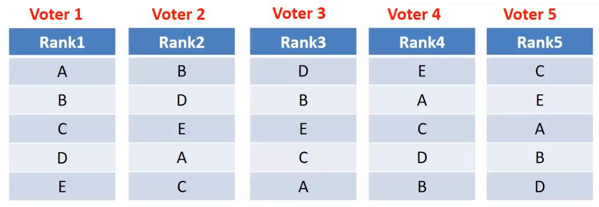
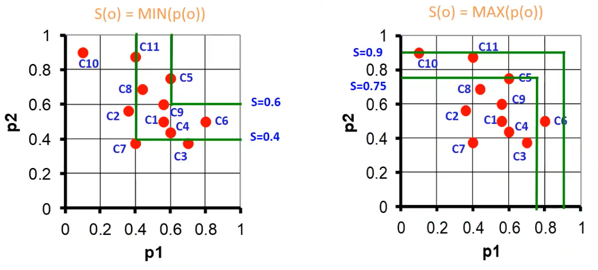
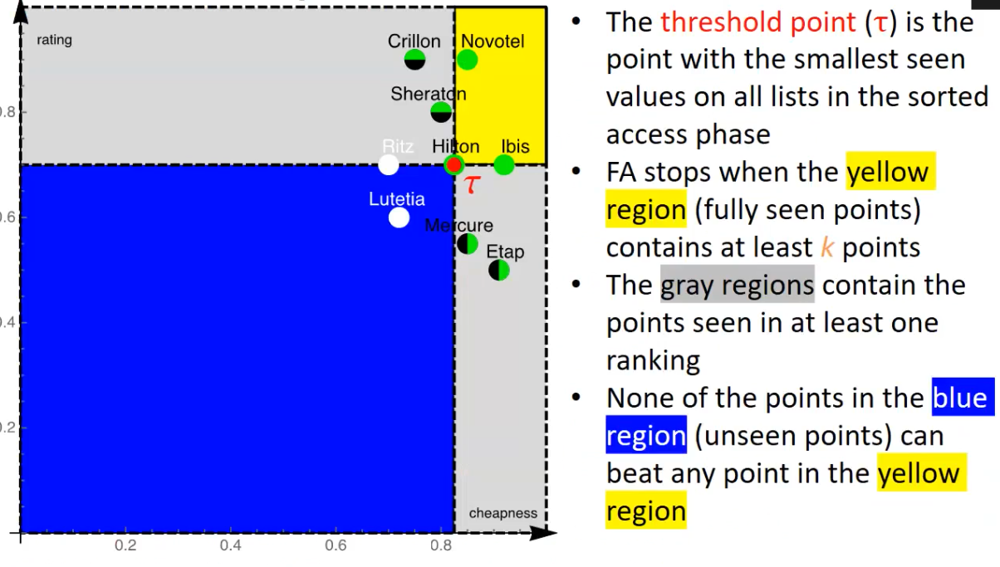
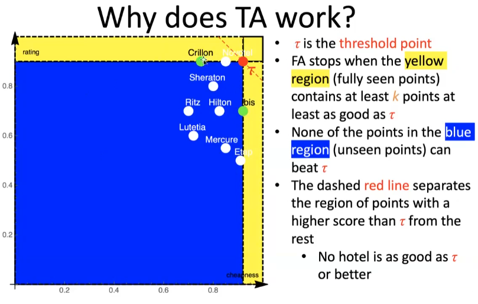
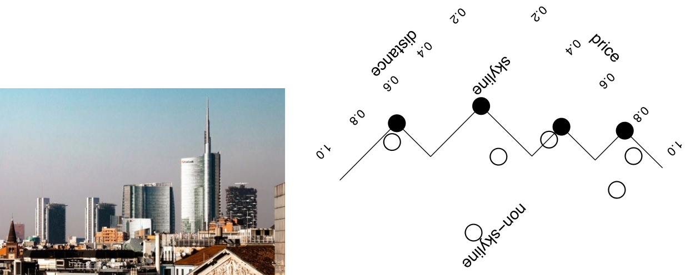

# Ranking 

Ranking is a method to return approximate matches to a query, based on relevance. It's a shift from exact queries to approximate ones where the result is not necessary an exact match. Results are returned in an order of relevance determined by ranking criteria or a scoring function. This "score" can be determined by a deterministic function or by a parametric function of some object attribute values weighted by parameters that can be subjective or even unknown.
Because of this, ranking is not sorting. Sorting is deterministic and not based on preferences, while ranking is based on preferences. The boundary between them is not absolute.
The actual subject of the exame are: 

-   Rank aggregation: This method combines several ranked lists of objects in a robust way to produce a single consensus ranking. 
-   Ranking (aka top-k) queries: This method extracts the top k objects according to a given quality criterion (typically a scoring function). 
-   Skyline queries: This method extracts the subset of objects that are not dominated by other objects with respect to multiple quality criteria.

## Ranking aggregation

Borda's proposal, also known as the Borda count, is a method of voting in which voters rank candidates in order of preference. Points are then assigned to each candidate based on their position in the ranking, with the candidate ranked first receiving the most points and the candidate ranked last receiving the least. The candidate with the most points overall is declared the winner.

Condorcet's proposal, also known as the Condorcet method, is a method of voting in which candidates are matched against each other in a series of head-to-head matchups. The candidate who wins the most matchups is declared the winner. If there is no candidate who wins a majority of matchups, the process is repeated with the remaining candidates until a winner is found.

Both Borda's and Condorcet's proposals are examples of voting methods that aim to achieve a more fair and representative outcome by taking into account the preferences of all voters. However, both have their own limitations and criticisms.

Approaches to Rank Aggregation

Metric Approach:

-   Finding a new ranking whose total distance to the initial rankings ($R_1$, $R_2$, ...) is minimized.
-   There are several ways to define a distance between rankings, such as:
    -   Kendall tau distance ($K(R_1, R_2)$), which is defined as the number of exchanges in a bubble sort to convert $R_1$ to $R_2$.
    -   Spearman’s footrule distance ($F(R_1, R_2)$), which adds up the distance between the ranks of the same item in the two rankings.
-   Finding an exact solution is computationally hard for Kendall tau distance (NP-complete) but tractable for Spearman’s footrule distance (PTIME).
-   These distances are related: $K(R_1, R_2) \leq F(R_1, R_2) \leq 2 * K(R_1, R_2)$.
-   $F(R_1, R_2)$ admits efficient approximations, such as the median ranking.

## Top-k 

### MedRank 

The MedRank technique used is based on the position of elements in the ranked lists, without taking into account any other associated scores. The approach is based on the median of the ranks of an element in multiple ranked lists, and provides an approximation of the optimal solution. The input is an integer $k$ and ranked lists $R_1$, $R_2$, ..., $R_n$ of $V$ elements, and the output is the top $k$ elements according to the median ranking. An algorithm is also provided, which uses sorted access in each list to find the top $k$ elements that occur in more than $\frac{m}{2}$ lists.

Another naive approach is using a score function: a function which is a typical linear function (but actually it can be any kind of function, even with attributes that are not deterministic for example) of the attributes. 

The problem of this is that is not usable on large databases. 

This passage is discussing the k-nearest neighbors algorithm, which is used for classification and regression tasks. In this algorithm, the "goodness" of a tuple t is determined by computing its distance from a target point q. The distance is a measure of how similar or dissimilar the tuple t is to the target point q. The lower the distance, the better the match.

The graph shows an example of how the distance values can be converted into "goodness scores" such that a higher score means a better match. This can be done by changing the sign of the distance values, and possibly adding a constant.

This is the general idea of k-nearest neighbours algorithm, where we look at the k closest points or tuples to a target point and make a decision based on them, it's commonly used in supervised learning problems, but it's important to note that there are different ways to define the distance or similarity measure between the points, and different algorithm variations.

### Top-k 1-1 Join Queries

In practice data is split across tables so we have to join relations. 

A top-k join query is a type of database query that combines rows from two or more tables based on a related column between them, and then returns the top k rows based on a specified ranking criteria. A 1-1 join query is a specific type of join query where the join is made between 2 tables and each row in the first table is matched with only one row in the second table. A top-k 1-1 join query is a combination of the above two where the top-k result is returned after a 1-1 join is made between 2 tables. It's used for example when you have a table of products and a table of prices, and you want to return the top-k products based on their prices.

### B_0 algorithm 

This algorithm can be used in various applications such as Information Retrieval, Recommender Systems, and Data Mining.

Input: integer k > 1, ranked lists R1, ..., Rn
Output: the top-k objects according to the MAX scoring function

1. Make exactly $k$ sorted accesses on each list and store objects and partial scores in a buffer
2.  For each object in the buffer, compute the MAX of its (available) partial scores
3.  Return the k objects with the highest scores. 

### FAGIN's algorithm 

1. Make $k$ sorted accesses in each list until there are at least $k$ objects in common
2. For each extracted object, compute its overall score by making random accesses wherever needed
3. Take the $k$ objects with the best overall score from the buffer

### Threshold algorithm

1. Do a sorted access in parallel in each list $R_1$ ... $R_n$
2. Don´t wait to do random access like FA, but do immediately and extract the score $S$
3. Define threshold $T=S(s1, ..., sn)$, where $s_i$ is the last value seen under sorted access for list $i$ 
4. If the score of the $k_{th}$ object is worse than $T$, go to step 1 otherwise return the current top-k objects

TA is an instance-optimal algorithm, which means that it is guaranteed to find the best possible results among all algorithms that use the same kind of accesses, but it's not guaranteed to be optimal among all algorithms in general. The authors of this algorithm received the Gédel prize in 2014 for the design of innovative algorithms.

### NRA algorithm 

NRA uses only sorted accesses over the lists. 

1.  Make a sorted access to each list
2.  Store in $B$ each retrieved object $o$ and maintain $S(o)$ and $S^*(o)$ and a threshold $r$
3.  Repeat from step 1 as long as $S^-(B[k]) < \max \{ \max \{ S^+(B[i]), i> k \}, S(\tau) \}$ 

| Algorithm | scoring function | Data access | Notes |
| :--- | :---: | :---: | :---: |
| B_(0) | MAX | sorted | instance-optimal |
| FA | monotone | sorted and random | cost independent of scoring function |
| TA | monotone | sorted and random | instance-optimal |
| NRA | monotone | sorted | instance-optimal, no exact scores |

## Skyline 

The skyline is the set of all top 1 objects according to some monotone scoring function. 

A point is int n-skyband if it is dominated by less than n tuples. (skyline is 1-skyband since all objectes are not dominated (they are technically dominated by less than 1 object)). 

A tuple t is in the skyline iff it is the top-1
result w.r.t. at least one monotone scoring
function
– i.e., the skyline is the set of potentially optimal
tuples!
• Skyline ≠ Top-k query
– there is no scoring function that, on all possible
instances, yields in the first k positions the skyline
points
– based on the notion of dominance

|  | Ranking queries | Skyline queries |
| :--- | :---: | :---: |
| Simplicity | No | Yes |
| Overall view of interesting results | No | Yes |
| Control of cardinality | Yes | No |
| Trade-off among attributes | Yes | No |

Block Nested Loop (BNL)

Input: a dataset D of multi-dimensional points
Output: the skyline of D
1. Let Window = empty
2. for every point p in D
	1. if p not dominated by any point in theWindow
		1. remove from the Window the points dominated by p
		2. add p to W
3. return W

Computation is O(n2) where n=|D|
• Very inefficient for large datasets

Skylines – Sort-Filter-Skyline (SFS)

Input: a dataset D of multi-dimensional points
Output: the skyline of D
1. Let S = D sorted by a monotone function of D’s attributes
2. Let W = empty
3. for every point p in S
	1. if p not dominated by any point in W
		1. add p to W
4. return W

Pre-sorting pays off for large datasets, thus SFS performs much
better than BNL
– If the input is sorted, then a later tuple cannot dominate any previous
tuple!
• Will never compare two non-skyline points
• Can immediately output any points in W as part of the result

But still O(n2)