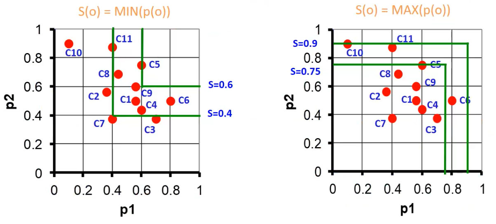
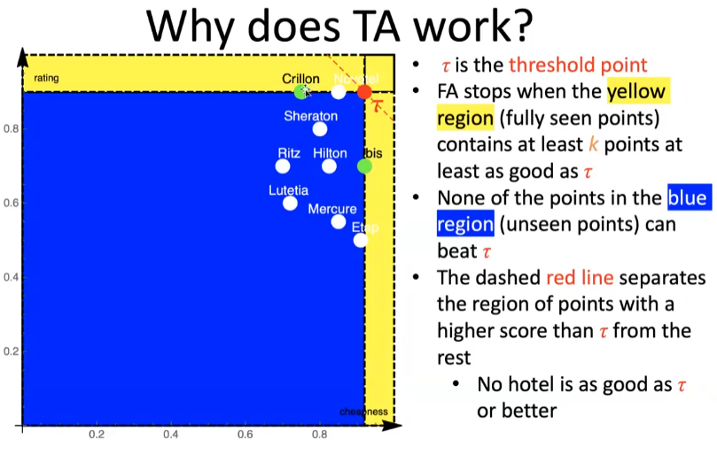

**DBMS is a system capable of managing data collections. 
You will not have the possibility to change the tables schema! Often you have to adapt to old schema. 

> The most useful assets of a company is not software, is data! You can rebuild software, not data.

Ranking data? Look how Google solved that problem finding a very efficient way to do it.

- Main topics:

1. DB architecture/technologies (concurrency control etc.)
2. Triggers
3. ORM and JPA
4. Physical DBs/Query optimization
5. Ranking and skylines


# Transactions

Banking and Booking apps are the killer apps. 

Transaction 

A transaction is an indivisible unit of execution
An elementary, atomic unit of work performed by an
application
• Each transaction is conceptually encapsulated within two
commands:
• begin transaction
• end transaction
• Within a transaction, one of the commands below is
executed (exactly once) to signal the end of the transaction:
• commit-work (commit)
• rollback-work (abort)
• In case of a rollback, the work performed must be undone, brin
> The undo function is one of the most difficult command ever invented. 

Transactional systems have 'undo function' inside! They have to have a rollback function.  

consistency 
A transaction must satisfy the DB integrity
constraints
Always catch expection! You are not the owner of the DB, maybe you aren't the one who will raise that exception. 

isolation
The execution of a transaction must be independent of
the concurrent execution of other transactions

durability Recovery management


# Concurrency 


Concurrency theory is "ideal" since it's based on the strong assumption that every transaction is submitted. 
Types of anomalies: 

-   Lost update:  `r1 - r2 - w2 - w1` , an update is applied from a state that ignores a preceding update, which is lost.
-   Dirty read: `r1 - w1 - r2 - abort1 - w2` , an uncommitted value is used to update the data. 
-   Non-repeatable read: `r1 - r2 - w2 - r1`, someone else updates a previously read value.
-   Phantom update: `r1 - r2 - w2 - r1`, someone else updates data that contributes to a previously valid constraint.
-  Phantom insert: `r1 - w2(new data) - r1`, someone else inserts data that contributes to a previously read datum.

Model: an abstraction of a system, object or process, which purposely disregards details to simplify the investigation of relevant properties
Operation: a read or write of a specific datum by a specific transaction.

- `r1(x)` is a read operation performed by transaction 1 on variable x.
- `w1(x)` is a write operation performed by transaction 1 on variable x.
- `r1(x)` and `r1(y)` are different operations, as they are performed by the same transaction on different variables.
- `r1(x)` and `r2(x)` are different operations, as they are performed by different transactions on the same variable.
- `w1(x)` and `w2(x)` are different operations, as they are performed by different transactions on the same variable.
- Schedule: a sequence of operations performed by concurrent transactions which **respects the order of operations** of each transaction.

A serial schedule is a schedule  where each single operation of the same transaction is executed consecutively. By definition a serial schedule has not anomalies. Serial schedules are "the dream schedules" but aren't realistic, so we will talk about **serializable schedule**: a schedule where concurrent transactions are executed in a way that produces the same results as if they were executed one at a time, avoiding inconsistencies.

## View-Serializability (VSR)

Two schedules are view-equivalent when they have the same operations, the same **Reads-from** and the same **Final writes**. Where:

- **Reads-from**: $ri(x)$ reads-from $wj(x)$ in a schedule $S$ when $wj(x)$ precedes $ri(x)$ and there is no $wk(x)$ in $S$ between $ri(x)$ and $wj(x)$.
- **Final write**: $wi(x)$ in a schedule $S$ is a final write if it is the last write on $x$ that occurs in $S$.

View-equivalent: Two schedules are view-equivalent ($Si \sim Sj$ ) if they have the same operations, the same reads-from relationship, and the same final writes.
A schedule $S$ is said to be view-serializable if it is view-equivalent to a serial schedule of the same transactions. Bad concurrency patterns are rejected by view-serializability. 

## Conflict-equivalence (CSR)

A schedule is **conflict-serializable** if it is **conflict-equivalent** to a serial schedule of the same transactions. The class of conflict-serializable schedules is named CSR. Two schedules are **conflict-equivalent** if: 

- They contain the same operations
- All the conflicting pairs of each operation (read-write and write-write conflicts) of the transactions occur in the same order.

Since a schedule is in CSR iff its conflict graph is acyclic, we use a conflict graph that has:

- One node for each transaction $T_i$
- One arc from $Ti$ to $Tj$ for each conflict between an operation $o_i$ of $T_i$ and an operation $o_j$ of $T_j$ such that $o_i$ precedes $o_j$


## Timestamp Concurrency Control

In practice we can´t evaluate online/realtime if the schedules are CSR and VSR obviously. So we can use locks (which it's called "pessimistic tecnique" since it eventually makes the requester waiting) or optimistic tecniques based on timestamps and versions. 
Since every DBMS have to guarantee an 'undo command' it's very 'natural and logic' use a multi-versioned system (It's used actually). 

> Idea: each write generate new versions, reads access the "right" version.  $WTM_1(x) \dots WTM_N(x)$ are the versions, sorted from oldest to youngest.

### Ts Mono 


The scheduler receives read/write requests tagged with the timestamp of the requesting transaction . You use the age in order to resolve potential conflicts. 
We reject if:

-   $R_{ts}(x)$ we reject if $ts < WTM(x)$
-   $W_{ts}(x)$, we reject if $ts < RTM(x)$ or $ts < WTM(x)$ 

These are the simple rules applied in TS Mono technique, there is also a variant called "Thomas Rule" to basically reduce the killed transactions. 
The only difference of Thomas Else is to no kill the write operations if $ts < WTM(x)$ with the motivation that our write is "obsolete" and it can be skipped.
That's a fair consideration since skipping a write on an object that has already been written by a younger transaction, without killing the transaction. 

This versions are not really implemented, they are just a little step to build some fundamentals. 


### TS Multi 

$r_{ts}(x)$ is always accepted. A copy $x_k$ is selected for reading such that:
- If $ts \ge WTM_N (x)$, then $k = N$
- else $WTM_k (x) \le ts < WTM_{k+1}(x)$ 

$w_{ts}(x)$:
- If $ts < RTM(x)$ the request is rejected
- Else a new version is created for timestamp $ts$ and $N$ is incremented

We are complicating a lot the implementation but in change we now have a huge benefit: the read will be always accepted. 

## 2 Phase Locking (2PL)

A transaction cannot acquire any other lock after releasing a lock. 


### Strict 2PL 

We drop the assumptions that aborts don´t occur. Locks held by a transaction can be released only after commit/rollback. 

Extra: actually the Strict 2PL prevents all possible anomalies except "Phantom Insert" anomaly. To prevent this inconsistency, a technique called "predicate locks" can be used, which extends the notion of data locks on future data using a predicate that blocks all data that satisfies it.

As you know after 3 years of Computer Science when there are locks there are deadlocks and starvation. There are mainly three possible way to solve this: 

- Timeout: killing transactions after its timeout runs out
- Deadlock prevention: killing transactions which could lead to deadlock
- Deadlock detection: kill one of the transactions in a deadlock that occurred.

The two main rules to reduce the deadlocks frequency are: 

- use Update Locks 
- use Hierarchical Locks

We we will see a super simple algorithm to detect cycles in wait-for-graph, in particular in a "distributed systems" environment: Obermark's algorithm. 


UPDATE LOCKS ADDENDUM 

Clearly deadlocks are possible in the presence of UL. Indeed,
UL only makes deadlock less likely, by preventing one type of
(very frequent) deadlock, due to update patterns, when two
transactions compete for the same resource (e.g., r,(X) 15(X)
w,(x) w,(x)). If we consider two distinct resources X Y, and
two transactions that want to access them in this order:
$$r1(X) \space r2(Y) \space w1(Y) \space w2(X)$$
It is likely that they end up in deadlock, especially if the system on which they run applies 2PL. UL is totally irrelevant here, because there is no update pattern.


### Obermark's algorithm


The Obermark's algorithm allows for better performance and it's super simple. The main concept is super simple: 

> Continue to check the chain of the transaction dependencies and locks??? Until in one of the iteration you find a loop (deadlock). 


Schedule is a kind of log while the scheduler is a component that accepts or rejects operations requested by transactions. 


CSR implies VSR ! 


# Triggers 

Main paradigm: 

````
EVENT -> CONDITION -> ACTION
````

where: 

- `EVENT`: 

````sql
create trigger <trigger_name>
{before | after}
{insert | delete | update [of <column>]} on <table>
[referencing (to put aliases on old, new, etc)]
[for each {row | statement}]
[when condition]
BEGIN
[my action]
END
````

•	Use triggers to guarantee that when a specific operation is performed, related actions are performed
•	Do not define triggers that duplicate features already built into the DBMS. For example, do not define triggers to reject bad data if you can do the same checking through aeclarative integrity constraints 
Limit the size of triggers. If the logic for your trigger requires much more than 60 lines of code, it is better to include most of the code in a stored procedure and call the procedure from the trigger. Use triggers only for centralized, global operations that should be fired for the triggering statement, regardless of which user or database application issues the statement. Avoid recursive triggers if not absolutely necessary. Trigger may•
: : :  fire recursively until the DBMs runs out of memory. 

Use triggers : : : · .Yro guarantee properties of data that cannot be specified by means of integrity constraints 


Importante perché solitamente ci sono tante applicazioni diverse che
accedono allo stesso DB. Quindi se ho qualche regola da far rispettare
in generale è molto meglio averla nel DB che a livello Applicativo nelle
diverse applicazioni. Potrebbero crearsi inconsistenze e casini.


Triggers are powerfull but also complicated because cascading policies. 
They could be bugs in triggers obviously, also because a **cascading** triggers: a trigger activates another trigger. Some systems block cascading of triggers. Also it could happen **recursive cascading** . 

````SQL
CREATE TRIGGER [schema_name.]_trigger_name 
{ BEFORE | AFTER | INSTEAD OF } {INSERT |  UPDATE | DELETE} ON schema_name
{ FOR EACH ROW}
BEGIN 
{ WHEN ....}
UPDATE schema_name SET attribute_name = .... 
{ WHERE .... }
END;
````

````sql 
DROP TRIGGER trigger_name;
````

````SQL

INSERT INTO NAMES 
VALUES (23,"rick");

SELECT * FROM NAMES;
````


sito per esercitarsi: [Online SQL Compiler (tutorialspoint.com)](https://www.tutorialspoint.com/execute_sql_online.php) 

usi la keyword new per selezionare la nuova entry

> Remember that every time you have an update, you usually also have a 'where'


````sql
SELECT * FROM table1 AS X JOIN table2 AS Y ON X.attribute=Y.attribute
````


Also exist 'IF EXISTS ... ELSE ... '


Cascading is generally bad and in some DBMS is even forbidden. 


### Termination analysis

Draw down the triggering graph where each node is atrigger and each arc from a trigger i to j is present only if T_i effects may activate T_j . 

## View Materialization 

When a view is mentioned in a SELECT query the query
processor rewrites the query using the view definition,
so that the actually executed query only uses the base
tables of the view
•
When the queries to a view are more frequent than the
updates on the base tables that change the view
content, then view materialization can be an option
•
Storing the results of the query that defines a the view in a
table
•
Some systems support the CREATE MATERIALIZED
VIEW command, which makes the view automatically
materialized by the DBMS
•
An alternative is to implement the materialization by
means of triggers


[JPA Introduction - javatpoint](https://www.javatpoint.com/jpa-introduction)


JPA auto-generates SQL code from Java code, creating correspondence between Java objects and DB tuples. This is called ORM (Object-relational mapping): 

- classes are tables
- objects instances are tables rows (tuples)
- the physical memory address of an objects is the primary key of the tuple 
- references to other objects are the foreign keys 
- methods are triggers 

````Java
//entity manager interface 
public void persist (Object entity) //creates an entity instance in the database 
public <T> T find (Class<T> entityClass, Object primaryKey) //find an entity instance by its primary key 
public void remove (Object entity); //removes the entity instance from the DB 
public void refresh (Object entity); //resets the entity instance from the DB 
//JPA uses a 'Persistence Context' as middleware between Java and the DB. This is like a cache and maybe sometimes you want to force changes: 
public void flush(); 
````

By default entities are mapped to tables with the same name and their fields to columns with the same names, but you can always change it using some annotations: 

````Java
@Entity @Table(name="SUPERHEROS")
public class Superhero {

@Column(name="REAL_NAME",nullable=false)
private String real_name;
@Transient 
private boolean isInJusticeLeague; //transient attributes are attributes that are not persisted 
...
}
````

All relationships in JPA are unidirectional, the only way to make bidirectional relationships is using two 'paired' unidirectional mappings.

- Many-to-one 
- One-to-many
- One-to-one
- Many-to-many

Sometimes @ManyToOne relationship are not necessary and they can be mapped only for consistency. 


"Select with possible NULL value and IF condition in a trigger" pattern: 

````sql
DECLARE X AS INTEGER
IFNULL(<SELECT_QUERY_HERE>, 0) INTO X

IF (X<>0)
THEN
	\\
ELSE
	\\
ENDIF;
````


# JPA exercises 

DB del 17/10 praticamente ho guardato 1 quarto della spiegazione ... c'è da leggere i riassunti e sistemare questo. 

When the
fetch mode is not specified, by default:
•
A single
valued relationship is fetched eagerly
•
Collection
valued relationships are loaded lazily 


So eager -> when there aren't many elements and you can load them runtime when needed. Few data. For small cardinality

So Lazy -> a lot of data. 


First of all you make a class for each entity. 

mapped by specify which foreign key defines this entity. 


There is also cascade type:

- PERSIST
- REFRESH
- REMOVE
- MERGE
- DETACH

### One to many

````Java
@Entity
public class B{
@Id private int id
@OneToMany(mappedBy = "b", fetch= FetchType.EAGER, cascade = CascadeType.REMOVE)
private List<A> a; //actually not only lists .. but any kind of collections 
...
}

//On the other side:

@Entity
public class A{
@Id @GeneratedValue(strategy=GenerationType.AUTO)
private int id;

@ManyToOne
@JoinColumn (name="b_fk") //the column where there is the foreign key
private B b;
...
}
````


### Many to many 

In a ManyToMany mapping there is no FK column. Such a mapping is implemented by means of a join table (aka bridge table).
ManyToMany annotation must come with the mappedBy element.


Map example


We can't have a traditional join table with 2 columns because we have 3 attributes: so we use a map ```Map<Product, Integer>``` . 

````Java
@Entity 
public class Order implements Serializable{
// ...

@ElementCollection(fetch = FetchType.EAGER) 
@CollectionTable(name = "product_order", 
						joinColumns = @JoinColumn(name = “orderId")) //orderId is the ID of the owner's entity 
@MapKeyJoinColumn(name = "productId") 
@Column(name = "quantity")
private Map<Product, Integer> products;

//...
}

//ON THE OTHER SIDE: 
												  
@Entity
public class Product implements Serializable {
@Id @GeneratedValue (strategy = GenerationType.AUTO)
private int productId;
private int unitPrice;

@ManyToMany // this is optional
@JoinTable (name = "product_order",
	joinColumns = @JoinColumn (name = "productId"),
							inverseJoinColumns = @JoinColumn (name = "orderId"))
private List<Order> orders; // owner of the relation

// ...	
}
```` 

# Check the above code when you do this exercise 

Using this solution you will have (on DB side) a rich table with 3 columns. An alternative solution to this is to make manually a 'bridge entity' . 

You have to use the keyword ```@Embeddable``` (over the class) and a ```@EmbeddedId``` over the primary key of this new bridge entity, which will also contain the ID of the other two entities using ```@MapsId("id1")``` before  ```@JoinColumn(name = "id1")``` and ```@MapsId("id2") ... ``` .  


!!!!!


@ManyToOne 

On "many side" we use the Foreign Key . 
On "one side" we use the name of the Java Attribute 


Ownership:

- manytomany 
- onetoone

the owner in these cases is not relevant. 


# Physical DB

Primary structure: it contains all the tuplesof a table
•
Main purpose: to store the table content
•
Secondary structures: are used to index primary structures, and only contain the values of some fields.


Three main types of data access structures:
 
- Sequential structures
- Hash-based structures
- Tree-based structures

$$\begin{array}{|l|l|l|}
\hline & \text { Primary } & \text { Secondary } \\
\hline \text { Sequential structures } & \text { Typical } & \text { Not used } \\
\hline \text { Hash-based structures } & \begin{array}{l}
\text { In some DBMSs (e.g., Oracle } \\
\text { hash clusters, IDM DB2 } \\
\text { "organize by hash" tables) }
\end{array} & \text { Frequent } \\
\hline \text { Tree-based structures } & \text { Obsolete/rare } & \text { Typical } \\
\hline
\end{array}$$

Blocks: the "physical" components of files
•
Tuples: the "logical" components of tables
•
The size of a block is typically fixedand depends on the file system and on how the disk is formatted
•
The size of a tuple (also called record) depends on the database design and is typically variablewithin a file


Operations are performed in main memory and affect pages (in the buffer). 
Operations are:

- Insertion and update of a tuple
- Deletion of a tuple
- Access to a field of a particular tuple, which is identified according to an offset w.r.t. the beginning of the tuple and the length of the field itself (stored in the page dictionary). 


# Sequential structures


The default are not sorting data and it will never happen a shifting operation. 

# heap 
Entry-sequenced sequential (a.k.a. heap) structure 
Effective for
•
Insertion, which does not require shifting
•
Space occupancy, as it uses all the blocks available for files and all the space within the blocks
•
Sequentialreading and writing (select * from T)
•
Especially if the disk blocks are contiguous (seek & latency times reduced)
•
Only if all (or most of) the file is to be accessed
•
Non-optimal for
•
Searching specific data units (select * from T where…)
•
may require scanning the whole structure
•
But with indexes can be used efficiently
•
Updates that increase the size of a tuple (“shifts” required)
•
Shift may require storage in another block
•
Alternative approach: delete old version and insert new one

$$\begin{array}{|l|l|l|}
\hline & \text { Entry-sequenced } & \text { Sequentially-ordered } \\
\hline \text { INSERT } & \text { Efficient } & \text { Not efficient } \\
\hline \text { UPDATE } & \begin{array}{l}
\text { Efficient (if data size } \\
\text { increases } \rightarrow \text { delete }+\text { insert } \\
\text { the new version) }
\end{array} & \begin{array}{l}
\text { Not efficient if data size } \\
\text { increases }
\end{array} \\
\hline \begin{array}{l}
\text { DELETE }
\end{array} & \text { "Invalid" } & \text { "Invalid" } \\
\hline \text { TUPLE SIZE } & \text { Fixed or variable } & \text { Fixed or variable } \\
\hline \begin{array}{l}
\text { SELECT * FROM T } \\
\text { WHERE key } \ldots
\end{array} & \text { Not efficient } & \\
\hline
\end{array}$$


# Hash based structures

Good for point query and bad for range queries (because the lack of sorting). 

 I/O operations = 

statistical estimations 

The modern systems use statistics to choose between B+ systems or hash or sequential ones. 


# Indexes 

Ausiliary 

Don’t get confused:
•
Primary key: set of attributes that uniquely identify a tuple (minimal, unique, not null)
•
Does not imply access path
•
In SQL “PRIMARY KEY” defines a constraint
•
Implemented by means of an index
•
Search key: set of attributes used in an index to speed up tuple location
•
Physical implementation of access structures
•
Defines a common access path
•
Each search key value is associated with one or more pointers
•
May be unique (one p

$$\begin{array}{|l|l|l|l|l|}
\hline
\text { Type of Index } & \text { Type of structure } & \text { Search Key } & \text { Density } & \begin{array}{l}
\text { How } \\
\text { many }
\end{array} \\
\hline \text { Primary } & \begin{array}{l}
\text { Sequentially } \\
\text { ordered } \\
\text { with SK = OK }
\end{array} & \text { Unique } & \text { Dense or sparse } & \begin{array}{l}
\text { One per } \\
\text { table }
\end{array} \\
\hline \begin{array}{l}
\text { Secondary }
\end{array} & \begin{array}{l}
\text { Entry sequenced } \\
\text { or Sequentially } \\
\text { ordered with SK } \\
\text { != OK }
\end{array} & \begin{array}{l}
\text { Unique and } \\
\text { non unique }
\end{array} & \begin{array}{l}
\text { Dense (not } \\
\text { possible to scan } \\
\text { primary data } \\
\text { structure wrt SK) }
\end{array} & \begin{array}{l}
\text { Many per } \\
\text { table }
\end{array} \\
\hline \text { Clustering } & \begin{array}{l}
\text { Sequentially } \\
\text { ordered with SK }= \\
\text { OK }
\end{array} & \text { Non unique } & \text { Typically sparse } & \begin{array}{l}
\text { One per } \\
\text { table }
\end{array} \\
\hline
\end{array}$$

Smaller than primary data structures, can be loaded in main memory
Support point/range queries and sorted scans efficiently
But less efficient that hash structures for point queries. BUT: adding indexes to tables means that the DBMS has to update the index too after an insert update or delete operation. Indexes do not come for free, they may slow down data changing operations.

# B + 


--- 

# Ranking 

Ranking is a method to return approximate matches to a query, based on relevance. It's a shift from exact queries to approximate ones where the result is not necessary an exact match. Results are returned in an order of relevance determined by ranking criteria or a scoring function. This "score" can be determined by a deterministic function or by a parametric function of some object attribute values weighted by parameters that can be subjective or even unknown.
Because of this, ranking is not sorting. Sorting is deterministic and not based on preferences, while ranking is based on preferences. The boundary between them is not absolute.
The actual subject of the exame are: 

-   Rank aggregation: This method combines several ranked lists of objects in a robust way to produce a single consensus ranking. 
-   Ranking (aka top-k) queries: This method extracts the top k objects according to a given quality criterion (typically a scoring function). 
-   Skyline queries: This method extracts the subset of objects that are not dominated by other objects with respect to multiple quality criteria. 
 
## Ranking aggregation


Borda's proposal, also known as the Borda count, is a method of voting in which voters rank candidates in order of preference. Points are then assigned to each candidate based on their position in the ranking, with the candidate ranked first receiving the most points and the candidate ranked last receiving the least. The candidate with the most points overall is declared the winner.

Condorcet's proposal, also known as the Condorcet method, is a method of voting in which candidates are matched against each other in a series of head-to-head matchups. The candidate who wins the most matchups is declared the winner. If there is no candidate who wins a majority of matchups, the process is repeated with the remaining candidates until a winner is found.

Both Borda's and Condorcet's proposals are examples of voting methods that aim to achieve a more fair and representative outcome by taking into account the preferences of all voters. However, both have their own limitations and criticisms.


Approaches to Rank Aggregation

Metric Approach:

-   Finding a new ranking whose total distance to the initial rankings ($R_1$, $R_2$, ...) is minimized.
-   There are several ways to define a distance between rankings, such as:
    -   Kendall tau distance ($K(R_1, R_2)$), which is defined as the number of exchanges in a bubble sort to convert $R_1$ to $R_2$.
    -   Spearman’s footrule distance ($F(R_1, R_2)$), which adds up the distance between the ranks of the same item in the two rankings.
-   Finding an exact solution is computationally hard for Kendall tau distance (NP-complete) but tractable for Spearman’s footrule distance (PTIME).
-   These distances are related: $K(R_1, R_2) \leq F(R_1, R_2) \leq 2 * K(R_1, R_2)$.
-   $F(R_1, R_2)$ admits efficient approximations, such as the median ranking.

## Top-k 


### MedRank 

The MedRank technique used is based on the position of elements in the ranked lists, without taking into account any other associated scores. The approach is based on the median of the ranks of an element in multiple ranked lists, and provides an approximation of the optimal solution. The input is an integer $k$ and ranked lists $R_1$, $R_2$, ..., $R_n$ of $V$ elements, and the output is the top $k$ elements according to the median ranking. An algorithm is also provided, which uses sorted access in each list to find the top $k$ elements that occur in more than $\frac{m}{2}$ lists.


Another naive approach is using a score function: a function which is a typical linear function (but actually it can be any kind of function, even with attributes that are not deterministic for example) of the attributes. 

The problem of this is that is not usable on large databases. 

This passage is discussing the k-nearest neighbors algorithm, which is used for classification and regression tasks. In this algorithm, the "goodness" of a tuple t is determined by computing its distance from a target point q. The distance is a measure of how similar or dissimilar the tuple t is to the target point q. The lower the distance, the better the match.

The graph shows an example of how the distance values can be converted into "goodness scores" such that a higher score means a better match. This can be done by changing the sign of the distance values, and possibly adding a constant.

This is the general idea of k-nearest neighbours algorithm, where we look at the k closest points or tuples to a target point and make a decision based on them, it's commonly used in supervised learning problems, but it's important to note that there are different ways to define the distance or similarity measure between the points, and different algorithm variations.


### Top-k 1-1 Join Queries

In practice data is split across tables so we have to join relations. 

A top-k join query is a type of database query that combines rows from two or more tables based on a related column between them, and then returns the top k rows based on a specified ranking criteria. A 1-1 join query is a specific type of join query where the join is made between 2 tables and each row in the first table is matched with only one row in the second table. A top-k 1-1 join query is a combination of the above two where the top-k result is returned after a 1-1 join is made between 2 tables. It's used for example when you have a table of products and a table of prices, and you want to return the top-k products based on their prices.




### B_0 algorithm 

This algorithm can be used in various applications such as Information Retrieval, Recommender Systems, and Data Mining.

Input: integer k > 1, ranked lists R1, ..., Rn
Output: the top-k objects according to the MAX scoring function

1. Make exactly $k$ sorted accesses on each list and store objects and partial scores in a buffer
2.  For each object in the buffer, compute the MAX of its (available) partial scores
3.  Return the k objects with the highest scores. 

### FAGIN's algorithm 

1. Make $k$ sorted accesses in each list until there are at least $k$ objects in common
2. For each extracted object, compute its overall score by making random accesses wherever needed
3. Take the $k$ objects with the best overall score from the buffer


### Threshold algorithm

1. Do a sorted access in parallel in each list $R_1$ ... $R_n$
2. Don´t wait to do random access like FA, but do immediately and extract the score $S$
3. Define threshold $T=S(s1, ..., sn)$, where $s_i$ is the last value seen under sorted access for list $i$ 
4. If the score of the $k_{th}$ object is worse than $T$, go to step 1 otherwise return the current top-k objects

TA is an instance-optimal algorithm, which means that it is guaranteed to find the best possible results among all algorithms that use the same kind of accesses, but it's not guaranteed to be optimal among all algorithms in general. The authors of this algorithm received the Gédel prize in 2014 for the design of innovative algorithms.




### NRA algorithm 

NRA uses only sorted accesses over the lists. 

1.  Make a sorted access to each list
2.  Store in $B$ each retrieved object $o$ and maintain $S(o)$ and $S^*(o)$ and a threshold $r$
3.  Repeat from step 1 as long as $S^-(B[k]) < \max \{ \max \{ S^+(B[i]), i> k \}, S(\tau) \}$ 

| Algorithm | scoring function | Data access | Notes |
| :--- | :---: | :---: | :---: |
| B_(0) | MAX | sorted | instance-optimal |
| FA | monotone | sorted and random | cost independent of scoring function |
| TA | monotone | sorted and random | instance-optimal |
| NRA | monotone | sorted | instance-optimal, no exact scores |


## Skyline 


The skyline is the set of all top 1 objects according to some monotone scoring function. 

A point is int n-skyband if it is dominated by less than n tuples. (skyline is 1-skyband since all objectes are not dominated (they are technically dominated by less than 1 object)). 


A tuple t is in the skyline iff it is the top-1
result w.r.t. at least one monotone scoring
function
– i.e., the skyline is the set of potentially optimal
tuples!
• Skyline ≠ Top-k query
– there is no scoring function that, on all possible
instances, yields in the first k positions the skyline
points
– based on the notion of dominance


|  | Ranking queries | Skyline queries |
| :--- | :---: | :---: |
| Simplicity | No | Yes |
| Overall view of interesting results | No | Yes |
| Control of cardinality | Yes | No |
| Trade-off among attributes | Yes | No |

Block Nested Loop (BNL)

Input: a dataset D of multi-dimensional points
Output: the skyline of D
1. Let Window = empty
2. for every point p in D
	1. if p not dominated by any point in theWindow
		1. remove from the Window the points dominated by p
		2. add p to W
3. return W

Computation is O(n2) where n=|D|
• Very inefficient for large datasets


Skylines – Sort-Filter-Skyline (SFS)

Input: a dataset D of multi-dimensional points
Output: the skyline of D
1. Let S = D sorted by a monotone function of D’s attributes
2. Let W = empty
3. for every point p in S
	1. if p not dominated by any point in W
		1. add p to W
4. return W


Pre-sorting pays off for large datasets, thus SFS performs much
better than BNL
– If the input is sorted, then a later tuple cannot dominate any previous
tuple!
• Will never compare two non-skyline points
• Can immediately output any points in W as part of the result

But still O(n2)