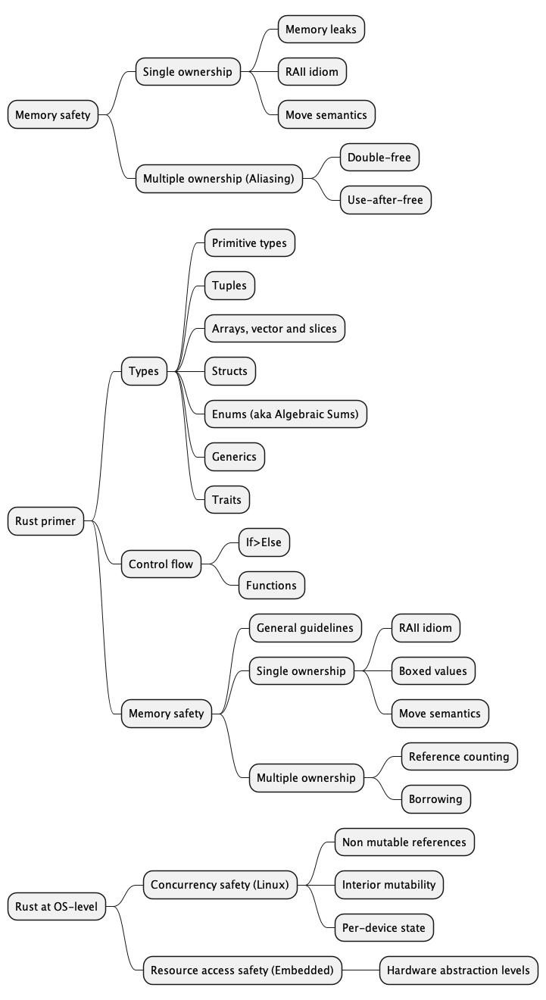

## Verification for OS

Since we work with operating systems in order to build programs we would like to have Security and Safety in the OS.  

Security: e.g. we want to check if the OS is vulnerable to security attacks (code injection, buffer overflows) Safety: e.g. we want that the OS is reliable and does not crash, or that it is responsive enough (time limits) in some specific real-time environment (e.g. a control system of an aircraft).

This is called verification for OS. 
Basically two main approaches:
- Model checking: common and successful but since saying if a program is correct is undecidable this technique has limitations.  
- Automated theorem proving: but actually not automated since proves user-written. So more complete than the MC method but they need user guidance.


Verification techniques are becoming more and more important, thanks to the fact that software is getting everywhere This is also true for Operating Systems, the "core programs" of the machine In general, verification is difficut, but there are many important and effective techinques nowadays.

## Rust 

Why in the world should we care about Rust in this course?
Ă It is the first mainstream system programming language to address memory safety at the
language level


 


### Memory Safety

Memory safety characterizes programs where, in any possible scenario, memory allocation/use   
and deallocation can never compromise the functionality of the program; memory access is   
always well defined. More than 70% of vulnerabilities are due to unsafe memory access.

C++ and Rust memory safety:   
Systems-level languages such as C++ and Rust cannot afford a garbage collector (which   
ensures valid memory access) and are usually not memory-safe.   
However, unlike C++, Rust has default compile-time and run-time mechanisms for ensuring memory safety.   

We'll cover some common temporal memory safety bugs and how they are solved by Rust. We will not cover spatial memory safety (bounds check) although this is also ensured by Rust.


Memory safety bugs can always be seen as an ownership problem: when a variable has a pointer to a region of memory we say that it owns it.
Large programs might use several variables that own at the same time the same region of memory. In general this is not a bug if you ensure to deallocate only on last owner exiting.
Otherwise you might get double free or use after free bugs.
Buggy programs might have memory regions not owned by a variable; these are called **memory leaks** because they cannot be reclaimed.

RAII stands for Resource Acquisition Is Initialization and is a form of mitigation of memory leaks. It is a programming idiom that ties automatic variables (i.e., variables allocated on the stack) to the acquisition and release of resources on the heap. Deallocation is typically done implicitly when the variable goes out of scope.


Modern C++ is full of the use of `unique_ptr` or `shared_ptr`.
````cpp
int main(){
unique_ptr<Rectangle> P1(new Rectangle(10, 5));
cout << P1->area() << endl; // This'll print 50
return 0; // here the smart pointer destructor will deallocate the rectangle object
}
````

Large programs might need to copy the same pointer into other variables (yes, it happens).
If the lifetimes of these variables do not overlap, you can enforce single ownership without any
additional overhead. In fact, even if syntactically you have multiple variables, semantically you
are moving ownership from one to the other.
C++ has special functions for complying with this semantics and exposes a new constructor (&&)
for building such copies.

Sometimes aliasing it is perfectly fine but bugs might happen: double-free and use-after-free are one such type.

````cpp
std::vector<int> v { 10, 11 };
int *vptr = &v[1]; // Points *into* v.
v.push_back(12); // after this operation maybe v is moved in another memory location!
std::cout << *vptr; //shit 
````

It's possible to avoid this problem in C++ of course, but we would like to have "push a button" stuff ... we would like to have something that assure me "good behavior" without thinking about memory/multiple ownership/shit too much: **memory safety by construction**. 

## Rust Primer

single ownership


Of course it is possible to make multiple ownership:

In Rust, the equivalent of shared pointers is the Arc type:

````rust
let s1 = Arc::new("Hello");
let s2 = s1.clone(&s1);
````

This works and solves the problem but it's performance expensive. 
It is also possible to make borrows. References (or borrows) are pointers that do not own the value
Ă Creating a reference is called borrowing; given a variable v you create a reference with &v.
Ă Aliasing through references is controlled. Rust ensures that if there is a live borrowing, you
cant modify the original value.