# Software Design

## Brief List of Design principles and process 

### Design principles

- Keep the level of abstraction as high as possible: organizing the design into high-level abstract concepts.
- Divide and conquer: breaking a complex problem into smaller, more manageable parts.
- Increase cohesion where possible: making sure that the different parts of a system work together effectively and efficiently.
- Reduce coupling where possible: minimizing the dependencies between different parts of a system to increase flexibility and ease of modification.
- Design for flexibility: allowing for changes to be made to the system without requiring significant modification or redesign.
- Design for reusability/portability: designing components that can be used and moved to different environments or platforms.
- Reuse existing designs and code: using existing solutions to common problems rather than re-inventing the wheel.
- Anticipate obsolescence: designing with the expectation that technologies and components will become outdated over time.
- Design for testability: making it easy to test and verify the correct operation of the system.

### Design process

- Top-down approach: starting with the high-level structure of the system and gradually working down to low-level details.
- Bottom-up approach: starting with reusable low-level utilities and building up to high-level constructs.

## Design Document Structure 

1) Introduction   
	- Scope: reviews the domain and product, summary of main architectural choices
	- Definitions, acronyms, abbreviations   
	- Reference documents   
	- Overview   
2) Architectural Design   
	- Overview: high-level components and interactions   
	- Component view: components and interfaces description
	- Deployment view: infrastructure description  
	- Component interfaces: more detailed description of each interface
	- Runtime view: dynamics of interactions  
	- Selected architectural styles and patterns   
	- Other design decisions
3) User Interface Design: overview of UIs  
4) Requirements traceability   
5) Implementation, Integration and test Plan: order in which you plan to implement all the stuff   
6) Effort Spent   
7) References

## Architectural styles 

Architecture is a transferable abstraction of a system. The architecture manifests the earliest set of design decisions:

- it introduces design constraints on implementation
- it introduces organizational structure 

### Layered style

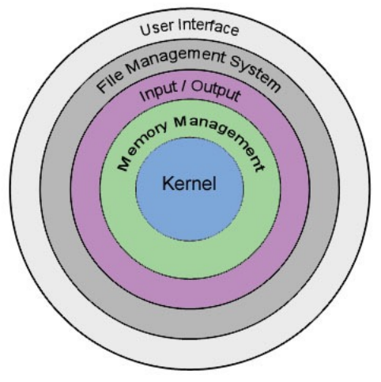

Layers architecture enable separation of concerns, claryfying the main focuses of each layer. Each layer can be considered 'independent' from the others. Layered style can be used when it is possible to identify a specific (bounded) concern for each layer and clearly communication protocol between layers.

### Client/Server

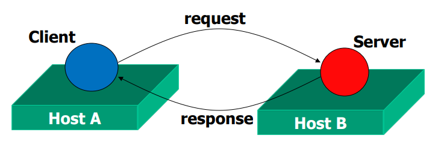

A client-server architecture is a kind of layered architecture with two layers (also called tiers).

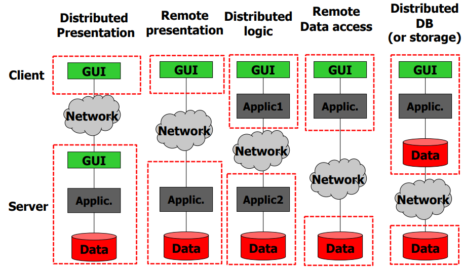

### Three-tier architecture

Decoupling of logic and data, logic and presentation using three tiers. 

Note how the middle tier plays 2 roles: both server and client. 

### Event-based

This kind of style is popular in distributed systems (systems heavily distributed and decentralized). 

There are producers of events and consumers of evens and everything is coordinated by an event dispatcher:

- components can "register to" or  "send events"  
- events are broadcast to all registered components by the event dispatcher

Since publishers/subscribers are decoupled, addition/deletion of components is easy. The main problem is the scalability since the event dispatcher may become a bottleneck (under high workloads). Also notice that the architecture has an asynchronous nature so the ordering of events is not guaranteed.
In continuous integration and deployment (CI/CD), event-based architecture is very common: for example, in GitHub Actions, a user can set up a workflow that is triggered by a specific event, such as a new commit being pushed to the repository. This and other triggers can make the CI/CD process more efficient and automated.

### Service-Oriented Architecture (SOA)

The architecture provides many services and each of them are offered through a API. 

### Microservice architectural style

Microservices are an evolution of SOA: they are based on the ideas of decomposing a monolithic application into smaller, independent components (like SOA), but they take this idea further by making the components smaller, more modular, and more autonomous. Indeed, each service uses its own technology stack and it's isolated. 

Microservices architecture is very resilience and scalable. Each service has its own software repository and there is no cross-dependencies between codebases. 
While monolithic systems are often big and complex and their replacement is risky and costly; replacing a microservice implementation is much easier. 
Microservices are commonly used to build complex, scalable applications: Netflix uses a microservices architecture, Amazon has microservices that handle tasks such as shopping cart management, order processing, and payment processing, Uber, Twitter for tasks such as feed generation, user authentication, and Airbnb. 

## UML diagrams

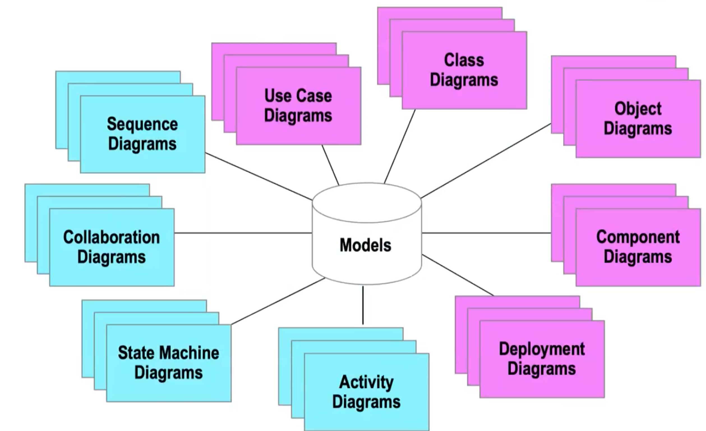

### Use Case Diagram 

A Use Case Diagram illustrates interactions between actors, the system and the ways it can be used, showing functional requirements and how the system will be used by actors.

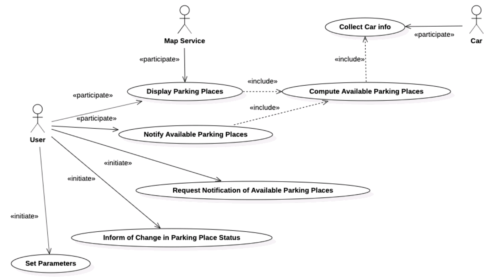

### Component Diagram

Component Diagram used to show interfaces between components. 

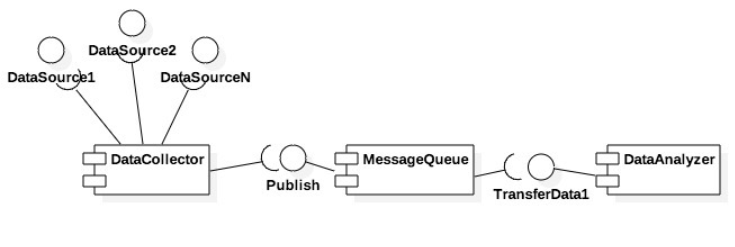 

A component can passively pass data or can actively pass it pushing it. In the component diagram this aspect can be visualized trough the "half and full circles notation". 
First example:

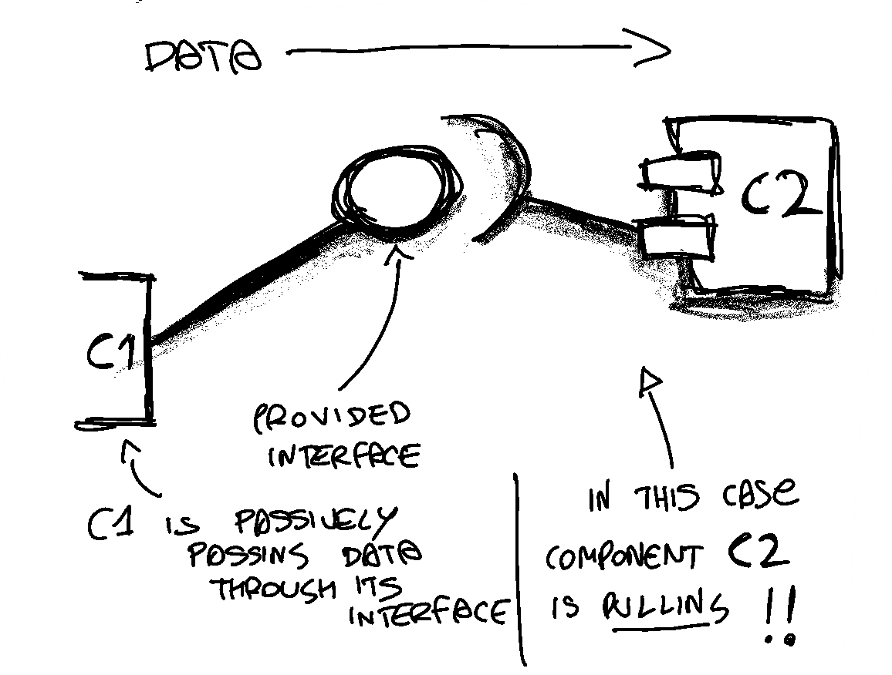{width=50%}

Second example: 

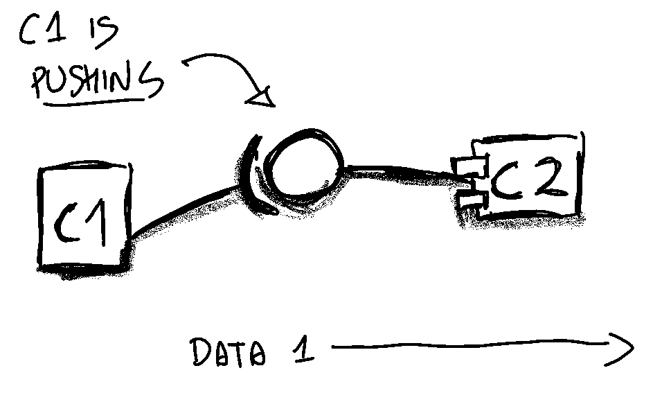{width=50%}

Another example of component diagram with actors: 

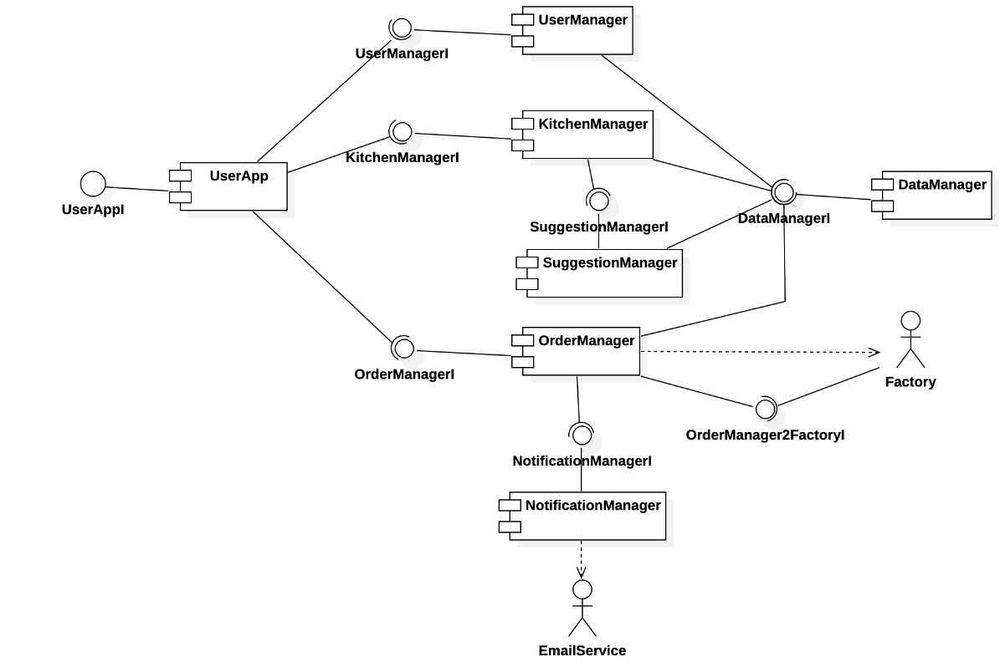

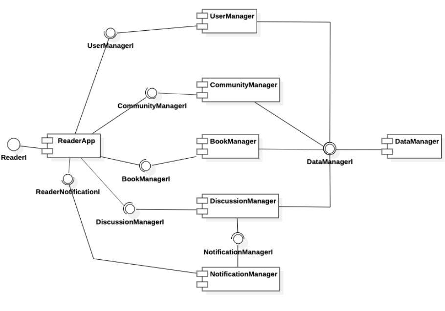

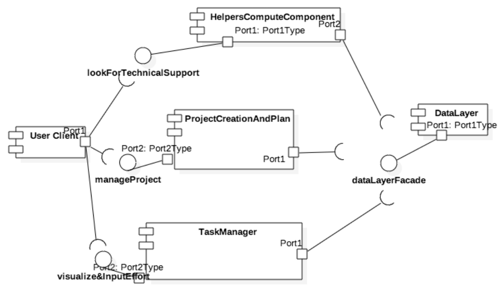

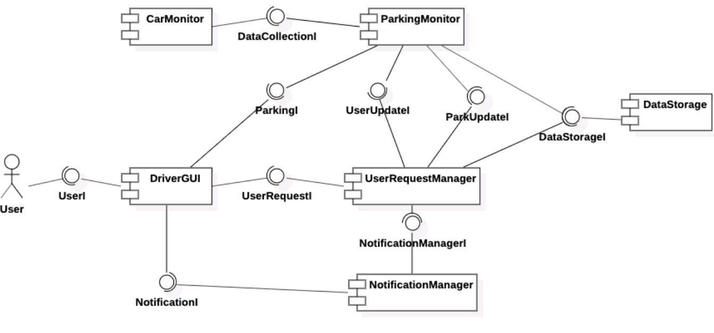

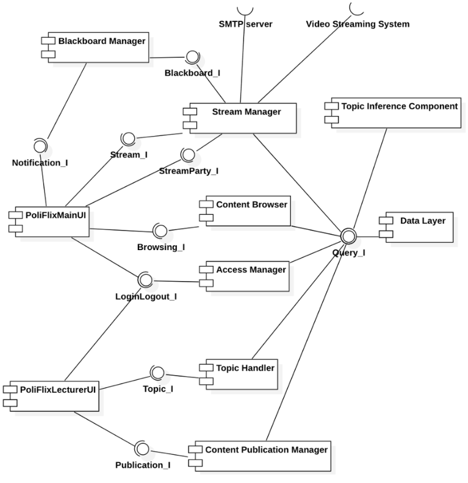

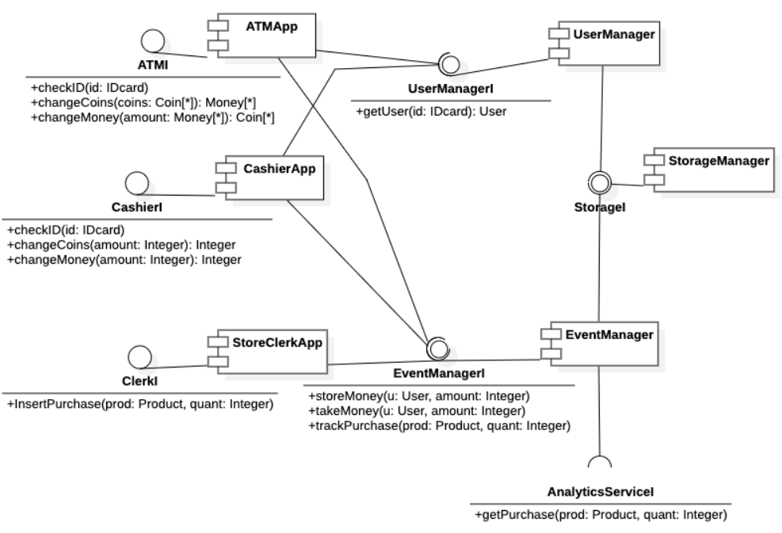

_3 different front-end modules. Each one handle the interaction with a different actor through a different interface. _

Suggestions: 

- Remember the NotificationManager if there are any kind of notifications 
- If there are other actors involved (as for example a Factory or and Email Provider or a Cloud provider) represent them! 

### Class Diagram

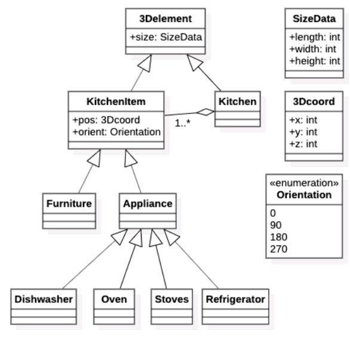

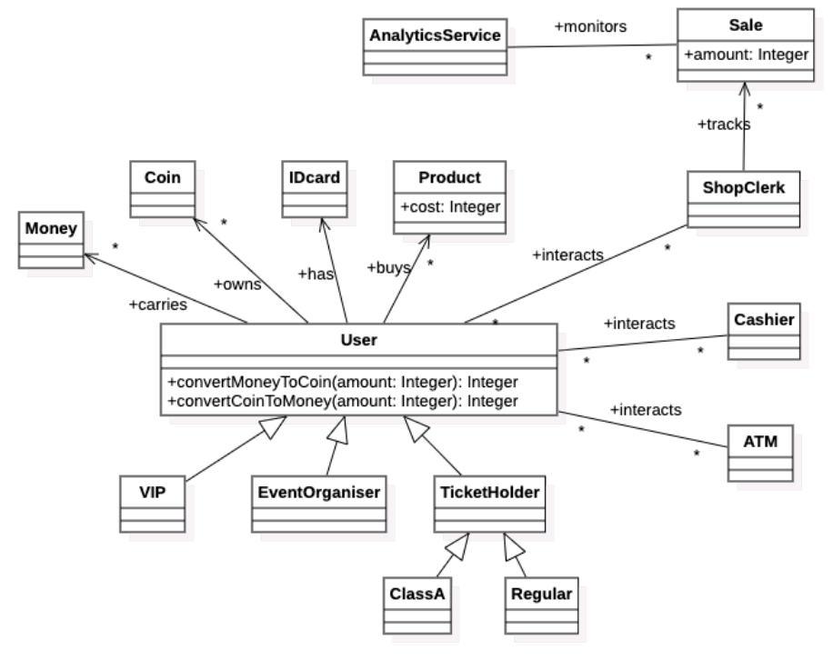

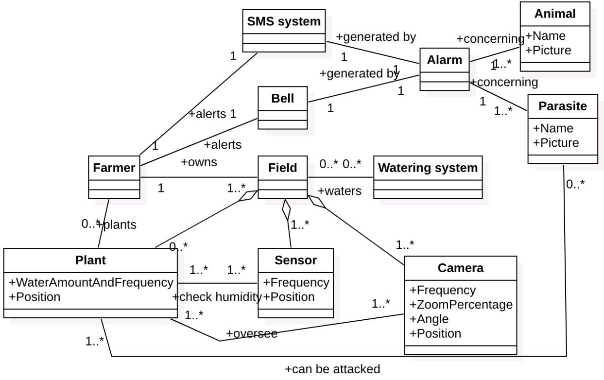

### Sequence Diagram

Sequence Diagram used to describe behavior time-oriented. Focused on internal message exchange among components. It is used to show the control flow and illustrate typical scenarios. 

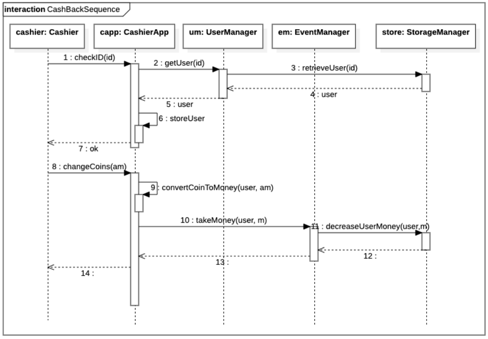 

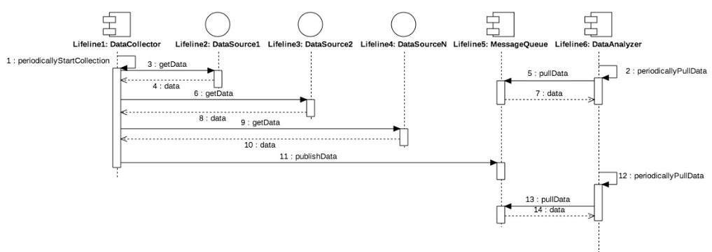

### Deployment Diagram

Deployment Diagram captures topology of a system: hardware, software and communications protocol between them. It is used to specify the distribution of components and identify performance bottlenecks. 

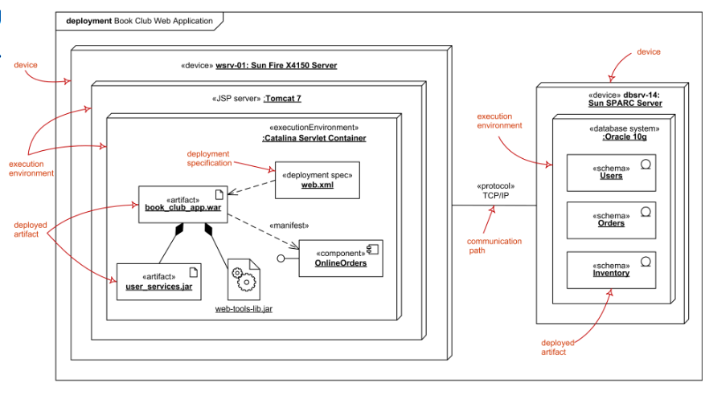
